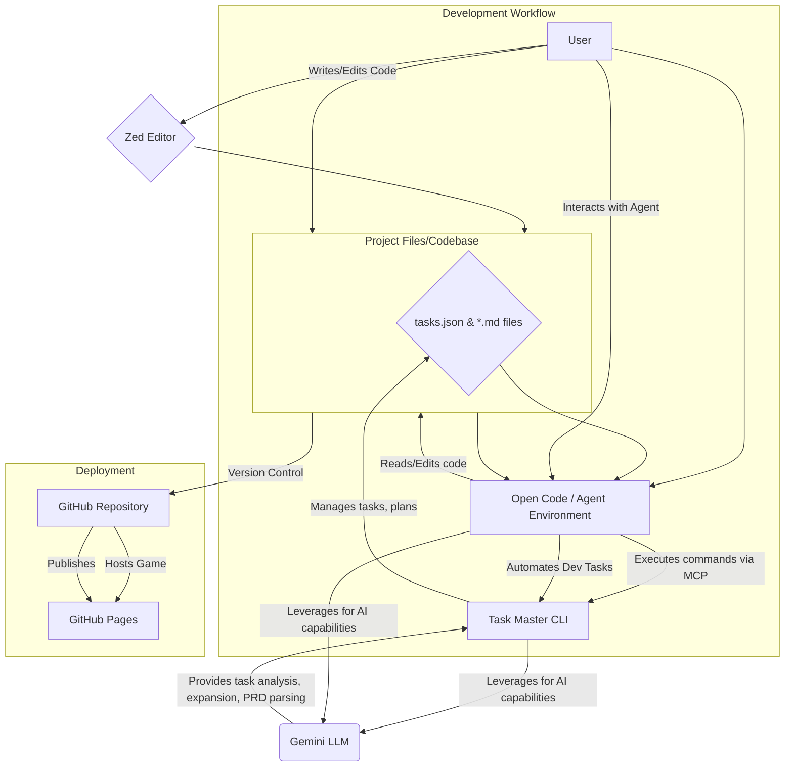

# Flappy Bird Development Workflow

Here's a Mermaid.js flow diagram illustrating how `task-master`, Open Code (the environment I'm in), Zed Editor, Gemini (the underlying AI), and GitHub Pages collaborate in the development of the Flappy Bird clone, along with a summary explanation:

### Summary of the Development Workflow

This diagram illustrates the integrated development workflow for the Flappy Bird clone. At the center of the development is the **User** (A), who interacts with the **Zed Editor** (B) for direct code writing and editing, and with the **Open Code / Agent Environment** (D), which is where I, the AI assistant, operate. This environment is flexible and could be swapped out for other agent interfaces like Gemini CLI, Kilo Code, or Zed Editor's built-in agent interface.

The **Project Files/Codebase** (C) is the central repository for all game code and assets. Changes from Zed Editor or automated edits from Open Code are reflected here.

Within the Open Code environment, the **Task Master CLI** (E) is a critical tool. This connection is enabled through **MCP**, allowing Open Code to execute `task-master` commands to manage the entire development process: parsing requirements from `prd.txt`, generating and expanding tasks, tracking their status in `tasks.json` and individual `.md` files (F), and analyzing complexity.

The intelligence behind both `task-master`'s advanced features (like task expansion and PRD parsing) and my own reasoning and code generation capabilities comes from the **Gemini LLM** (G). Gemini processes prompts and data to provide task-related insights and generate code or instructions.

As development progresses, the code in the **Project Files/Codebase** (C) is committed to a **GitHub Repository** (H). Finally, the completed game is published from the GitHub Repository to **GitHub Pages** (I), making the Flappy Bird clone accessible online. This setup creates a loop where requirements are broken down, tasks are managed, code is written and refined, and the project is deployed, all facilitated by AI-powered tools and platforms.