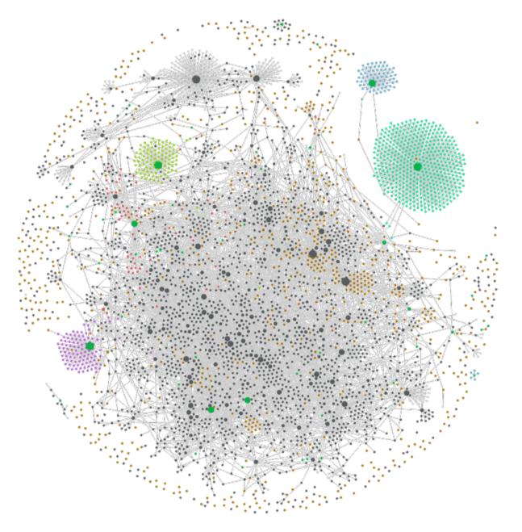
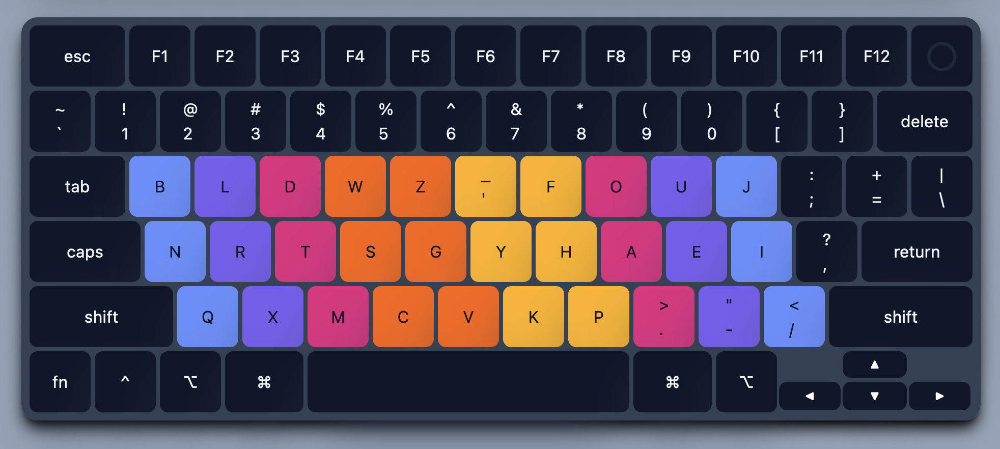
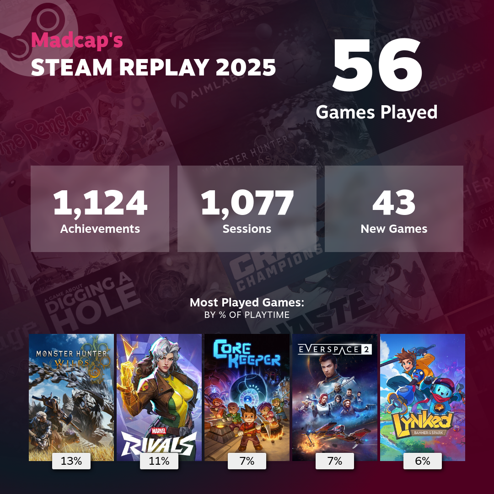

## AI

Like I wrote about in [[my-ai-learning-journey|My AI Learning Journey]], I spent the bulk of July watching lectures and learning about different concepts related to #AI and LLMs.

### Vibe Coded Apps
- [Team Flow Mapping](https://teamflowmapping.com/)
	- Team Flow Mapping started as a simple idea, but grew into a basic, but full featured application that took about a month of full-time development.
	- Developing Team Flow Mapping taught me a lot, which I cover more in [[building-team-flow-mapping|Building Team Flow Mapping]].
- [DelayCost Visualizer](https://studio--delaycost-visualizer.us-central1.hosted.app/)
- [Wardley Doctrine & AI Impact Explorer](https://wardley-doctrine-ai-impact-explorer-512441749265.us-west1.run.app/)
- [Agile Big Room Planning](https://team-dependency-matrix-838267439197.us-west1.run.app)
- [Agile Team Profiler](https://agile-team-profiler-539581219123.us-west1.run.app)
- [OutlineFlow](https://studio--outlineflow.us-central1.hosted.app/)
- [Ganttify](https://studio--ganttify-6q9ac.us-central1.hosted.app/)

## Blog

I tried hard this year to write about topics I thought would be impactful and give people with alternative perspectives and paths to agility than the behaviours I saw in my day to day work. In my day to day, I saw poor management, people following the path of least resistance, and more focused more on getting things done than considering:

- What are we building?
- Why are we doing it?
- Does it add real value?
- Is this having a positive impact on the team?

In terms of stats, here's what 2025 looked like on the blog.

- 15 posts
- 16.8k words
- 4.2k views

## Obsidian

I didn't spend as much time adding or grooming my [Obsidian](https://obsidian.md/) content in 2025 than I had in previous years. With the exception of the new AI and Machine Learning notes I captured, I spent a lot more of my time experimenting and building things than I did reading or note taking.

In previous years I was using both Obsidian and [Logseq](https://logseq.com/), but since 2023 Logseq has had very few updates as they invested most of their resources developing a new database driven version of the application. While I enjoyed using an outliner with block-based editting and built-in queries, performance really suffered with my large vault. And meanwhile, Obsidian has consistently been developing at a high velocity with the community plug-in ecosystem becoming more and more mature.

I also spent time in the latter part of the year relearning how to using and configuring Emacs, and how to use [Org Mode](https://orgmode.org/).

I don't think I'll ever remove Obsidian from my workflow, but in this age of software, I appreciate using applications with exceptionally high performance, stability, longevity, and customization. That pursuit occasionally leads me to try out and learn different applications.

Two of my main reasons for learning Emacs was using Org Mode as a GTD app, and because I've seen Emacs described as one the best tools in existence for editing text. And while the learning curve is still high, things are better now than they were 10 years ago, and being able to get help from AI on my specific issues has been a big help.

I cover how I setup and use Emacs for writing in [[my-emacs-writing-setup|My Emacs Writing Setup]].

*My Obsidian graph as of December 2025*

## Started Learning Piano

This year, I found myself with more free time after work than I had in the past. I didn't have the motivation to put energy into reading or writing, and wanted to try something different.

So I bought a keyboard, and every day after work I would practice for about an hour or so, then after doing a short workout and dinner, I'd go back and practice for a bit longer.

I have to say the one thing I really don't like about playing piano, and I'm sure it's the same for every instrument, is just how uncomfortable some of the hand positions can be. I feels pretty horrible whenever I have to twist my hands or fully stretch my hands in order to play an octave with the side of my pinky finger and my thumb.

## Learned the Graphite Keyboard Layout

In the quest for better comfort and ergonomics, I've learned a few different keyboard layouts.

This year I decided to take the leap again and switch from using Engram, which I picked up in 2021, and start using [Graphite](https://github.com/rdavison/graphite-layout).

*Colors indicates expected fingering*

Overall my keyboard layout journey has looked like:

QWERTY -> Dvorak -> Colemak -> Engram -> Graphite 

Learning to type with a new keyboard layout is very disruptive to your productivity. It takes a lot of time, requires daily practice, and means having to start all over. But nevertheless, I find it fun and rewarding whenever I do it.

## Video Games

### Steam Replay 2025

*[Steam Replay 2025](https://s.team/y25/ftqnvcg?l=english)*

### Games Played

To help me create this ranking of how much I liked all of the games I played this year from most to least, I quickly created an app in Google AI Studio to take in all the games I played during the year and ask me a series of comparison questions.

1. Clair Obscure (100%)
2. Mars First Logistics (100%)
   - I really enjoyed the freedom and creativity this game provided. This game was the best implementation I've played of clean, cel-shaded, Moebius-like art. Even better than what Sable was able to do. 
1. Core Keeper (100%)
   - This game was such a cute adventure, with fun progression, and lots of fun discoveries and secrets to find. This would have been really nice to play in a co-op world with someone, but as a solo player it was fun too.
4. Monster Hunter Wilds
   - I was really looking forward to this game after waiting for years, and put a lot of hours into it when it launched. Unfortunately the game's poor performance and end-game activities drove me away for good and I've had very little reason to ever pick it up again.
   - The game is just filled with bad design decisions that makes it really difficult to want to play it again:
	   - Its end-game gear mechanic is RNG-based, which involves lots of grinding for materials for a chance at gear with the desired attributes.
	   - I'm not a fan of the post-launch content being added to the game. They added Akuma from Street Fighter, but he doesn't play like a character with fist weapons. Instead, you have to activate actions in your item bar to use his skills.
	   - They also added a Great Sword weapon that is shattered into peaces, yet somehow keeps its shape? It doesn't make any sense.
1. Marvel Rivals (100%)
   - A great game and very fun, but like all service games, I eventually had to force myself to stop playing because it's too easy for me to get sucked into trying to unlock all the content, completing every battlepass and special event. While I could have kept playing this game for hundreds of more hours, but playing Rivals meant I wouldn't likely get to any of the other games in my library.
6. Everspace 2 (100%)
7. My Time at Portia
8. Nova Lands (100%)
   - I was really surprised with how much I liked this game. As a factory/automation game, Nova Lands is very approachable and has a unique charm to it.
   - The only nitpick I had with this game, without spoiling much, was a mining activity that's introduced later in the game. It was the only part of the game that was repetitive.
9. Sable (100%)
   - This was a game I had wanted to play for a while. The world was beautiful, but movement was very janky and graphics performance could have been better.
10. Jusant (100%)
    - I wasn't too big a fan of how the narrative of this game was delivered, but it created such a cool world and had engaging controls.
    - Because the game is so short, this is one I recommend lots of people pick up.
11. Chants of Senaar (100%)
12. BALL X PIT (100%)
13. Escape from Duckov
14. Backpack Hero (100%)
15. Mega Bonk
16. Legend of Grindea
	- A fun homage to gaming. The games a bit of a running joke, but packs a lot into it with interesting dungeons, character build choices, and skill progression.
17. Blue Prince
    - Blue Price was unique and one of a kind. I liked the world we became a part of with its unique visual style and music, but I'd lie if I said it wasn't incredibly frustrating and repetitive.
    - Many of the game's puzzles can only be solved if users take copious notes, or in my case hundreds of screenshots, when they find any clues.
18. Balatro
19. Slime Rancher
20. I am Future (100%)
21. Luma Island (100%)
22. Heroes of Hammerwatch 2
23. Littlewood
24. Linked: Banner of the Spark
25. Outer Wilds
    - I might get some flak for this, but based on how much people raved about this game, I was expecting a lot more.
    - I was turned off by the game's main mechanic which always created a sense of pressure, forced me to rush and repeat things.
    - While I really liked the way you uncovered new knowledge and the way you expored the world, ultimately the gameplay loop was simply "Go here, read this, go there, read that."
    - I couldn't believe the ending sequence the game forced you through and didn't even try. I just watched a YouTube video of the ending and even then, didn't find it rewarding.
