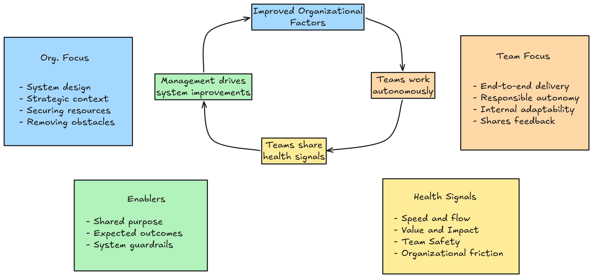

It's easy for organizations that implement Agile to end up with a system designed for top-down control of teams. Ironically, the problem starts with implementing agile as a project management technique, with the goal of creating an organized system to enable complete transparency, predictability, and alignment. These principles become poisoned when management forces transparency, predictability, and alignment-focused systems onto teams for the purposes of command-and-control.

Instead of seeking to create organizational agility, command-and-control thinking uses agile to create command-and-control systems.

To break out of this pattern, we have to change our perspective and zoom out beyond just "Agile Teams" and "Agile Delivery." To develop meaningful organizational agility, management needs to be as much a part of the agile system as teams are.

## The Problems We Need to Fix

When organizations implement agile practices to increase the command-and-control, typically through the use of top-down standardized agile models, problems emerge:

- **Processed forced onto teams:** Processes are designed and mandated from the top down, stripping away team-level initiative and the ability to adapt to local conditions.
- **A feature factory with no say in the work:** Instead of acting like autonomous work groups, teams start to resemble a conveyor belt; they become a feature factory, expected to follow a standardized model whose only concern is the output of new features.
- **No local decision-making:** Because decision-making only happens at the top, the teams doing the work need to escalate issues up the chain, making them reliant on management action or instruction.
- **Micromanagement:** Management spends more time tracking daily task work, progress, and due dates. Data on value delivery and team friction are replaced by pointless sprint metrics.
- **Wasted time on endless status updates:** Rather than delivering value, teams spend time estimating, calculating metrics, and preparing slide decks to give management confidence and a false sense of control.

## Shifting to the Enablement Loop

Typical Agile implementations are rolled out top-down as a closed system, where management designs the rules, team structures, team roles, how teams work, and what they work on. Information travels back up from teams in the form of status reports that inform more management decision-making.

Instead of designing control-based systems, organizations should aim to design enabling ones, where:

1. **The organization** creates the environment, shares context, and secures resources to improve team capabilities.
2. **Teams** work autonomously, adapt to changing conditions, and pass feedback upwards that informs management about what resources, systems, and support they need from the organization to improve their performance.
3. **Management** takes the feedback and further enhances organizational factors. Management is not just a process designer that sits outside the system; it becomes part of the continuous improvement cycle.

## Management and Team Focus
Instead of only focusing on team-level Agile, the goal is to create a reinforcing loop between management and teams. As teams work and generate data, they actively feed that information back into the system.

### Management Focus: The Organization as a Platform

The organization acts as an enabler for team autonomy by focusing on improving system factors:
- Securing resources
- Removing obstacles
- Sheltering the team
- Providing teams with strategic context and the autonomy to manage themselves
- Creating the right environment
- Eliminating bottlenecks
- Simplifying processes
- Defining outcomes, standards and criteria for performance evaluation

### Team Focus: Self-regulating Work Groups

Teams operate as semi-autonomous units with end-to-end ownership:
- Responsible for delivering positive outcomes end-to-end
- Improving its efficiency and effectiveness
- Growing the capabilities of its members
- Self-regulating and shifting to adapt to challenges
- Adjusting internal roles and workflows
- Providing feedback up the system

The teams act as sensors. As teams work, they generate data, and feed those health signals back up to management, focusing on areas like:
- Speed and flow
- Value and Impact
- Team Safety

## Guardrails

For there to be a productive feedback loop between the two groups, we need some constraints:
- **Shared Purpose:** There needs to be mission, alignment, trust, common ground, and mutual shared purpose to enable coordination up and across the organization.
- **Expected Outcomes:** Clear definitions of success, such as OKRs, delivery targets, and SLAs.
- **System Guardrails:** Clear safety or performance boundaries, budgets, and legal guidelines within which the team has freedom to act.

*A reinforcing loop where autonomous teams act as sensors and the management works to improve organizational factors to support them.*

## Abstracting the Kanban Cadences

The goal is to move beyond installing systems (top-down) about how teams are expected to work and report information (bottom-up).

While some models focus on where decisions are made and the direction of information flow, the [Kanban Cadences](https://djaa.com/kanban-cadences/) is one of the few models that explicitly promotes creating bidirectional feedback loops within an organization.

The model I'm presenting is an abstract version of those cadences.

I think the goals of the Kanban Cadences are good, but I also think its implementation, with its seven different meetings and reviews, creates a challenge. Not many people are familiar with them, and logistically, they create hurdles to adoption.

The core idea to focus on is: If it's important, put a feedback loop in place.

What's important will be different for every organization, but taking inspiration from a few sources, including the Kanban Cadences, this could include creating bi-directional organizational feedback loops around:
- Value delivery and impact
- Workflow bottlenecks and team capabilities
- Team safety
- Delivery risks and dependencies
- Strategy, vision and purpose
- Organizational support, systems and structure
- Overall team effectiveness

## Summary

The core of this idea is to find a way for organizations to achieve agility without depending on management acting as ivory tower system designers, defining team structures and tracking task progress.

Shifting from command-and-control to enabling, and from top-down to a reinforcing loop, are changes organizations embarking on an Agile transformation need to consider.

No matter which specific agile framework or practices your organization uses, if feedback loops between teams and management aren't happening, and if the organization isn't changing in ways that enable your teams to have more autonomy and deliver better results, your organizational agility will always be limited.