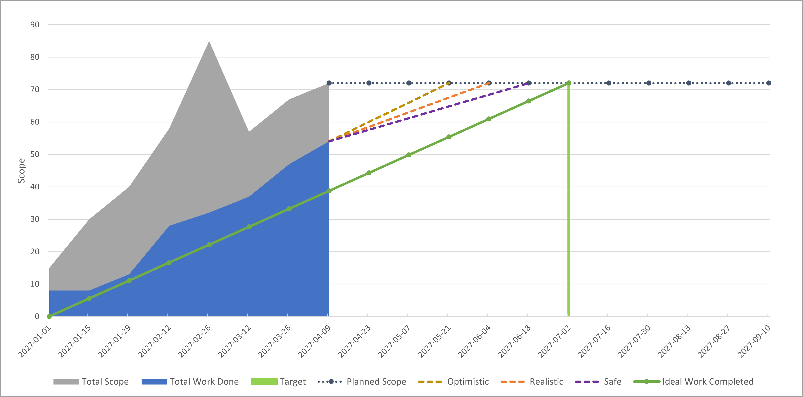
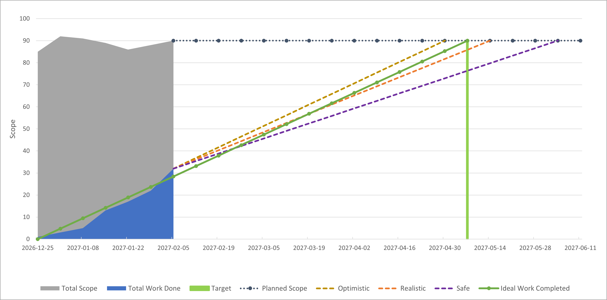
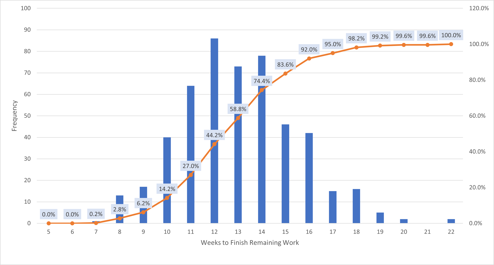
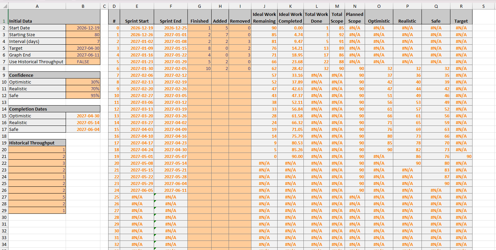

*An example burnup chart*

Link: [Google Drive - burnup-forecaster.xlsx](https://docs.google.com/spreadsheets/d/1prrQNT-fYMD0GrXTSNim-3DhIoMi50wb/edit?usp=sharing&ouid=114228439340577936039&rtpof=true&sd=true)

## Goals

Problem I want to solve:
- Jira doesn't always do a good job of helping people answer when their work will be done.

What I want to do with forecasting:
- Understand when a feature or project is likely to finish.
- Plan for a range of possible futures.
- Show how variability affects completion time.
- Show how scope changes over time.
- Be able to use historical throughput data to get a quick forecast for new projects.
- Simplify management discussions on metrics and focus on:
	- What's done vs not
	- When will it be done?

What I want to avoid when forecasting:
- Avoid committing to a single date.
- Avoid guessing.
- Avoid estimating.
- Avoid doing lots of manual tracking.
- Avoid planning any efforts bigger than a few months long.
- Discourage discussions about teams having to go faster.

Assumptions using this tool:
- Assume we are looking at an existing team in as existing domain
- Assume the team is stable and working towards a single goal

The biggest impact you can have to improve forecasts:
- Improve forecasts by making the scope smaller
- Improve forecasts by tackling sources of variability

## User Entered Data

Because most of my work with clients involved locked down, hosted instances of Jira, I often had to rely on manual counting for data tracking. Because of that, it was important to make the tracking as simple as possible for users.

There are two main types of data that need to be entered:
- Project data: Entered once at the start of a project or feature
- Work data: Updates that track how work is progressing

### Project Data

- Initial size
- Start date
- Iteration duration in days
- Target date
- An option to use historical data
- Chart end date
	- Ideally, this would be done automatically, but I haven't figured out how to do that yet.

### Work Data

- Work completed
- Scope added
- Scope removed

## How it works

1. It reads the starting data and the completed iteration data.
2. It calculates how the total scope changes over time
3. It calculates an "ideal" throughput and plots an ideal throughput line from the project start to the target finish.
4. It calculates the work remaining after the last completed iteration.
5. It runs a Monte Carlo simulation, taking random samples from the throughput data to find how many weeks it would take to complete the work remaining.
6. It plots three versions of the resulting data at different configurable confidence levels, plotting lines from the work completed to the total scope target.

## Photos

*Another example burnup chart*

*Simulation results for weeks to finish remaining work*

*The main data sheet*

Link: [Google Drive - burnup-forecaster.xlsx](https://docs.google.com/spreadsheets/d/1prrQNT-fYMD0GrXTSNim-3DhIoMi50wb/edit?usp=sharing&ouid=114228439340577936039&rtpof=true&sd=true)
