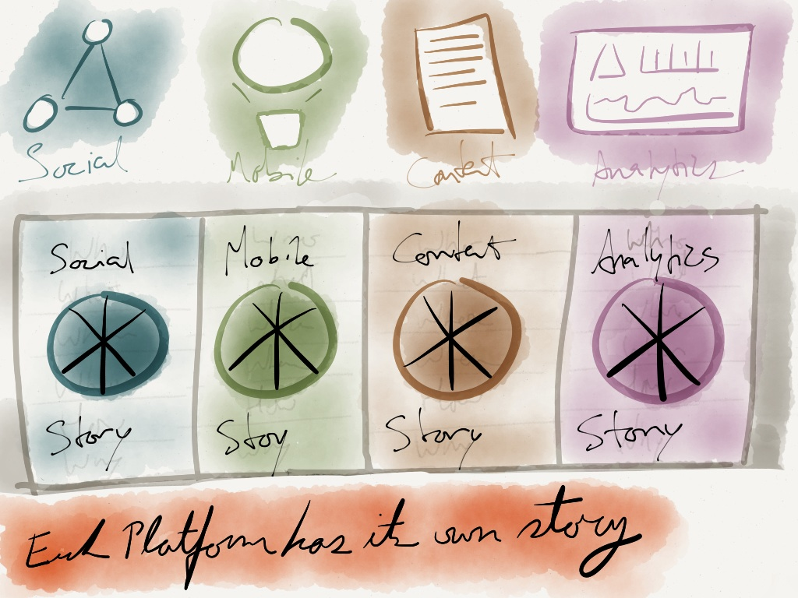

Each platform has its own story. You can work though many different questions and get many different answers of Who, What, When, Where, How, and Why.

I find this illustration useful to illustrate that no one platform is superior or the best one for all cases. Each has its own characteristics and affects consumers’ lives in different ways that are worth looking into.
