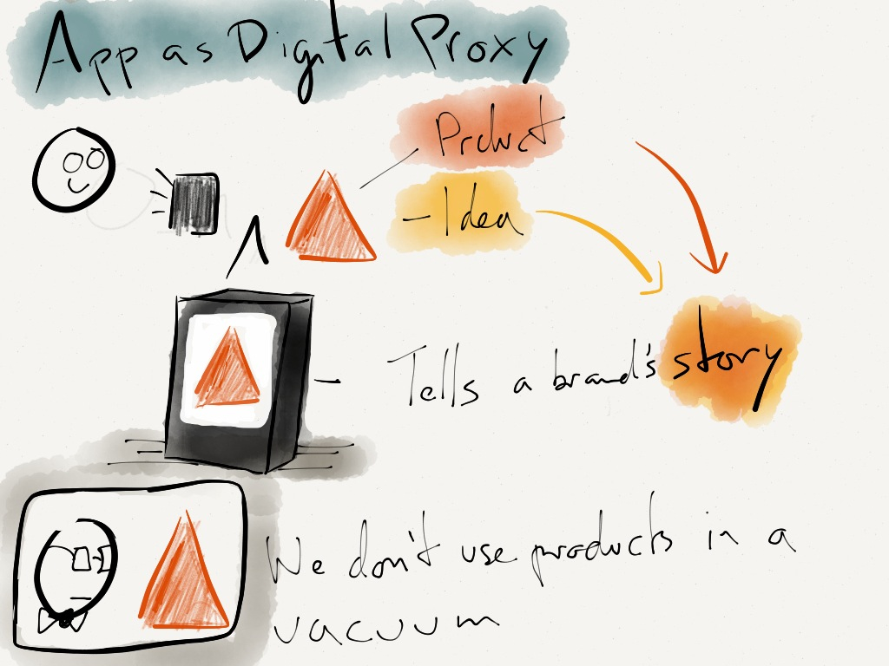

In a network of people, devices, and things, apps are more important than the things themselves. Apps can extend any product or idea, making its values and its brand relevant to customers. Relevance comes from translating things into a story we can understand.
