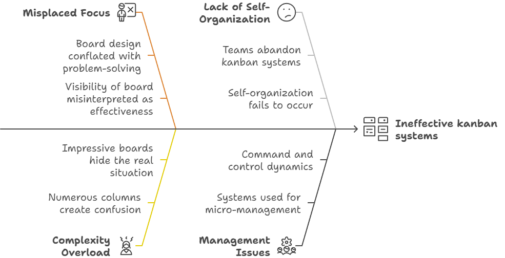
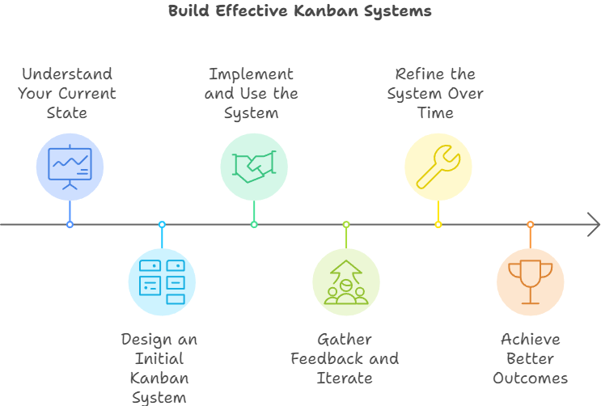

One of the most helpful things you can do when facing a problem is to visualize the situation. In software or service delivery, kanban is a handy method that lets teams visualize and better manage their business or workflows.

> If you don't know what else to do, make it visual. Find some way to make what's happening visual so you can see the flow.
>
> John Shook

What I often see happen when teams or managers encounter challenges is they jump to implementing unnecessarily complicated kanban systems that describe ideal end-states rather than simpler systems focused on dealing with the challenges in front of them.

To help teams more effectively engage with their challenges, the guidance I've started giving is that teams should focus on doing just enough kanban.

## The Trap of Overly-Elaborate Kanban Systems

People often fall into the trap of thinking that the most visible part of a kanban system, the board, is the most important. They conflate the activity of board design with problem-solving, which leads teams to create elaborate kanban boards and believe that once they have a board, they've also fixed their problems.

Assuming that a more elaborate kanban system will result in better outcomes is a trap I see teams, managers, and consultants fall victim to.

A kanban board with lots of columns might seem impressive and give the impression that a team deeply understands their workflow, but kanban boards alone have little to do with how smoothly work flows through a system or how well a team serves their customers.

Implementing overly complicated kanban systems or imposing pre-made boards on teams can create friction, slow teams down, or promote regressive management behaviours. Some types of friction teams can encounter include:

- Effort goes into implementing a system board, communicating how to use it, and the benefits it will achieve, but everything stays the same.
- Self-organization doesn't happen.
- Teams abandon the kanban systems.
- The systems become a tool for micro-management or command and control.

## Start With What You Do Now

One of The Kanban Method's three [Change Management Principles](https://resources.kanban.university/kanbans-change-management-principles/) is "Start with what you do now." I extend that guidance to my teams by promoting the idea that they use just enough kanban whenever possible.

Instead of trying to implement an ideal end-state kanban system from the beginning, start with what you have and design a system that enables you to take the next best step, then make gradual changes based on feedback and experimentation.

Here are three guiding principles to help you apply these ideas:

## Teams Should Build Their Kanban Systems Step-by-Step

Teams can create the impression of making quick progress by installing a pre-existing kanban system, but it's only progress if the people using the board understand their new system and how to use it.

Teams will learn more by stumbling around, creating and iterating their kanban systems over multiple iterations, and learning from that process compared to copying someone else's system.

Ownership is a property of kanban systems essential for evolution, but it's also impossible to introduce after the fact.

## Kanban Systems Should Help Teams Take the Next Best Step

When faced with a challenge, a team's first goal shouldn't be to solve for some ideal future state, nor should they design a kanban system for that future state. But this is the behaviour I most commonly witness.

A better approach is to start by understanding where the team is and the current situation.

- How does the team's work happen?
- What's working well?
- What's not working?
- What challenges are they facing?
- What's important to them?

Based on the answers to those questions, the team will be in a better spot to determine what direction they should move in and what they need from their kanban system.

## Kanban Systems Should Focus on What's Important

Kanban systems help teams better understand and manage their work. When designing kanban systems, the goal should be to create a helpful model, not necessarily a more detailed or accurate one.

Kanban systems don't need to be perfect, one-to-one representations of how work happens for them to be useful. Kanban systems don't get better or generate better outcomes the more accurately they describe every activity and policy in a workflow.

Kanban systems model how a system works to help teams solve their challenges. What makes kanban system design a subjective activity is thinking about and deciding which problems the team should solve and how their system can help them.

Being intentional about the problems a kanban system is trying to help solve means being intentional with what information the system should present to its users.

Kanban systems that act as reference guides or communicate more information than people can hold in their heads are less helpful than systems that effectively surface the two or three key things people need to know to make better decisions.

## Kanban Systems Don't Solve Your Problems for You

Kanban systems are powerful tools to visualize and manage work, but it's misguided to think the boards solve any problems on their own. Boards don't solve your problems for you. You need to decide what to do based on what you see.

> Kanban is great in helping you visualize the current situation, but it doesn't tell you what to do. You need to decide that!
>
> Mattias Skarin, Real-World Kanban

Better kanban systems don't guarantee better outcomes. They are only as good as the people who use them and the actions they take. Kanban systems help you understand how work happens so you can identify and solve your real problems and take the appropriate actions. "Better" is a quality of people's decisions and actions, not a board's design.

Kanban systems help teams by supporting the conditions needed for their desired outcomes. They can promote better transparency, collaboration, experimentation and improvement, but they can also do the opposite if implemented inappropriately or imposed onto teams.

For a better chance of finding success with kanban:

1. **Do just enough kanban** and only build the first iteration of your kanban system. Don't start by building the final version.
2. **Do just enough kanban** so that your system helps you take the next best step.
3. **Do just enough kanban** so that your system provides you with the critical information you need. Don't worry about creating a perfectly accurate replica of your workflow.
