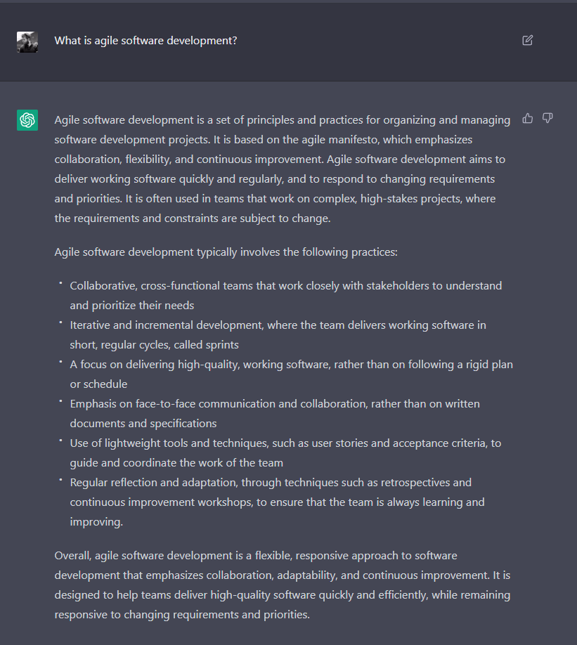
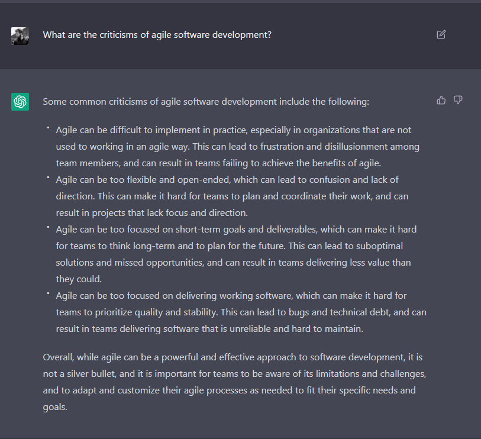
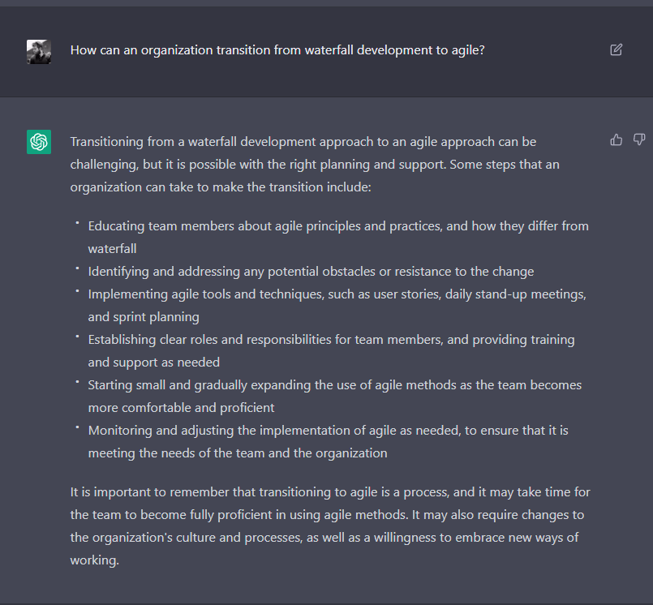
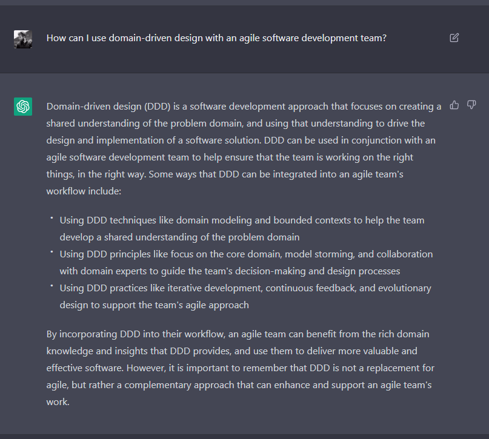
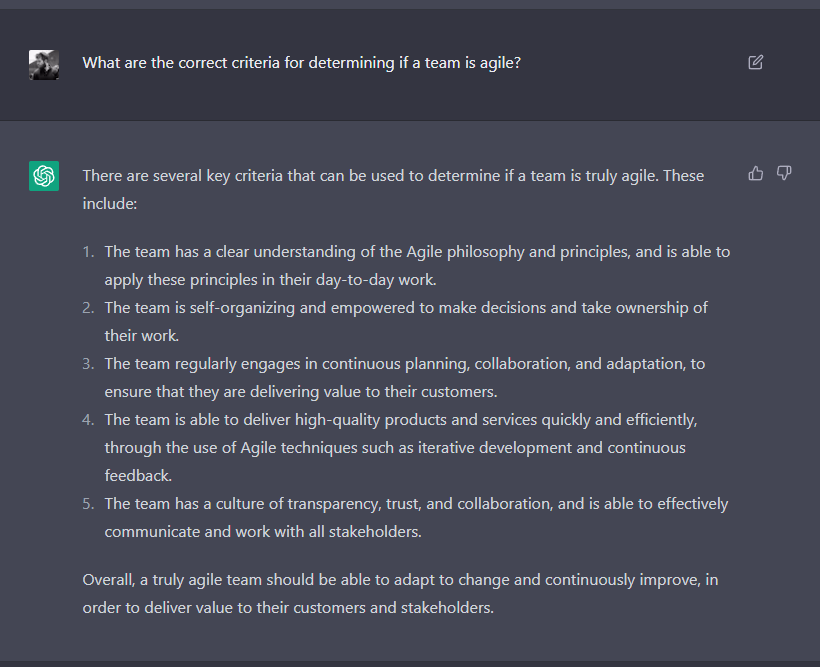
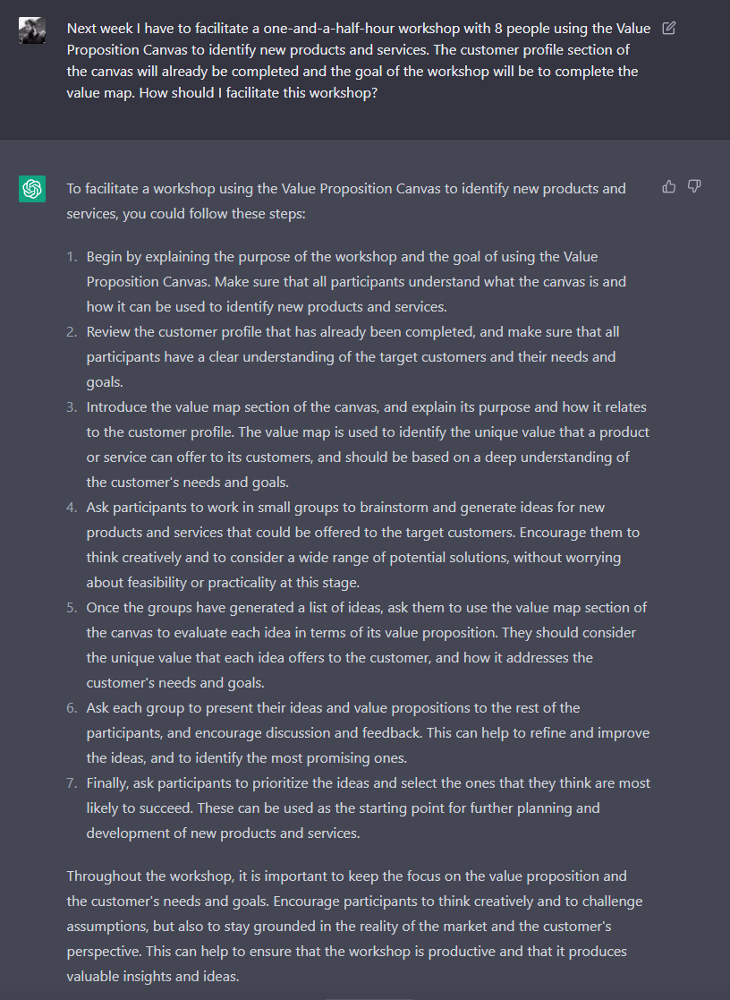

I spent some time experimenting with [OpenAI's ChatGPT](https://chat.openai.com/chat) product to ask it some questions about agile and was blown away by the results. Using this tool made it feel like I was getting a sneak peek into the future. I asked it a series of increasingly challenging questions.

I started with some straightforward questions, asking it to fetch summaries of topics like:

What is agile software development?

What are the criticisms of agile software development?

Then I asked it some more complicated questions, hoping to get answers to questions with no one clear answer:

How can an organization transition from waterfall development to agile?

How can I compare if one team is more agile than another?

The next set of questions I asked was about combining and comparing different topics:

How can I use domain-driven design with an agile software development team?

Is Scrum better than Kanban?

I tried to throw it some curve balls, but of course, it handled those queries without a hitch:

What are the correct criteria for determining if a team is agile?

Can a team follow recommended agile practices too closely and in doing so, actually become less agile?

I experimented with more questions across a variety of topics, and while I could point out minor issues with the responses I got back, experimenting with ChatGPT was a fantastic experience. The next experiment of mine will be to think of different ways to offload some of my work to ChatGPT:

Create the agenda for a five-day long workshop designed to teach people with no prior experience about agile. This workshop should give them all the basic tools to collaborate and an understanding of agile and agile teams. It should not include any content on Scrum or Sprints.

Next week I have to facilitate a one-and-a-half-hour workshop with 8 people using the Value Proposition Canvas to identify new products and services. The customer profile section of the canvas will already be completed and the goal of the workshop will be to complete the value map. How should I facilitate this workshop?

Just incredible. This is powerful stuff.
