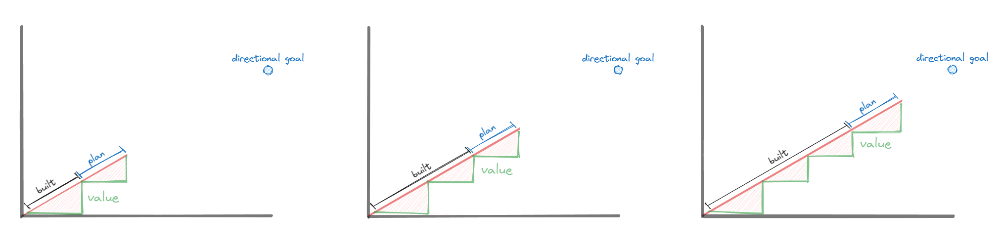

Do you think of software development as an exercise in identifying the right problem, doing the right analysis and getting the right people to code the right features? Or is it more of a discovery and learning activity where you make a bet, build something and get feedback?

In the former approach, organizations will create projects with defined targets to achieve a particular goal and deploy resources to complete them. In the latter approach, projects don't work because knowing the answers upfront is impossible.

In "[What is Agile?](https://blog.crisp.se/wp-content/uploads/2013/08/20130820-What-is-Agile.pdf)" Henrik Kniberg drew a picture to visualize the risk with big batch releases. On the left, we see the risk inherent with large batch sizes. On the right, we see how small batches reduce risk and deliver value sooner.

Too many organizations create "Agile" teams and implement "Agile" practices but do so in a big batch project context. In those organizations, managers enforce certain practices and track teams' progress to ensure their project's success. But working incrementally and iteratively in a way that delivers real value requires different a completely different set of practices.

Managing the work will only make you successful if you're also focused on managing the value.

## The Problem with Managing the Work

Projects create a context where it's possible to focus too much on managing the work. It's when managers or teams focus on copying the visible Agile practices they think are required to be successful and achieve their deadlines.

In these situations, managers might have certain expectations and ask questions about how teams are working, such as:

- "Did they complete a project canvas?"
- "Do they have a kanban board?"
- "Are they using sprints?"
- "What's their required throughput?"
- "Do they have a Scrum Master?"
- "Have they written all their stories?"

When used appropriately, these different practices could be valuable. However, when applied in a project context, these have little to do with whether a team will succeed. They certainly don't represent how agile a team is.

If these are the first questions and conversations managers are having, there's a risk that managers will get what they ask for. Teams will start filling out canvases, sprinting or reporting throughput whether or not they understand those practices or use them in the right context.

## Beware "Trust us" Metrics

In an agile setting, metrics help the team by acting as feedback from the system they can use to guide their decisions.

However, the metrics aren't for the team in a project setting. In a project, the metrics are for the project managers to know whether their project is on track.

In important projects, the weekly reporting of metrics becomes a sacred ritual where teams present elaborate metrics and figures to say to their managers, "You can trust us to meet the deadline."

> You must adapt as the project unfolds by changing your plans. You can plan out an entire project into detailed iterations in advance, but that isn't Agile.
>
> [Agile Process - Iterative Planning](http://www.agile-process.org/iterative.html)

When managers focus on the particular agile practices teams are performing to deliver their projects, there's no upper limit on how much they can try to manage the team's activity.

On big, "Agile" projects that went off-track, I've seen managers try to bring things under control by putting more and more controls in place. These controls lead to reporting more metrics and additional management touchpoints. In one case, I saw a Senior Vice President attempt to declare a program-wide mandate "All teams should be completing at least 55 story points every sprint." 

## What to Do Instead - Manage the Value

Instead of focusing so much on ensuring teams are executing specific Agile practices, focus on the conditions that will lead to a team's success.

The biggest thing teams can do to help to increase their chances of being successful is to make things smaller.

- Smaller projects
- Smaller features
- Smaller checkpoints, goal-posts or milestones

*Shifting from a fixed goal to smaller checkpoints*

Shifting from project-based thinking to an iterative and incremental way of working where teams release frequently creates more opportunities to:

Validate assumptions about the customer's needs and expectations

De-risk our work by identifying and resolving potential issues early

Show progress using real code rather than reviews or reports

I recently worked with a manager and an architect who had to collaborate with a team in a different country to deliver a large project. The manager started asking questions about how that overseas team would work and how we would track their progress. Instead of suggesting ways to manage the other team's work, I proposed that they design a set of incremental deliverables to act as internal checkpoints. 

Off the top of his head, the architect came up with three examples:

- Establish a handshake between both systems
- Exchange dummy response data
- Exchange test account data

These example milestones built using code running on actual infrastructure act as early opportunities for feedback, helping them build confidence that they'll be able to meet their ultimate goal on time. If things start getting missed, then they act as early warning signals.

It's important to note that these three examples are all internal milestones. Increasing the feedback from external users is even more critical. We should also seek to deliver value in small increments to get real customer or user feedback.

## Reduce The Need for "Trust Us" Metrics

> The measure of progress is working code. Reviews and presentations are an inexact model of progress. Working code shows just what's really been accomplished.
>
> [Agile Development Methods for Space Operations](https://ntrs.nasa.gov/api/citations/20120013429/downloads/20120013429.pdf)

When you work incrementally instead of on long projects, "Trust us" metrics become less important. As teams show they can deliver regularly, it builds trust that they are predictable, so there's less need to look at metrics.

As teams deliver incrementally and achieve smaller milestones, the size of their plans starts becoming smaller compared to the software already built.

*As teams deliver, the size of their plans starts becoming smaller compared to the software already built*

## Short-term Plans, Long-term Direction

> The most powerful way to reduce variability in forecasts is to shorten our planning horizons... Smaller scope leads to faster development, which shortens time-horizons.
>
> The Principles of Product Development Flow

It's less agile for teams to commit to fixed, long-term goals. Agile teams keep options open by only committing to short-term goals that provide feedback and learning opportunities. Over longer time horizons, agile teams have looser, more directional plans, which can change.

*Agile teams have short-term plans, but only directional long-term goals*

## Focus on Working Software over Plans

> Software programs should start small, be iterative, and build on success ‒ or be terminated quickly
>
> [DIB Guide: Detecting Agile BS](https://media.defense.gov/2018/Oct/09/2002049591/-1/-1/0/DIB_DETECTING_AGILE_BS_2018.10.05.PDF)

When we talk about going from working with big-batch projects to something more incremental and iterative, the core idea is changing from focusing on plans to focusing on working software.

"Working Software over Plans" isn't technically spelt out in the [Agile Manifesto](https://agilemanifesto.org/), but the elements are there:

- "**Working software** over comprehensive documentation"
- "Responding to change over **following a plan**"

## Overcome Project Thinking

The key theme is that overcoming project thinking is an even more significant challenge for organizations than getting them to form Agile teams or adopt practices like kanban boards.

In trying to be more agile, overcoming project thinking is essential because Agile isn't just a better way for teams to deliver long lists of fixed project requirements.

In uncertain environments where things are constantly changing, being agile is more about being flexible, adaptable and easily changing your plans as you gain new information.
