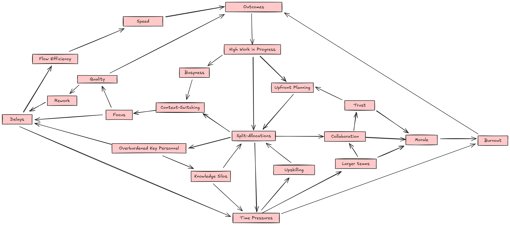

## Why Splitting People Across Projects Kills Productivity

It looks clean and clear on a resource plan, but the problem with split-allocations and context-switching are all the hidden costs that damage your team's focus, speed, and morale.

Organizations often deal with having high work in progress, with lots of projects for new features, software and security upgrades, as well as handling production incidents and support, etc. Even when organizations invest in creating agile teams, it often feels like it's only to help them cope better with high WIP, rather than make any fundamental changes to how they work. A common way to deal with a lot of work in progress is to run projects in parallel and divide people's time across multiple work streams, but this approach creates more problems than it solves.

On paper, split-allocations look clean and efficient, but in reality, it's just more busyness, less productivity, less focus, more interruptions, more waiting and less finishing.

## The Hidden Costs of Splitting Focus

When you split a person's time and focus, the real outcome is never just a clean and simple split, as it might appear on a project plan. The real price materializes in added friction, delays, and degraded quality—costs that are much more difficult to account for on a project spreadsheet than just somebody's hours.

- **Meeting Mayhem:** Conflicting meetings force key people to arrive late, leave early, or miss conversations entirely. It causes teams to plan and schedule their meetings around if/when key people can attend.
- **Priority Paralysis:** Both projects suffer. With experts trying to juggle all the tasks and demands on them, stress increases while team members and work are left waiting.
- **Collaboration Breakdown:** Teams need more than just deliverable handoffs; they require advice, answers, technical support, and more, all at random and unpredictable times throughout the week. When key individuals are stretched thin, these interactions suffer; people and work get stuck, and individuals begin to feel less like a cohesive team and more like a collection of part-time, siloed individuals.

What at first looks like efficient resource allocation quickly devolves into an unreliable scramble. The problem only gets worse when you add in non-value-adding meetings, status updates, reports, and reviews on top of an already strained schedule for bottleneck resources.

## Splitting Focus Crushes Flow

Working with split-focused bottleneck resources directly damages **flow efficiency.** Flow efficiency measures the time a task is actively worked on versus the time it spends waiting. Split allocations and the delays they create directly reduce the flow efficiency of multiple teams and projects.

When people are shared, they become bottlenecks for multiple workstreams. Work slows as people on one team start needing to wait for experts who are busy with meetings, priorities, or unexpected fires related to other projects.

This slowdown isn't a problem of optimizing handoffs; value is created through relationships. As [Jabe Bloom](https://blog.jabebloom.com/about/) says, "Social capital says that the value is not in the machines... it's not in individual human heads... It's in the relationships in your business." By splitting people's focus in an attempt to increase output, you are actually damaging the quality of interactions between people and weakening the relationships needed to create value.

## The Myth of the Perfect Split

For a split allocation to work, a lot of different things all need to line up and go right:

- Experts need to be available at the right time for information sharing, answering questions, engaging in discussions, providing feedback, and offering support to multiple teams.
- Experts need to be able to juggle the meeting cadences and ceremonies of every team they support.
- Team members need to finish work and be ready to start new work at the same time that experts become available.
- Experts need to do all their own work correctly the first time.

But in software development, things never go as planned. Work is always more complex than initially estimated, dependencies cause unplanned delays, rework increases the amount of work required, and surprises always pop up. On top of that, people get sick, take vacations, and ineffective meetings or personality issues on newly formed teams all create extra friction. All of these factors can derail an idealistic plan.

To make matters even worse, bottleneck resources are usually specialists responsible for additional tasks, such as supporting legacy systems, and may be needed to provide support during incidents. They're also relied on by managers and often pulled in to handle ad-hoc tasks. Additionally, who knows what work they are also doing "off the books" as a favour. Their "50/50" time easily becomes 50/50 plus another 20% or 30%, creating an unsustainable workload for your most critical people, slowing down any work that's not deemed urgent or priority.

*The effects of split-allocations on productivity and team dynamics.*

## A Better Path: Cultivating Focus

So, what is the alternative? Instead of splitting your experts and maximizing "utilization," aim to maximize focus.

- **Dedicate People, Not Just Time:** Assign individuals to a single team and a primary mission. If you must share an expert, have them embed with a team for a set period, allowing them to dedicate their time to solving a specific problem and transferring their knowledge.
- **Grow More Experts:** Instead of sharing one expert across multiple teams, use that expert's time to upskill other team members.
- **Allocate Generous Buffer Time:** Your most valuable people need time to think, mentor, and handle unexpected issues. Schedule them at 60-70% capacity, not at 100%.
- **Keep Teams Small and Stable:** Long-lived teams build trust and deep contextual knowledge, reducing their reliance on outside experts and minimizing coordination overhead.

## Conclusion

At first glance, splitting people across projects is a logical strategy to make the most out of scarce resources in order to meet deadlines. In practice, it creates delays and drains morale instead. It is not a practice that any team promoting ideas of collaboration or agility should be doing.

By moving away from the illusion of capacity as a resource that can be reliably measured and planned for on a spreadsheet, and by embracing the power of dedicated, focused teams, your teams can experience better morale, improved flow, and start delivering better results.
