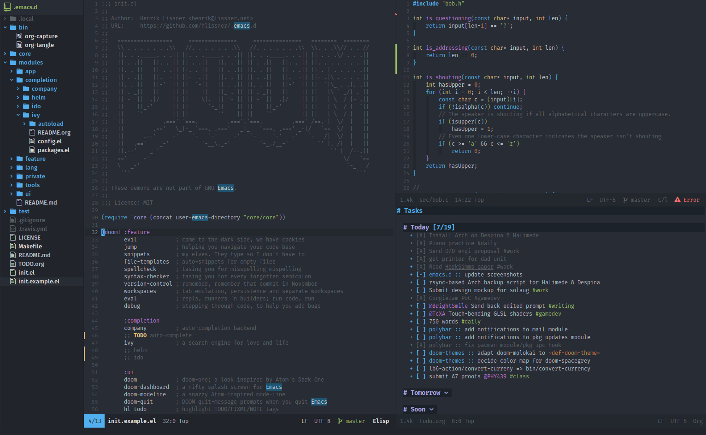

## Doom Emacs


*[Doom Emacs](https://github.com/doomemacs/doomemacs)*

I decided to use Doom Emacs. When I first started I actually spent a few days trying to start from scratch, by following some tutorials and installing a few plugins I was able to get something pretty good, but the ceiling or limit to what Emacs can do is so high. I resisted it a bit at first, but I eventually made the decision to offload the work on creating a crafted Emacs experience people who have been this for years, and with that decided to install [Doom Emacs](https://github.com/doomemacs/doomemacs).


### Plugins

Here's a subset of the plugins I've enabled in Doom Emacs related to writing:
- zen
- undo
- syntax
- grammar
- markdown

A lot of what you need from Doom Emacs is enabled by default.

One of Emacs default behaviours I didn't like was how moving the cursor up or down would skip wrapped lines.

To fix that, I needed to add this to my `config.el` file

```
(map! :nv "j" #'evil-next-visual-line
      :nv "k" #'evil-previous-visual-line
      :nv [up]   #'evil-previous-visual-line
      :nv [down] #'evil-next-visual-line)
```

## Shortcuts

There's a plus and minus to using a keyboard driven application. On the plus side, you can execute commands and navigate very quickly. But the negative is that until these commands and actions become muscle memory, things are very slow.

One thing I appreciate about Emacs is how you can search through every available command by using the hotkey `M x` or (Alt + x). It helps, but the there are so many actions you need to learn the hotkeys for. I tried saving all the shortcuts i thought would be important in Obsidian.

### Finding/Saving Files

| Key | Description |
| --- | --- |
| `SPC` `SPC` or `SPC` `p` `f` | Jump to file in project (like Atom/Sublime Text’s goto-anywhere) |
| `SPC` `.` or `SPC` `f` `f` | Explore files in current directory |
| `SPC` `f` `S-f` | Jump to file under current directory (recursive) |
| `SPC` `f` `s` | Save file |
| `SPC` `f` `S-s` | Save file as (prompts for location) |
| `SPC` `o` `p` | Initialize or toggle treemacs |
| `SPC` `o` `P` | find and focus the current file in the treemacs window |

### Leaving Emacs
| Key | Description |
| --- | --- |
| `:qa`    | Quit Emacs    |
| `:wqa` | Save all buffers and quit Emacs |
| `SPC` `q` `q` | Quit Emacs |
| `SPC` `q` `r` | Restart Emacs and restore session |

### Search (and Replace)

|Key|Description|
|---|---|
| `SPC` `/` or `SPC` `s` `p`|Search across current project|
| `SPC` `s` `S-p`|Search another project (prompts you to select one)|
| `SPC` `s` `d`|Search in current directory (recursive)|
| `SPC` `s` `S-d`|Search in another directory (recursive)|

### Buffer Management

|Key|Description|
|---|---|
| `SPC` `,` or `SPC` `b` `b`|Switch to another buffer|
| `SPC` `<` or `SPC` `b` `S-b`|Switch to another buffer across workspaces|

### Window Management

|Key|Description|
|---|---|
| `SPC` `w` `s`|Split the window horizontally|
| `SPC` `w` `v`|Split the window vertically|
| `SPC` `w` `d`|Delete current window|
| `SPC` `w` {`h`,`j`,`k`,`l`}|Select window in direction (left, below, above, right, respectively)|
| `SPC` `w` {`S-h`,`S-j`,`S-k`,`S-l`}|Swap current window with window in direction|
| `SPC` `w` {`C-S-h`,`C-S-j`,`C-S-k`,`C-S-l`}|Move current window to edge of frame in direction|
| `SPC` `w` `u` or `C-w` `C-r`|Undo or redo last change to window configuration|
| `SPC` `w` `o`| Enlarge current window. Again to undo.|
| `SPC` `w` `m` `m`|Delete other windows. Again to undo.|
| `{N}` `C-w` <code>\|</code>  |Change width of current window to `N` (a number)|
| `{N}` `C-w` `_`|Change height of current window to `N` lines|

### Font Size

|Key|Description|
|---|---|
| `C--` | Decrease font size |
| `C-=` | Increase font size |
| `C-+` | Reset font size |

### Writing

| Key | Description |
| --- | --- |
| `SPC` `t` `z` | Toggle Zen mode |
| `SPC` `t` `Z` | Toggle full-screen writeroom-mode |
| `g` `s` `SPC` | Jump to character |
| `M` {`up`, `down`} | move section up or down |
| `z` `n` | Create indirect buffer and narrow it to current sub-tree |
| `z` `N` | Widens narrowed buffers |
| `SPC` `m` `s` `n` | Narrow buffer to the current sub-tree |
| `SPC` `b` `c` | Clone indirect buffer |
| `SPC` `b` `C` | Clone indirect buffer to another window |
| `SPC` `w` `d` | Delete current window |


### Modifying Text Objects

| Key | Description |
| --- | --- |
| `c` `t` `[char]` | Change until target character |
| `c` `i` `w` | Change inner word |
| `c` `i` `"` | Change inner quotes |
| `c` `a` `"` | Change around quotes |
| `D`,`d` `$`| Delete from cursor to the end of the line |
| `C`,`c` `$` | Change from cursor to the end of the line |
| `x` | Delete a single character under the cursor |
| `r` | **Replace** a single character and stay in Normal mode. |
| `o` | Open a new line **below** the current one and enter Insert mode. |
| `O` | Open a new line **above** the current one. |
| `>` | Right indent  |
| `<` | Left indent |
| `=` | Indent text |
| `~` | Invert case of character |
| `u` | **Undo**. |
| `C-r` | **Redo**. |

### Jumps

| Key | Description |
| --- | --- |
| `w` | Jump to the **start** of the next word. |
| `e` | Jump to the **end** of the next word |
| `b` | Jump **back** to the start of the previous word |
| `0` | Jump to the absolute **start** of the line |
| `^` | Jump to the first **non-blank** character of the line |
| `$` | Jump to the **end** of the line |
| `f` `[char]` | **Find** the next occurrence of a character on that line |
| `%` | Jump between matching brackets |
| `:[number]` | Jump to a specific line number |
| `C-]` | Jump to tag under point |
