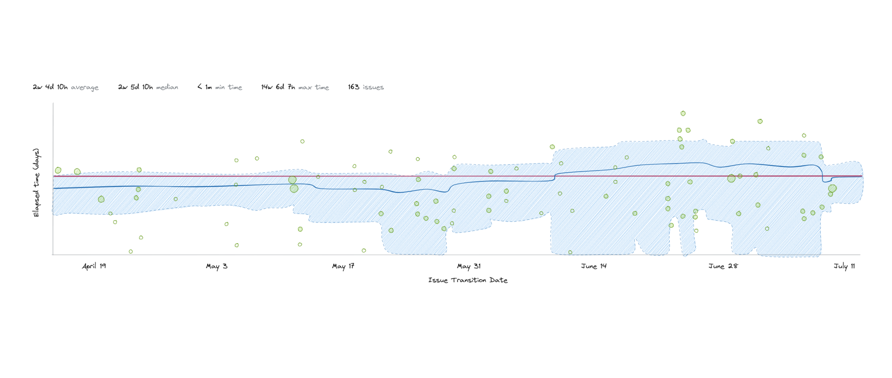

I've never been a fan of any of the reports you get from Jira, but I've especially felt like the control chart should be more useful for all the information it provides.

A few weeks ago, I created a new custom filter that changes what information is displayed, which helps me quickly visually scan a team's workflow for aging work in progress.

Here's what my team's original control chart looked like:


*My team's default control chart*

There are a few reasons I don't like using the default control chart:

- It mixes data for both completed items and work in progress
- It includes non-standard issue types where the lead time does not reflect the actual speed.
- It includes issues that added were on the board before being moved to the backlog

Here's the query, which I added as a Quick Filter, and a bit about how it works:

```
resolution = Unresolved and status not in (Backlog) and issuetype not in (Epic)
```


*My new Jira Quick Filter*

The filter gives me a new control chart with information on all the active issues in progress.

To help me monitor aging WIP, this filter removes all data for issues that are finished or still on my team's backlog. Because I'm only interested in the issues that people directly work on, I also remove epics.


*My team's new control chart displaying active issues*

The new chart shows significantly fewer issues, and I can immediately see what issues need attention.

Unfortunately, the stats on this control chart don't update while items sit in a status. Jira's control chart will only update when an issue's status changes. It's probably not a big problem if your team has short lead times, but the control chart will under-represent the actual item age.

## Conclusion

With this new control chart, we have something Delivery Managers and Scrum Masters can use to actively manage their teams by quickly scanning the current situation and spotting problem issues. This view would benefit teams dealing with high amounts of work in progress or teams with long lead time tails.
