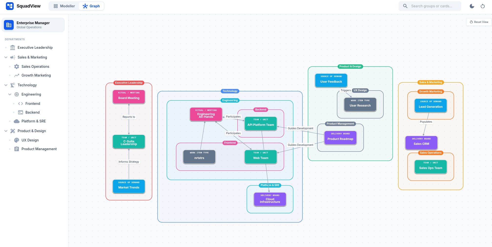
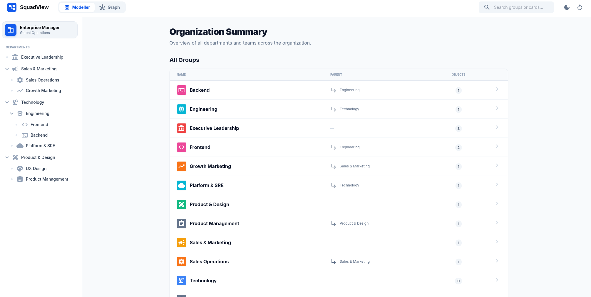
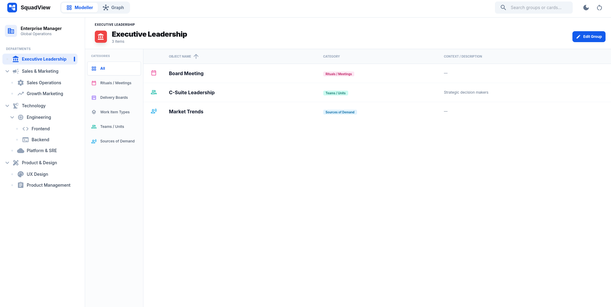
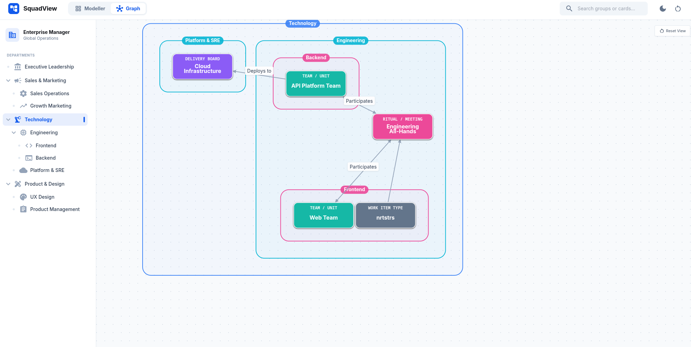

*An organizational map in  [SquadView](https://squadview.vercel.app/)*

I made a new tool in a attempt to better map how work happens in organizations. It's working title is [SquadView](https://squadview.vercel.app/).

## Introduction

Whenever I start work on a new program or team, I always begin by creating a map. It's the only way I feel like I can really understand how things work.

In order to get a clear sense of what's going on, I start by mapping out:
- **Organization and Team Structure:** Which teams are involved, and which departments do they report into?
- **Boundaries of Responsibility:** What systems or activities is each team responsible for?
- **Management:** Who is managing each of these groups?
- **Collaboration:** How do these different people and teams work together?
- **Work:** How does work move through the system?

## The Work Graph

Despite how useful I've found this activity, I've never found anyone who's done anything like it. I will typically make one of these on my own after joining a project, then start showing it to others to help them figure out the bigger picture.

The most I ever see are static tables listing team members, titles, and resources—which tells you who people are, but not what they do together.

In the past, I relied on digital whiteboards to sketch these pictures out. While that worked okay, I wanted to build a more fit-for-purpose solution, something specifically designed for mapping how teams and work are connected.

Typical models usually focus on parts of this picture:
- Org Structures show how people are organized into hierarchical groups
- Workflow maps (Kanban/Value Stream Maps) show how work flows through teams and activities.

But some elements were always missing from the picture:
- **Sources of Demand:** Where is the work coming from?
- **Meetings:** What meetings and do these groups rely on to keep moving?
- **Layers:** How does information flow vertically across different levels of the hierarchy?

## Stakeholder Maps

When I tried to find stakeholder maps online, the templates popular in Project Management were all artificial and conceptual.

Tools like the Salience Model, the RACI matrix, the Stakeholder Knowledge Base Chart, and the Power/Interest Grid all focus on stakeholders as a separate audience. They try to represent relationships using arbitrary categories and a structure that doesn't match how people work together.

These maps also focus entirely on stakeholders' power, influence, interests, and their involvement. These are not generally useful concepts when thinking about the delivery of work.

## Highlights
- **A functional stakeholder map:** It creates a functional view rather than just a political one.
- **Navigate new structures:** When organizations can't support stable teams, they often have to spin up new teams and new networks for every new initiative. These sorts of maps can help people navigate new systems.
- **Visualize waste:** It brings "hidden" wastes to light—overloaded teams, too many meetings, and bottlenecks.
- **Expose dependencies:** It reveals the handoffs responsible for slowing work down.

## Gallery

*A sleek interface for managing different groups in your organization*

*Add various meetings, teams, roles, work types to your organization's different groups*

*Zoom in on just one team or department in your organization*

Check out [SquadView](https://squadview.vercel.app/)

(Also, I'm open to suggestions for what to call this kind of graph.)