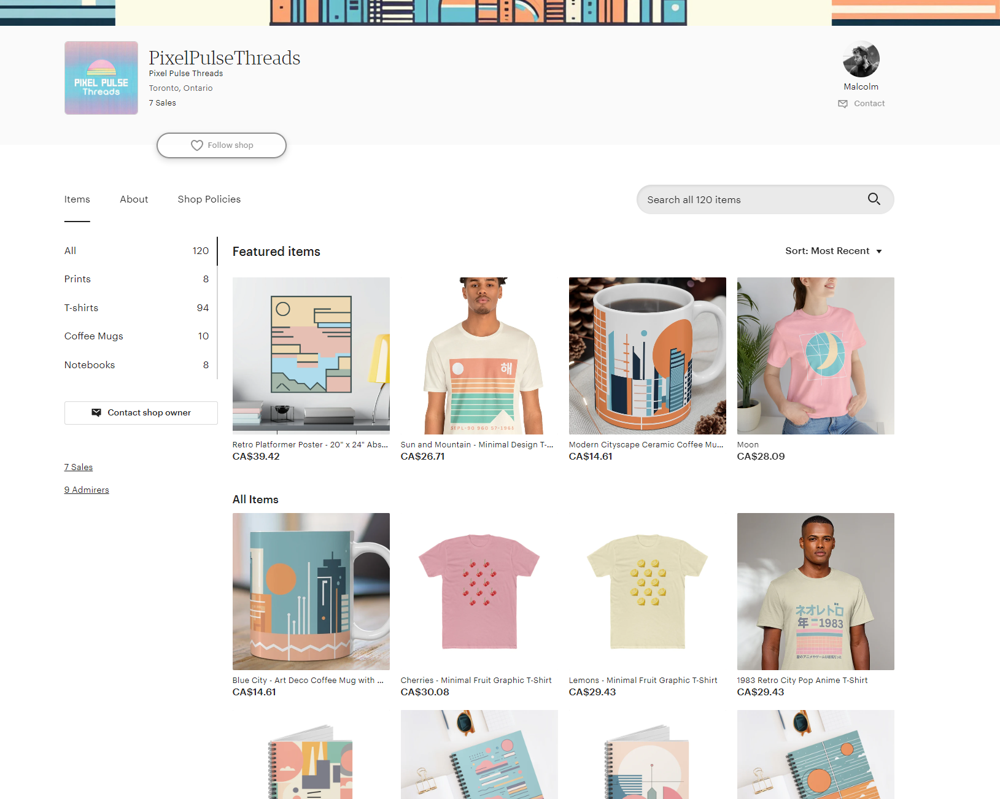
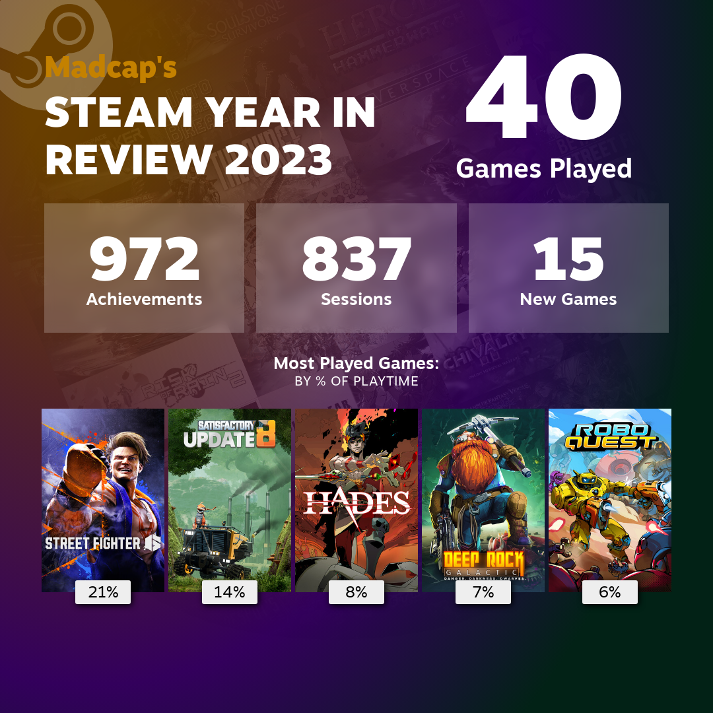

As we start 2024, it's a good time to reflect on what I've achieved in 2023 and what I hope to accomplish in the coming year. Here are some reflections on the past year and my goals for 2024.

## Blog

Here are my blog's stats for 2023:

- 24 posts
- 26k words
- 36 likes
- 3 comments
- 13 new subscribers

Next year, I'd like to focus even more on the blog. While the blog didn't pull in big numbers this year, I'm still proud of everything I wrote. 

I see a lot of the same shallow Agile content shared online and lots of people practicing fake Agile, which frustrates me and drives me to do something different. 2023 was a rough time for many industries with lay-offs, and I know many Agile Coaches who were similarly affected.

I encounter lots of unique and different situations in my work. I am lucky to have the opportunity to experiment with new ideas and try different techniques in practice to solve real challenges. As long as I put in the effort, there's plenty of material to write about. I hope my writing can take those experiences and lessons learned to make a small but positive difference.

## Smaller Steps

I reflected on my Agile Coaching practice and realized that I often create interventions, workshops and exercises that start but don't always finish because clients are too busy with other things. In 2024, I want to focus on developing and sharing interventions that help my clients take smaller steps. 

Steps are small activities that create a positive and complete change that will either help clients see things differently (gain new knowledge or understanding) or do things differently (implement a new practice).

## Pixel Pulse Threads

*My Etsy shop, [Pixel Pulse Threads](https://www.etsy.com/ca/shop/PixelPulseThreads)*

I'm a big fan of the retro animes of the 80s and 90s and the City Pop genre of Japanese music. In the latter half of the year, I created an online print-on-demand shop called [Pixel Pulse Threads](https://www.etsy.com/ca/shop/PixelPulseThreads) to sell t-shirts and other goods with designs inspired by that era generated with the help of AI. 

So far, I've managed to produce a total of 120 different designs. In total, broken down by product, my shop now has:

- 8 prints
- 94 t-shirts
- 10 coffee mugs
- 8 notebooks

The shop has only generated 7 sales, which is fine because the costs to operate the store are low, and the experience of creating the shop and making these designs has been rewarding and a great learning experience.

## Logseq & Obsidian

I've used [Obsidian](https://obsidian.md/) for over three years to collect and connect quotes and highlights from books, articles, and videos. However, little has changed in Obsidian since I studied and consumed a lot less this year than in previous years. 

Instead, in 2023, I started using [Logseq](https://logseq.com/) more as my central scratch pad. I would use it to draft my blog posts, as a daily journal, to track high-level todos and to capture any thoughts I had while reading articles and throughout the day. I used it to create a database of video games I want to play. I've even used Logseq to save my different t-shirt designs and sources of inspiration for Pixel Pulse Threads. Overall, Logseq has been an adaptable tool that helped me stay organized and track my thoughts.

Because I've been using Logseq a lot more this year, I've even considered moving everything I had in Obsidian (roughly 2,400 files) to Logseq. I have yet to make any decision, but I'm considering it.

*My Logseq graph as of December 2023*

*My Obsidian graph as of December 2023*

## Gaming

*My [Steam Year in Review 2023](https://s.team/y23/ftqnvcg?l=english)*

I spend a lot of time gaming. For the first time this year, I felt the urge to achieve all the achievements in some of the games I had in my library. I got to work, looking through the games I liked and where getting all their achievements was reasonably doable.

The games I was able to "perfect" in 2023 include:

- [Risk of Rain 2](https://store.steampowered.com/app/632360/Risk_of_Rain_2/)
- [Hades](https://store.steampowered.com/app/1145360/Hades/)
- [Dysmantle](https://store.steampowered.com/app/846770/DYSMANTLE/)
- [Everspace](https://store.steampowered.com/app/396750/EVERSPACE/)
- [Into the Breach](https://store.steampowered.com/app/590380/Into_the_Breach/)
- [Ys: Memories of Celceta](https://store.steampowered.com/app/587110/Ys_Memories_of_Celceta/)
- [The Surge](https://store.steampowered.com/app/378540/The_Surge/)
- [Hardspace: Shipbreaker](https://store.steampowered.com/app/1161580/Hardspace_Shipbreaker/)
- [The Ascent](https://store.steampowered.com/app/979690/The_Ascent/)
- [Inertial Drift](https://store.steampowered.com/app/1184480/Inertial_Drift/)

If you want a complete look at my year in gaming, you can visit my [Steam Year in Review 2023](https://s.team/y23/ftqnvcg?l=english).

## Matrix and Mastodon

*Image: [A new onboarding experience on Mastodon](https://blog.joinmastodon.org/2023/05/a-new-onboarding-experience-on-mastodon/)*

Finally, in 2024, I would like to have more conversations over on [Matrix](https://matrix.org/) and [Mastodon](https://joinmastodon.org/).

Matrix is a decentralized, security-focused, and open-source standard for communications. It falls behind in features compared to Slack and Discord, but it lets you create communities and communicate without dealing with paywalls or monetization schemes. There's also a growing collection of [clients](https://matrix.org/ecosystem/clients/) available for different platforms.

I've created a [space specifically for readers of this blog](https://matrix.to/#/#flowfocused:matrix.org), and I hope to see more people join me on Matrix.

Meanwhile, Mastodon is an open source, federated alternative to Twitter which I've been using since 2016. You can find my Mastodon profile at [https://mastodon.social/@malcolm](https://mastodon.social/@malcolm).
