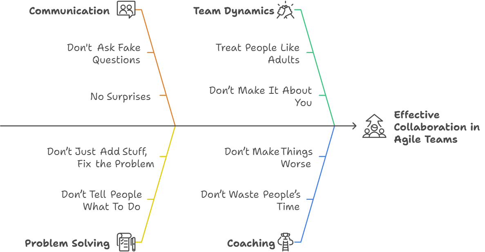

In my time working with different teams and organizations, I’ve found myself repeating certain lessons that have proven consistently effective at helping improve how teams work together. I’ve started calling these my "Golden Rules.” These are principles that I teach to the teams and leaders I coach and that I also try to follow in my own work.

I expect that I’ll come up with more in the future, but here are the nine I’ve collected so far.

- Don’t ask fake questions
- Don’t tell people what to do
- No surprises
- Don’t show and tell; do it together
- Don’t make it about you
- Treat people like adults
- Don’t just add stuff, fix the problem
- Don’t make things worse
- Don’t waste people’s time

## Don’t Ask Fake Questions

I tell people not to ask fake questions when they try to appear more collaborative and friendly by sugarcoating what they say. For instance, the question, ‘What do you think about this approach?’ is fake when it really means, “This is what we’re doing.”

This rule emphasizes direct communication:

If you want someone to do something, clearly state what and why.

When you dislike something, express your concerns and explain your reasoning.

If you notice an issue, point it out directly and seek clarification.

While suggestions and noting can help bring issues to people’s attention, being too passive can make finding a solution take longer, as people need to work through the extra “padding” of what you’re trying to say.

I usually see managers and Agile Coaches fall into this trap when they want to avoid a command-and-control style but have no other tools than telling people what to do.

## Don’t Tell People What To Do

This rule warns about the costs of assigning people tasks without first considering what you’re trying to achieve. Tasks can create a lot of waste and create environments that encourage effort, the amount of work done, instead of results, the outcomes achieved.

Another way I sometimes deliver this message is from the assignee’s perspective: “When somebody tells you to do something, don’t do it.”

In both cases, I want to encourage more mindfulness.

People get too focused on the tasks getting done but ignore the side effects:

Low-maturity organizations like to see people busy with work. These cultures want big work breakdowns with tasks and names attached to them.

Collaboration suffers when there is a division between people who assign and “manage” the tasks and those who execute them.

There’s the opportunity cost of the wasted resources you could have invested elsewhere.

Instead of carelessly handing out or working on tasks, both parties should pause first and talk about the intended outcomes. These discussions about outcomes and strategy are different from the work that typically appears on a team’s task board, so this type of collaboration is rarely considered or practiced.

## No Surprises

When people are negatively surprised, it indicates a communication breakdown. These sorts of surprises create unease, confusion, and defensiveness.

Examples include:

When managers surprise their teams by announcing that they’re implementing new policies

When people learn about important events only when they receive a meeting invitation.

Surprises occur when people communicate and make decisions in isolated pockets and only involve the rest of the team after the fact.

## Don’t Show and Tell; Do It Together

Avoid the approach where one person works on a task in isolation, then later presents their findings back to the team and does a “show and tell.”

Show-and-tells happen in teams that assign tasks to individuals and where people are not used to working together.

Instead, when there’s something to do, do it together. If there’s something important that the whole team should know, don’t put that responsibility in the hands of any one person. Make it a shared responsibility for the team.

This approach improves the quality of work, increases ownership, and facilitates better learning and understanding.

## Don’t Make It About You

You can notice how often people fall into this trap by paying attention to how frequently they start sentences with “I think...”

Starting sentences with “I think...” is especially dangerous for Agile Coaches and managers. Framing everything as a personal opinion often happens when you can only use power or authority to persuade. Too much decision-making through authority takes power and learning opportunities away from the team.

Using authority to push teams in a particular direction is especially dangerous for Agile Coaches because coaches shouldn’t be convincing people to do things or believe things. Instead of pushing their own ideas onto the teams, coaches should support them, increase team awareness and alignment, and help them make their own decisions.

## Treat People Like Adults

Micromanagement and excessive control are antithetical to agility. Trust your team members and avoid “babysitting.” If you cannot trust your team, examine the root causes of this mistrust and address the underlying issues in team dynamics or skills.

A precondition for developing agility is mature, responsible team members interested in improving team performance and results. If that condition is missing, no amount of babying will move a team closer to agility.

## Don’t Just Add Stuff, Fix the Problem

When facing issues, resist the urge to resolve them by adding new meetings or processes. This tendency to solve problems by adding instead of reconfiguring or substracting is known as “additive bias.”

Some problems with this approach include:

Increasing complexity without addressing core issues.

Assuming all existing practices are necessary.

Another danger is how it costs more to remove a new process after it has been introduced and adopted. Instead of adding something new to fix a problem, examine current ways of working, understand the root causes, and fix the real problem.

## “Don’t Make Things Worse” & “Don’t Waste People’s Time”

These two rules are especially relevant for Agile Coaches hired by organizations to help. One of the worst failures coaches can commit is to worsen the situation they’ve been hired to improve.

The most common way Coaches can waste people’s time or make things worse is by trying to direct and instruct teams.

To avoid falling into this trap:

Increase team focus and awareness of the outcomes they’re trying to achieve.

Work to empower teams to make their own decisions.

Think about what you can do to make your interactions with people more effective. Ask yourself, “How can I make this easier for the other person?”

## Conclusion

Remembering these nine golden rules can help you create an environment that supports agility and promotes continuous improvement.
