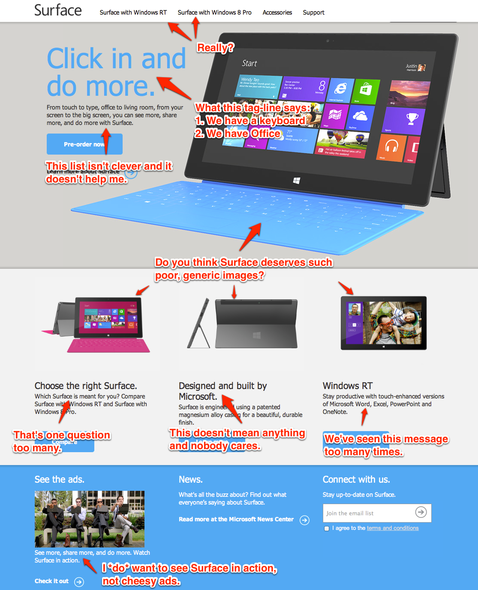

A couple problems I have with Microsoft’s website for Surface.

The whole site makes learning about the Surface such a chore. The content is really bad too. Sometimes it feels like they put it through Google Translate a few times and came out with inflated passages like the following:

> A feat of engineering and a work of art. One touch and you’ll recognize the thoughtful design and precision craftsmanship that make Surface a joy to behold. The unique VaporMg casing delivers a high-quality fit and finish that’s ultra-light and durable.

Technically, the site isn’t finished yet as one of the main navigation elements, Surface with Windows 8 Pro, just shows the user a big “Coming Soon”.

When browsing through the website it quickly becomes clear that Microsoft tried to use this weird pattern of two-word headings for every section:

- "Serious. Fun."
- "Passion. Play."
- "Snap. Apps."

It’s really horrible especially given that only after you read a paragraph can you even understand what the headings are trying to say.

After browsing a dozen pages that each only explain two product benefits, and looking at such shoddy product images, all I’m going to say is this: Pass.
