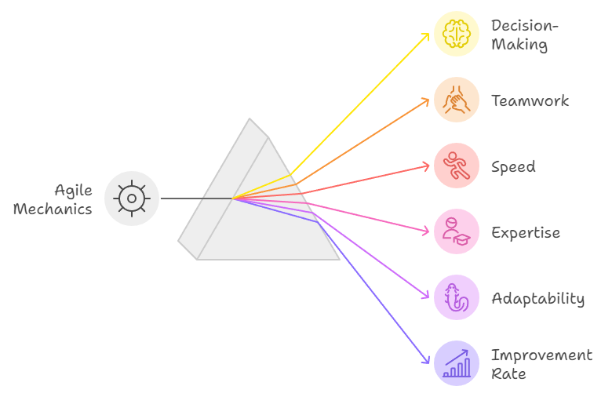
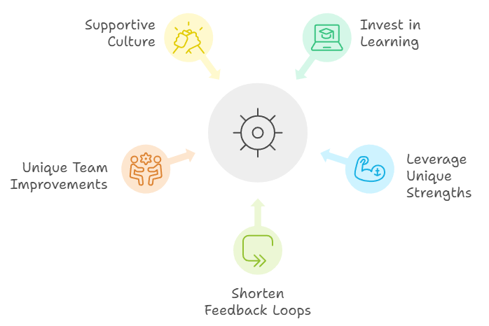

I watched a StarCraft stream last month, and the streamer, a popular StarCraft caster, said to his audience: "Strategies are easier to replicate than mechanics." He expanded and explained how professional StarCraft players don't need strategies to beat weaker players because their mechanics are so strong.

I thought about how this idea could apply to Agile teams, and there's a lesson here about how the things that are easier to replicate aren't what help you succeed. Focusing on adopting frameworks and methodologies overshadows the development of core capabilities.

## Strategies: Easily copied

Strategies in the context of StarCraft are the elements of gameplay concerning how you intend to defeat your opponent. They include different build orders of units and buildings, openings and timing attacks. Players can find guides online listing and explaining all of the various strategies with steps on how to execute them.

In Agile, the strategies would be the visible aspects of how teams intend to practice Agile:

- Agile frameworks and methodologies
- Meetings and ceremonies
- Defined Agile roles
- Artifacts
- Tools and techniques

Teams and organizations can learn these patterns and practices from guides, workshops, hiring consultants, or copying someone else. For example, the most famous example of an Agile strategy that teams and organizations around the world have copied is the Spotify Model.

Organizations spend lots of time, money and effort putting these elements into place, but just having them isn't enough to guarantee improved agility.

## Mechanics: Quality of Action

In StarCraft, mechanics include micro, macro, speed, offence, defence, versatility, multitasking and decision-making. Players can find guides and seek help to improve at these elements of play, but getting better only happens through practice and experience.

Amateurs can recognize professional levels of play when they watch matches, but it doesn't mean they play like them or perform anywhere close to the professional level.

Agile mechanics are not as easy to spot and are impossible to copy. These include things like:

- Decision-making
- Teamwork
- Speed
- Expertise
- Adaptability and flexibility
- Improvement rate

Developing these properties in a team or organization happens through leadership, experience, practice, and a deep understanding of principles.

## Why Mechanics Matter More

While strategies provide a framework for how to organize your organization or team, it's the mechanics that make the real difference in achieving high performance. Here are some reasons why focusing on mechanics yields better results:

**Teams with good mechanics create their own process**: Teams that constantly chase after newer or better frameworks or copy what other teams do generate lots of activity and busyness but don't produce results. Teams with strong mechanics can focus on doing what works and creating and improving their own process.

**Mechanics drive the ability to improve**: While teams can quickly adopt Agile strategies, developing strong mechanics requires the capability to learn and continuously improve. Teams with good mechanics aren't just more proficient in doing the work; they're better at getting better.

**Mechanics help teams adapt to change**: Teams that rely on particular strategies that work well in one context may struggle when the situation they face changes. Teams with strong mechanics can better adapt and apply their skills and principles to changing needs.

## Cultivating Better Mechanics

*Cultivating better mechanics*

Cultivating strong mechanics is not a quick or easy process. It's challenging to grasp what mechanics are, which are important, and how to develop them. Here are five strategies that can help teams move beyond surface-level Agile and develop the deep capabilities that drive real agility:

1. **Invest in learning:** Invest in education and create opportunities for your team to gain experience and develop expertise. Invest in things like workshops, coaching, pairing and mentorship. Learn from others through lectures or case studies. Establish learning goals for people on your team.
2. **Help teams leverage their unique strengths:** Just as StarCraft professionals develop distinct playstyles that match their strengths, Agile teams need to discover what their unique strengths are and work in a way that best suits them. Teams with strong mechanics can develop tailored approaches and processes that leverage their strengths.
3. **Shorten feedback loops:** Developing mechanics takes time, experience, and a commitment to continuous improvement. Not everything will be an improvement; sometimes, things will fail, so shorten feedback loops, celebrate the failures, and create a culture of continuous improvement to improve the chances of success.
4. **Let teams uniquely improve in their own way:** Provide support at the organizational level but allow teams the freedom to develop their own approaches. Even after successfully developing good mechanics within your organization, what works for one team might fail for another. Each team has to go through their own journey and build their own mechanics. This is one of the reasons why well-functioning teams can't be split up or divided in order to spread high performance across an organization.
5. **Good mechanics result from the right culture:** A team can only develop good mechanics if an organization's culture also supports the same goals. Before focusing on what teams are doing, understand what behaviours the broader organization promotes and rewards.

Like those StarCraft pros, Agile teams with good mechanics don't only rely on their strategies to succeed. Teams with good mechanics can shift and adapt as circumstances change and perform at a high level.

## Conclusion

When your mechanics are good, it doesn't matter what method you follow. And if your mechanics aren't good, it doesn't matter what method you follow either.

If it can be copied, it won't make much difference.

Successful Agile teams aren't the ones who install frameworks and invest time in things like polished ceremonies or adhering to methods. The successful teams are the ones who spend time getting good at the things that matter. They develop strong mechanics - the ability to make good decisions quickly, have better teamwork, adapt to changing circumstances, and continuously improve their processes and outcomes.

So, while it's tempting to focus on the visible aspects of Agile, remember that the real power lies in the fundamental capabilities, the mechanics. They can't be copied, but they can be developed.
