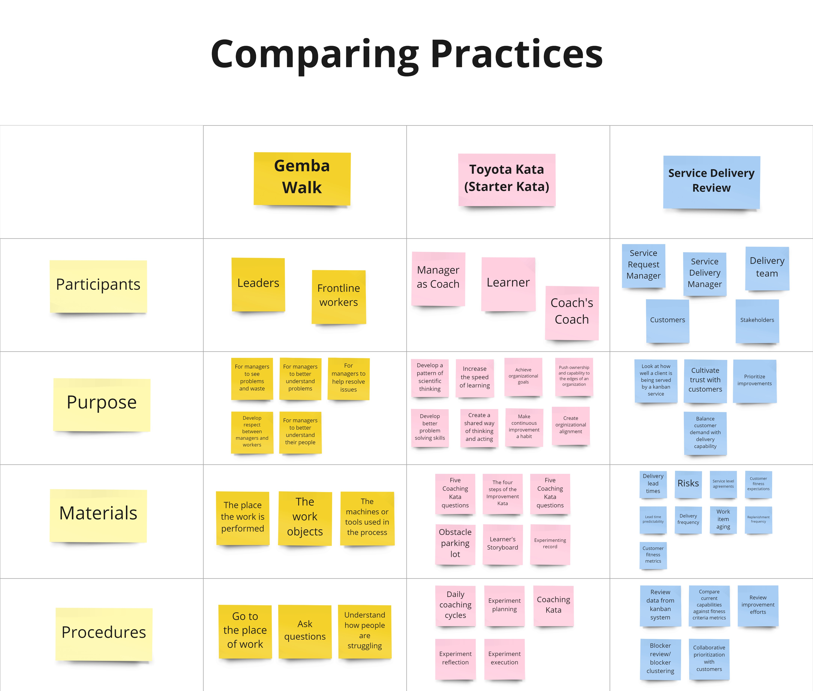
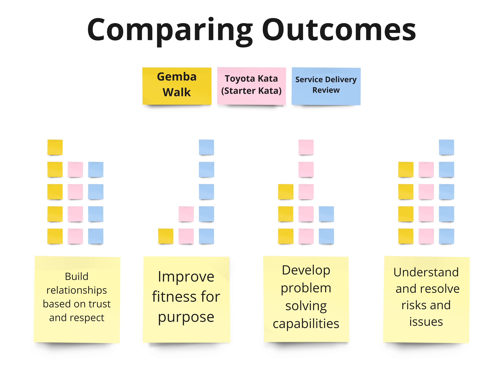
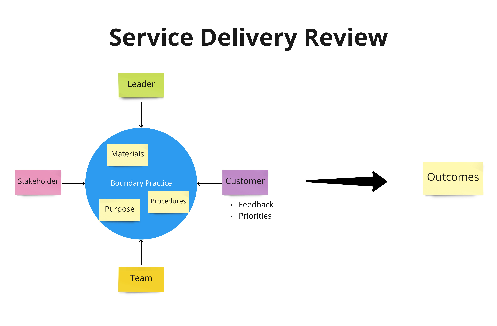

One practice I often see organizations adopt but struggle with is Gemba Walks. Gemba Walks, sometimes called "go and sees," originated from the Toyota Production System, and the principle behind them is that to truly understand what is going on, you have to go where the work gets done and see what is happening. The goal of the Gemba Walk is to encourage leaders whose jobs keep them far from the work to go to the front lines and for front-line staff to take a step back from their day-to-day activities. Together, these groups work to understand and examine the work process for problems and opportunities.

Gemba Walks offer a few benefits:

- It encourages leaders to act as partners and collaborate on problem-solving instead of approaching things with a command and control mindset.
- It trains people to identify waste and problems in their value streams.
- It reduces the hierarchical power gap and develops trust and respect between leaders and frontline workers.
- It provides an alternative to Scrum's focus on managing through plans and commitments.

So what's the challenge? Why do teams often have a hard time implementing Gemba Walks?

Here are the two patterns I typically see:

1. The first pattern is where the Gemba Walk is a meeting where leaders grill the team. Leaders expect status updates, they expect the latest lead time numbers, they want an explanation for the team's throughput, they want to see a cumulative flow diagram, and they want explanations for everything. In this pattern, the team is put into a defensive posture and does its best to provide satisfactory answers.
2. The second pattern is where the Gemba Walk is a meeting, but nobody quite knows what the purpose of the meeting is or what they should be doing. In this pattern, the Gemba Walk becomes a presentation from the team to the leaders, but once that presentation is over, very little happens. Both parties walk away feeling like they've wasted time.

In both cases, rather than promoting new leadership behaviours, the Gemba Walk has been installed as a new meeting. And since behaviours haven't changed, leaders rely on their existing habits.

As I was thinking about how I could coach leaders and teams to have better Gemba Walks, I started thinking of the Gemba Walk as something that creates a new space between the boundaries of leaders and staff in the organizational hierarchy. Teams and leaders come together in this space defined by shared purpose to collaborate. Thinking about this collaborative space made me realize that two other practices I was familiar with shared a similar purpose. So, I decided to examine the differences and similarities between these three practices.

The three practices I compared were:

1. Gemba Walks
2. Toyota Kata (Starter Kata)
3. Service Delivery Reviews

## Comparing Boundary Practices

After some *light* research, I took an inventory of each practice and listed:

- The participants
- The purpose
- The required materials
- The procedures, steps or skills involved

*Breaking down each practice into its components.*

With this picture of the different practices broken down, I then looked at the different purposes of each and tried to identify a set of common outcomes. (The scoring was just an experiment and should not be taken seriously.)

*Comparing each practice against a set of common outcomes.*

What stood out most to me between these three practices is that the Service Delivery Review is the only one that makes it a point to include customers and stakeholders as part of the process. In the Service Delivery Review, customer collaboration drives service improvements and demand prioritization. The Service Delivery Review is also the only practice that makes creating trust with customers and meeting customer fitness criteria an explicit goal.

*The Gemba Walk and Toyota Kata involve the leader and the team.*

*The Service Delivery Review adds the customer and interested stakeholders.*

## Remixing the Gemba Walk

There's no need to choose one of these practices to implement, and there's also no promise that any particular one will work well in your environment. The goal of this exercise was not to score or declare the best of these three different practices but to break each down to a lower level of granularity.

Having decomposed each practice, it's possible to cherry-pick, combine and re-combine the elements of the different practices in order to create something unique that's appropriate to your organization's goals and challenges.
