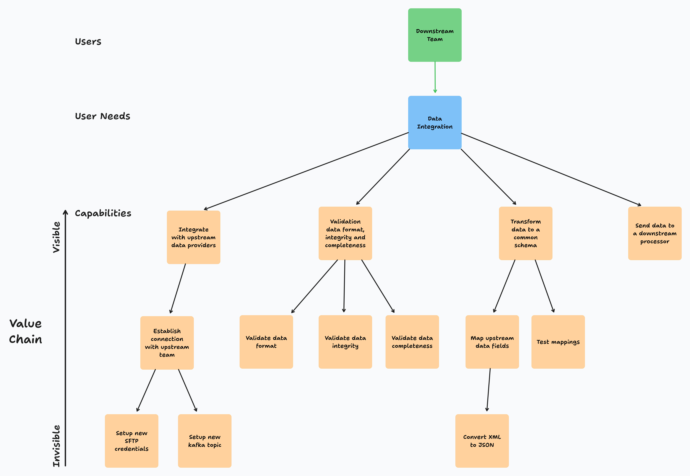
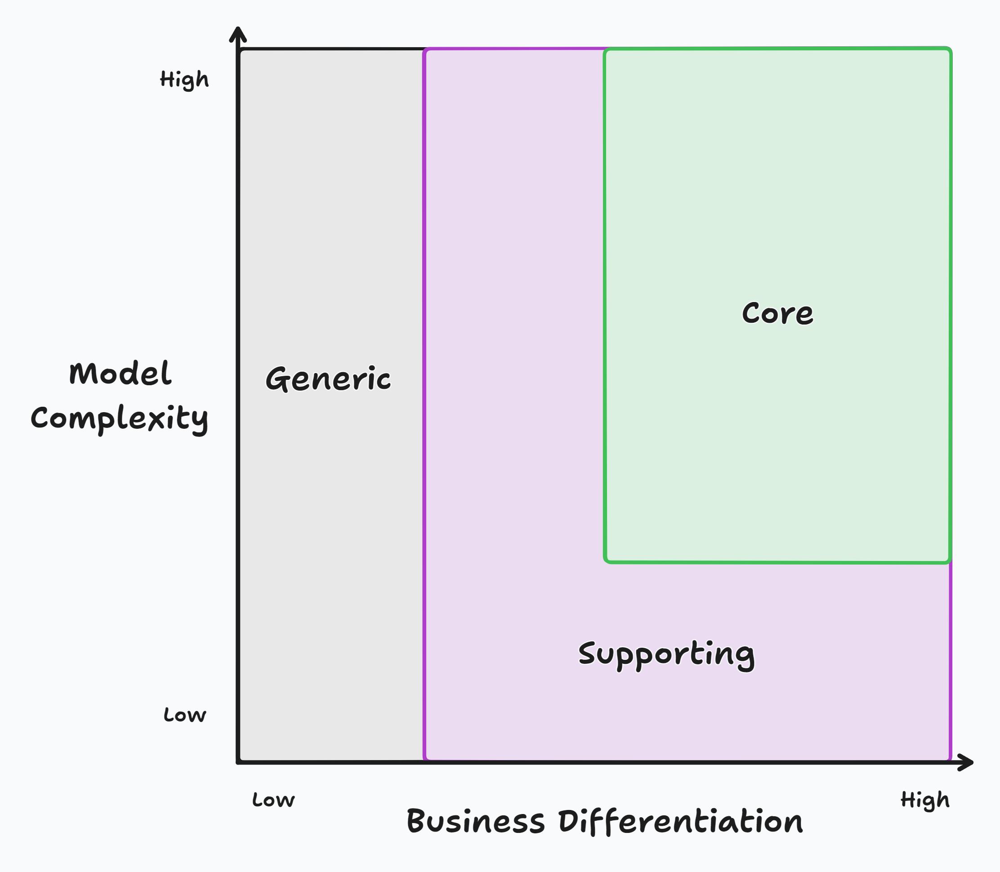

A team I'm coaching faced a challenge with the demand for their team's services far exceeding the amount of work they could deliver. Here's a look into an ongoing exercise I began with this team to help them get control of their work, and how I combined User Needs Mapping, Core Domain Mapping and Team Topologies' ideas on optimizing a team's cognitive load.

## What Was the Challenge?

The team I'm coaching supports delivery teams, integrating their work into broader organizational processes and ensuring the security and integrity of the products and services being released to customers. They work closely with delivery teams before launching new features to eliminate or minimize potential risks.

They deal with requests from many different delivery teams for their services, and they often struggle to keep up and to work within the timelines the delivery teams are trying to meet. Other factors like duplication and different teams implementing different non-standard or not cost-effective solutions also slow the team down.

When I started working with this team, they were stuck in a loop of trying to keep delivery on track through continual planning and re-planning but weren't addressing the root causes. They needed to break this cycle and find a better way to work.

## What Did We Do?

I worked with this team and took them through an exercise involving User Needs Mapping and Core Domain Mapping. The goals of this multi-step exercise were to:

- Understand the team's demand
- Map what activities the team performed to satisfy that demand
- Understand what problems the team was spending time on that had low strategic value

### User Needs Mapping

We started the process by doing [User Needs Mapping](https://teamtopologies.com/key-concepts-content/exploring-team-and-service-boundaries-with-user-needs-mapping). User Needs Mapping is an activity that focuses on the first four steps of creating a [Wardley Map](https://en.wikipedia.org/wiki/Wardley_map).

These steps include:

- Identify the users being served
- Identify the needs to be met
- Identify the capabilities needed to meet those needs successfully
- Connect those users, needs and capabilities in a value chain with dependency relationships included.

We started by identifying the different services this team provided to its users and the different activities or capabilities that enabled the team to deliver those services.

An example User Needs Map showing the value chain between users, user needs and capabilities

For example, if of the team's services is to provide data integration; on the User Needs Map, we would break down all the capabilities required to deliver that service, including:

- Integrate with upstream data providers
- Validate data format, integrity and completeness
- Transform data to a common schema
- Send data to a downstream processor

We repeated this activity for the different services the team provides. After mapping a handful of services, we had a tree-like structure that captured how a few customer-facing services lead to dozens of different internal team activities.

## Core Domain Mapping

After completing the user needs mapping activity, we made a copy of all the capabilities we were able to generate and mapped them onto a [Core Domain Chart](https://github.com/ddd-crew/core-domain-charts).

The Core Domain Chart categorizes systems into three groups depending on their business differentiation and model complexity.

Traditionally, a Core Domain Chart is a tool that helps you map out the parts of your architecture as a portfolio and helps you make strategic decisions about where to focus your efforts. But instead of looking at it through the lens of system architecture, I wanted to understand the team's activities. Of the things they were doing, what was strategic? What was overhead? What was toil?

Core Domain Charts traditionally have two axes, "Business Differentiation" and "Complexity," but to keep things simpler, I relabeled "Business Differentiation" as "Business Value." The way I talked about "Business Value" with the team was by asking them how closely an activity related to their team's core mission. I used the "Complexity" axis to measure how complex, tricky or difficult an activity was.

Based on these two dimensions, we classified the team's activities into one of three categories:

**Core Domain:**

> The CORE DOMAIN is where the most value should be added in your system.
>
> Eric Evans, Domain-Driven Design

These activities are the more complex but differentiating work with high business value and are worth investing time and energy in.

This is the work that aligns with the team's core mission.

This is the most critical domain for the team.

The goal of this exercise, as it relates to the core domain, was to maximize the team's ability to focus on these tasks.

**Supporting Domain:**

> Supporting Domains are business necessities, they contain business concepts related to the domain, but there is limited ROI.
>
> Nick Tune, [Core Domain Patterns](https://medium.com/nick-tune-tech-strategy-blog/core-domain-patterns-941f89446af5)

These are the activities that either have low business value or low complexity.

These activities are needed to support the team's core work.

These activities have to be done and will require attention from the team, but what we want to do is get more efficient at these tasks through techniques such as:

- Training
- Documentation
- Standardization
- Better technology choices
- Communities of practice

**Generic Domain:**

> A universal subdomain that can appear in any kind of software and includes standardized solutions such as account management and support functionalities.
>
> Kamil Nicieja, Writing Great Specifications

These are the activities that have low business value regardless of complexity.

They may be required but unrelated to our offering or core domain.

The goal of activities mapped to the generic domain is to get other teams to handle the heavy lifting or acquire pre-existing solutions for our team to leverage. That way, our team can focus on their core domain.

These ideas of how to treat activities of each domain are directly inspired by the material on germane, intrinsic and extraneous cognitive load found in [Team Topologies](https://teamtopologies.com/).

Combining the capabilities from the Users Needs Mapping onto the Core Domain Chart reveals what capabilities are Core, Supporting or Generic.

## What Did We Learn?

Based on what the team has completed, there have already been some takeaways:

For the first time, made the different services they offer explicit and understood the value chains they operate.

Managers and technical and non-technical team members created a shared model and saw for the first time the long list of capabilities needed by their team to deliver those services.

Sorting their activities into Core, Supporting, or Generic domains challenged the team to think about and define their Core.

## What’s Next?

Unfortunately, this is as far as I've gotten in this exercise exercise with the team and only a snapshot of an ongoing activity. I don't know yet what the ultimate outcomes will be.

I wanted to share what we've done so far because I believe this activity that blends Users Needs Mapping, Core Domain Mapping, and Team Topologies' ideas of optimizing cognitive load has a lot of potential.

Once this team finishes the exercise, they want to share the results with other teams and take them through the exercise. The hope is that by sharing what we've done and taking other teams through this process, then the larger group will be able to define more common patterns, centralize more low-level activities, share best practices, and create the extra capacity needed to handle the increasing levels of demand being asked of them.
