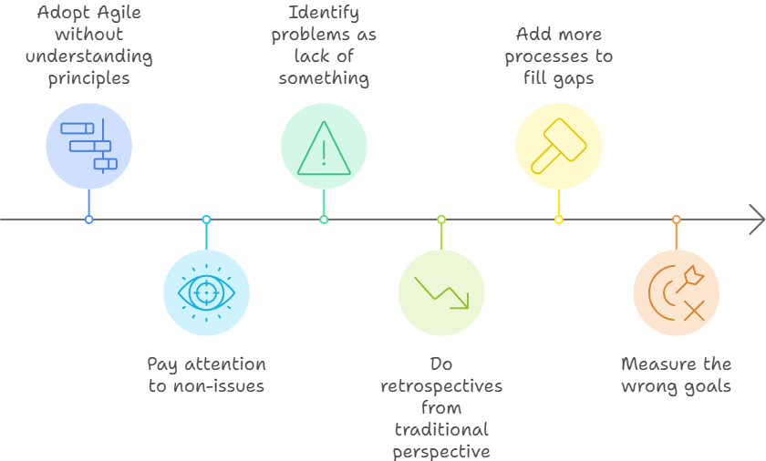

A typical scenario I encounter with teams that want to be more agile is when they slowly start slipping into more Waterfall ways of working. This drift to waterfall happens when the solutions teams come up with to solve their problems and end up negatively impacting the team's agility and adaptability.

Let's look at some real-life examples that illustrate the drift to waterfall in action:

- A team experiences issues with changing requirements, so it decides to lock down the requirements for its next project before starting development.
- To address confusion around roles, a team creates detailed RACI-based role expectations.
- Late deliveries prompt the introduction of thorough project planning and estimation.
- Escaped defects lead to additional review meetings.

These solutions are all logical and seem to address the problems directly. However, these remedies all move teams to a more Waterfall-based approach, emphasizing working with fixed scope, upfront planning, rigid roles and responsibilities, and extra quality reviews.

## The Root of the Problem

The drift to waterfall happens when teams adopt Agile structures and practices without understanding Agile principles. When these teams start doing retrospectives and reflecting on their challenges, they approach problem-solving from their existing traditional perspectives and Waterfall-style thinking.

Traditional thinking sees the causes of problems mentioned earlier as a lack of something (e.g., a lack of clarity, insufficient planning, or inadequate quality control) and then responds by adding more processes to fill those gaps.

Teams that don't understand Agile principles will also pay attention to things more Agile teams won't even think of as problems. I often encounter teams that run Sprint Planning planning meetings where they commit to a specific set of user stories. They'll then start measuring and reporting the percentage of committed stories completed each sprint. More agile teams would instead either focus on a goal rather than specific stories or avoid Sprint Planning entirely.

The solution to prevent the drift to waterfall starts with addressing how a team perceives and interprets their problems.

## Principle-Driven Problem Solving

Understanding Agile principles and applying them to how teams interpret problems and design solutions is the key to countering the drift to waterfall. Understanding Agile principles empowers teams to navigate their challenges in ways that support agility, not create more rigidity.

Here's how Agile principles could alternatively guide us to resolve the problems mentioned earlier:

### 1. Changing Requirements

Instead of locking down requirements, consider these principles:

> Business people and developers must work together daily throughout the project.
>
> Principles behind the Agile Manifesto

> Welcome changing requirements, even late in development. Agile processes harness change for the customer's competitive advantage.
>
> Principles behind the Agile Manifesto

These principles remind us that change is inevitable and that being able to respond to change is an advantage. Rather than trying to eliminate change, teams should find ways to embrace it.

### 2. Role Expectations

Rather than creating explicit and rigid role definitions, remember:

> Build projects around motivated individuals. Give them the environment and support they need, and trust them to get the job done.
>
> Principles behind the Agile Manifesto

> Develop people who are deep in one area and broad in many.
>
> The Principles of Product Development Flow

These principles emphasize the power of team motivation and trusting people to do what's right. They encourage teams to think of people more as T-shaped individuals rather than as single functional experts with strict role assignments.

### 3. Late Deliveries

Instead of detailed upfront planning, consider:

> Our highest priority is to satisfy the customer through early and continuous delivery of valuable software.
> 
> Principles behind the Agile Manifesto

> Deliver working software frequently, from a couple of weeks to a couple of months, with a preference to the shorter timescale.
> 
> Principles behind the Agile Manifesto

These principles promote frequent delivery and short feedback cycles instead of long-term planning.

### 4. Quality Issues

Rather than adding review gates, think about:

> Peer reviewed change approval mechanisms (such as pair programming or code review by other developers) are as effective at creating stable systems as change advisory boards--but have a drastically better throughput.
> 
> Lean Enterprise

> Quality is made in the board room.
> 
> W. Edwards Deming

These concepts encourage building quality from the start and treating it as a product of your development process rather than a separate phase.

## The Coach's Role

As Agile coaches, our role is not to implement Agile practices but to guide and support teams in their growth and development. We do this by coaching them to understand and embody Agile principles, which is crucial in countering the drift to waterfall.

Coaching Agile principles involves:

- Asking probing questions to explore how teams are working and why.
- Helping teams understand the principles supporting Agile practices.
- Encouraging teams to develop their own solutions guided by Agile principles.

Often, my first conversation with teams about how they work is asking them, "Why are you doing this?" The answer is frequently "Because we have to," and at that point, the conversation ends. The requirement to conform kills self-organization and agility.

However, those conversations can still be valuable as we explore how we navigate the cracks of what's possible.

For example, I like to explain to teams how the idea of projects doesn't work well with Agile, but I also have to be pragmatic. These teams work in large organizations where the organization expects and needs projects to function. So, our conversations become about how they can navigate their way through and balance what the Agile principles say with the reality of the team's constraints.

My goal isn't for teams to mindlessly follow Agile principles but to understand them, understand why they're more effective than traditional approaches, and support them in applying the principles in ways that help them.

## Conclusion

The drift to waterfall is a common challenge for Agile teams, but it's avoidable. By having Agile principles inform their perspective and problem-solving approach, teams can resist this drift and increase their agility.

Creating new, principle-informed solutions improves outcomes and helps develop self-organizing teams capable of adapting to new challenges. Agility does not come from adopting Agile structures or practices or treating surface-level problems but from understanding and applying Agile principles.
