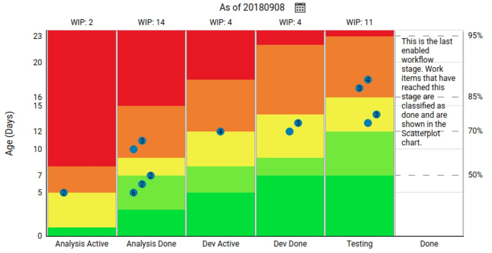

Limiting how many stories or tasks can occupy any particular activity in a team's flow is a commonly recommended practice for teams using kanban systems. This way, the team can avoid overloading their system, reduce multitasking, and improve focus and quality.

Applying work-in-progress (WIP) limits to kanban systems at the story or task level reveals the bottlenecks in a team's flow and forces them to resolve those issues rather than ignore them. Being stuck doesn't feel as productive as working on something, and the effect of the WIP limit effect is to say, "Don't just work on something; get things unstuck instead." 

However, WIP limits can be challenging to set up or stick with:

WIP limits can be hard to enforce or maintain for teams that commonly deal with external dependencies or are sensitive to other interruptions that affect their workflow.

The tools teams use to manage their work can make setting and following WIP limits difficult.

For some teams, asking people to agree to limit their work in progress can sometimes be too much of a change to ask of them.

## What Is Cycle Time, and Why Does It Matter?

I like to use "Cycle Time" when measuring the time required for work to flow through a single process and "Lead Time" for the time work takes to proceed through an entire value stream.

For example:

**Cycle time:** The cycle time for development was seven days, whereas the cycle time for testing was three days.

**Lead time:** The team's lead time from when they started the work to when they deployed was three weeks.

The cycle time of a team's activities matters because having a system with a stable lead-time distribution is one of the most significant improvements a team can make. Planning, making commitments, meeting deadlines, and creating trust with customers are more straightforward when a team's delivery is under control.

> Understanding time in your process is key to improvement, customer fitness and better decisions in your business.
>
> Alexei Zheglov

Shorter and more consistent lead times mean teams can make smarter decisions on when to start new work, can respond to new requests more quickly, validate what they develop sooner, learn more and reduce their risk.

But system lead time, an aggregate measure of all a value stream's activities, can be challenging to act on. Looking at the cycle time data of each activity in your workflow can make things easier.

Value stream mapping, the process of mapping each of the steps of a workflow, is one practice teams can start doing to explore, understand and analyze how work flows through their system.

> The lack of understanding about how work flows—or, more commonly, doesn't flow—across a work system that's sole purpose is to deliver value to a customer is a fundamental problem that results in poor performance, poor business decisions, and poor work environments.
>
> Value Stream Mapping

Another way to understand cycle times is to use something like Kanbanize's [Aging WIP Chart](https://knowledgebase.kanbanize.com/hc/en-us/articles/115001141531-The-Aging-WIP-Chart), which is one of the best tools to understand the typical cycle times of different stages of a workflow and how long the cards currently in that stage have been there. A tool like the Aging WIP Chart makes determining appropriate cycle time thresholds very straightforward.

*The Aging WIP Chart in [Kanbanize](https://kanbanize.com/)*

## My Experience With Controlling Cycle Time

Last year, I joined a team using Jira to manage their work. From the moment I joint this team was using one Jira board to manage two sub-teams, working on multiple unrelated projects. After a few months of working with them, the board transitioned from being organized around sub-teams to feature teams.

In this sort of situation, trying to use WIP limits would run into different problems:

Because WIP limits apply to an entire column, issues in Feature Team A might block any other work from starting.

Because different feature teams are working on various projects in other domains, people can't quickly swarm across projects to resolve bottlenecks.

Since Jira treats all issues the same, WIP limits can easily get exceeded when teams add different work to their boards. On a Jira board tracking epics, stories, sub-tasks, dependencies, and developer tasks, those WIP limits would get quickly clogged by items that aren't necessarily actionable.

An alternative approach I've been using is controlling cycle time instead of WIP. The idea is to monitor how long work items stay in each stage of the process and intervene when they exceed a certain threshold. Teams can use this technique without having to change how they work on a day-to-day basis. Only when work exceeds the cycle-time thresholds are some new behaviours triggered. Even high-WIP states are acceptable as long as work keeps flowing smoothly.

It also creates a new feedback loop when a work item exceeds the cycle-time threshold. The team focuses on the work items that are taking longer than expected and discusses or resolves the causes of delays or blockers.

To implement this approach, you need to do the following steps:

- **Define a cycle-time threshold:** For example, you can decide that any work item in a particular column for more than five days is a warning sign of a problem and that any work item in the same column for ten days deserves immediate attention.

- **Track your cycle time for each work item:** In Jira, you can use queries to automatically give issues different colours based on their cycle times or filters to highlight the work items exceeding your cycle time thresholds.

- **Investigate blocked work:** When cycle times exceed your thresholds, investigate and collect data to understand why those work items take longer. By understanding what kind of work gets stalled in your flow, where things get slowed down and why, you can take steps to prevent those delays from happening in the future.

Capturing what work items are taking longer and why while delivery is still happening allows teams to make more real-time improvements while the details are fresh in everyone's minds.

*Jira's Quick Filters can be used to quickly focus on cards that have been idle.*

*Jira's Card colours filters let you apply colours to cards that match your query.*

The query to capture work items that have been stuck in the same column for over 10 days that I use is:

`not status changed AFTER -10d and created` 

## Conclusion

Teams should look at applying WIP limits at multiple levels whenever they can, limiting the flow of stories or tasks through their Kanban systems and also limiting the number of initiatives, projects or epics they commit to.

In some situations, applying WIP limits can be challenging for teams to adopt, enforce, or get the benefits from. In cases where introducing WIP limits isn't feasible, or even if you already have them, monitoring the cycle times of your work in progress might be another helpful practice to add to your repertoire.

Tracking cycle time can create new feedback loops in a team, shows where the team needs help, and doesn't require significant changes in how a team works.
