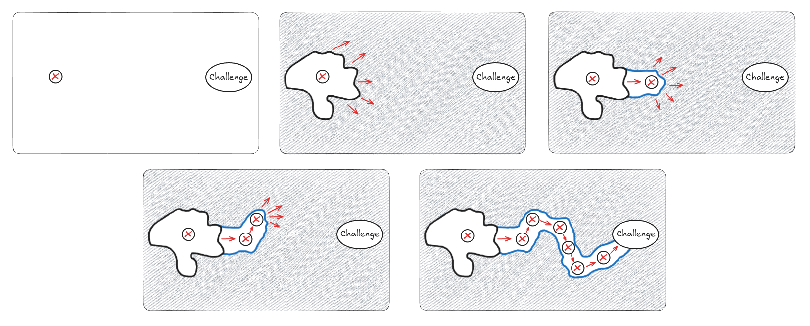

Whenever I come across presentations or articles about MVPs, I often see the same image. It's the one showing a skateboard evolving into a scooter, then a bike, then a motorcycle and finally a car. Henrik Kniberg created this graphic as a part of a 2013 presentation titled "[Spotify - the unproject culture](https://blog.crisp.se/wp-content/uploads/2014/03/unproject.pdf)". His image went viral and is still in the top results when searching for MVP on Google. The graphic was well-intentioned, but over the last decade, it has stolen the show, and the presentation's main point has gotten lost. Everybody shared, wrote about and presented this graphic, but people haven't spent as much time absorbing the rest of the presentation.

*Henrik Kniberg, [Spotify - the unproject culture](https://blog.crisp.se/wp-content/uploads/2014/03/unproject.pdf)*

In this post, I'm less interested in discussing the different ways to do MVPs, better alternative labels, or thoroughly dissecting the graphic. What I am interested in is that, after 12 years, so many IT projects are still doing Big Bang delivery.

The lesson is there in the title of the presentation. It wasn't just a presentation about MVPs; it was a presentation about a lot of things, including how projects are often unsuitable for IT product development.

## The Problem with Projects

Projects are an attempt to "one-shot" towards a goal, setting out on a path to produce the final product from the very start.

With this approach:

- It's a big bet on a distant, predetermined target.
- Value is only delivered at the very end.
- You don't get any customer feedback until the final product is complete.

In practice, a lot of time is spent on planning and reporting, making sure the team delivers on time and "gets it right".

> [!IMPORTANT]
> Trying to "get it right" delays feedback.

The Big Bang delivery approach carries a big risk: If you're building a car, and you discover halfway through that nobody wants a car, you've wasted a ton of effort.

*Attempting to deliver a specific product from start to finish in one large effort.* 

Even "good" project plans cannot be agile:

- **Plans assume correctness.**
	- Big Bang deliveries assume they can get it right the first time.
	- Even prioritizing based on value assumes correctness.
	- Until it's delivered, value is always a guess.
- **Plans tend to become commitments.**
	- Changes to the project plans are considered negative and treated as undesirable.
	- Following the plan becomes more important than doing the right thing.
- **Plans are rigid.**
	- They aim to achieve their final goal in one shot by mechanically organizing resources and activities in an optimally structured way that minimizes waste and maximizes output.

*Henrik Kniberg, [Spotify - the unproject culture](https://blog.crisp.se/wp-content/uploads/2014/03/unproject.pdf)*

One point from the graphic I do think is worth pointing out: In the top example, there are still deliveries happening throughout the project. The problem with the top example is that none of those deliveries are usable by the customer, and so it's impossible to create a useful feedback loop. When we talk about a Big Bang delivery, there may be deliveries happening, but the Big Bang part is when customers finally get something they can use and when useful feedback is possible. A Big Bang delivery embodies all of the guesses and assumptions baked into the project plan up until that point.

## **MVPs, Big Bang & Projects**

Henrik's graphic is a metaphor about delivering something to customers that serves their needs, the advantages of getting feedback and integrating that feedback into the product development process. To focus on just the "Not like this..." slide for a moment, the graphic gets in the way of the lesson in a couple of ways:

- People take the metaphor literally.
- Because it presents the whole sequence at once, it's too easy to think of each flow as a linear process.
- People have all seen the graphic multiple times, so it's harder to use it to teach them anything new.
- People's variations of the graphic have altered the meaning.
- Things are not explicitly labelled, which leaves things open to interpretation, and some key points are missed.

The consequence of these points is that companies still believe in projects and linear plans, but they've just added MVPs to their projects. I've seen many projects structured with MVPs 1, 2, and 3 all defined and scoped ahead of time. These MVPs act more like milestones of a traditional project. I've even seen one project team working on 3 MVPs in parallel. In these cases, what was the goal of each MVP and what kind of feedback loop was being created? The answer is always "bug fixes".

Big Bang delivery projects have become accepted, even by some agilists, by assimilating MVP language and adopting team-level Scrum practices. Meanwhile, companies still suffer from the same costs and problems inherent in large IT projects.

> Project model invites Big Bang thinking
>
> Henrik Kniberg, [Spotify - the unproject culture](https://blog.crisp.se/wp-content/uploads/2014/03/unproject.pdf)

## Iterative and Incremental

Henrik's presentation provided the alternative. Replace big projects with continuous product development.

Approaching product development based on agile principles means embracing iterative and incremental development:

- **Incremental:** Don't try to do it all at once. Build a small, functional piece.
- **Iterative:** Don't do it only once. Keep refining and improving based on what you learn.

Agile teams deliver things frequently, trying to solve customers' needs, trying to learn, making little bets at each step along the way, and adjusting their direction with each new insight. They start with figuring out the best step right now, and with each new insight, identify the *next* best step. It's impossible to capture this process in a project plan neatly; it emerges through the work and the interactions between developers and customers.

No matter what process you follow, if there isn't a feedback loop with customers integrated into your product development, without customers testing things and providing feedback, you're essentially doing Big Bang delivery.

When we focus more on discovery and learning, the speed of learning becomes critical. From this perspective, you could say that all Agile practices ultimately aim to accelerate learning.

> [!IMPORTANT]
> Speed is the only moat.

## **The Current Knowledge Threshold**

*Mike Rother, [Improvement Kata and Coaching Kata Practice Guide](https://public.websites.umich.edu/~jmondisa/TK/Handbook/Practice_Guide.pdf)*

Instead of only relying on the skateboard-to-car model presented in Henrik's graphic, it's also helpful to consider the "Current Knowledge Threshold" model by Mike Rother. This graphic is helpful because it illustrates what's happening at each stage in the process in more detail:

- You start with a clear direction, your "Challenge" – what you're trying to achieve overall.
- You understand your current condition, which marks the boundary of what you presently know.
- Next, you establish a new target condition. This isn't the ultimate destination; it's a tangible step just beyond your current knowledge, typically achievable within a short timeframe (like a few weeks to a few months). The real work happens in the journey from your current understanding to this immediate target condition. This is your "bet".

The overarching "Challenge" provides the necessary sense of direction, but the path to get there is flexible, evolving as teams learn. Teams consistently iterate, moving towards each target condition, learning and adapting along the way. Teams are iterating and incrementing their way closer to the "Challenge".

*The learning process in IT product development, working towards a challenge through incremental and iterative deliveries and learning.*

A lot of the material on MVPs focuses on how the goal is learning, and the Current Knowledge Threshold model does a nice job of showing what a product development learning process looks like.

Using the Current Knowledge Threshold model, it becomes easy to see that trying to "one-shot" to the ultimate goal doesn't make much sense, and neither does pre-defining MVPs ahead of time.

"Output" focused methods produce stuff, but they don't create the same kind of learning as shown in the Current Knowledge Threshold model that Agile does.

## Conclusion

> Big Projects usually fail. Regardless of process.
> 
> Henrik Kniberg, [Spotify - the unproject culture](https://blog.crisp.se/wp-content/uploads/2014/03/unproject.pdf)

This leads us to a core truth I often find myself coming back to: there's no such thing as an "Agile project". Projects use deterministic plans with defined timelines and scope. Agile implies adjusting direction and making small bets based on new information and learning that comes from customer feedback.

You don't need complicated processes, and you don't need fancy agile team structures. You need "small." Small increments, little bets, fast & cheap prototypes, and rapid cycles of continuous learning and adaptation.

*Henrik Kniberg, [Spotify - the unproject culture](https://blog.crisp.se/wp-content/uploads/2014/03/unproject.pdf)*

Without understanding the whole of Henrik's presentation, it's too easy to talk about MVPs and value, yet still plan big, long projects.

To conclude, here's part of Henrik's closing from his original presentation:

> Projects aren’t the only way to get things done
> 
> The standard project model is a tool
> 
> Like any tool, it is suitable for some situations but not all.
> 
> It is often unsuitable for IT product development
> 
> Henrik Kniberg, [Spotify - the unproject culture](https://blog.crisp.se/wp-content/uploads/2014/03/unproject.pdf)