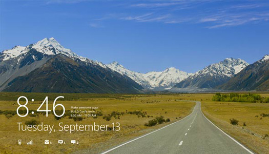

[gallery]

It seems like we all know where computing is going.

Tablets, ultraportable laptops, NFC, smart phones, the Internet of Things...

We know it's coming. It's just a matter of when it'll be ready for consumers.

We also know the interfaces are getting more intuitive and simpler for
the average consumer to use on a day to day basis. So much of the
future seems obvious in fact that not much of it is exciting anymore.

But at the same time software is bigger than ever and is moving faster
than ever.

As the biggest software trend that's already four years old, social
media is still changing and is still disrupting. It's one of few
software trends ever to go mainstream, and new privacy concerns still
come up, most recently with the use of real identities and with social
sharing. Most surprisingly is that new start-ups come out with new
products and services every month.

There's still a lot of unresolved issues with software in general that
the world is dealing with. Software patent litigation, government
injunctions, IPOs, and more direct competition than ever between the
biggest companies in the world. Maybe the most profound change is the
rise of the app ecosystems, markets ruled by private corporations.

It's a volatile time as traditional industries that have been around
for centuries are being disrupted. Publishing of newspapers, magazines
and books, brick and mortar stores, television, movies and music.
Better experiences delivered through new hardware and software are
disrupting these industries.

These industries will always exist, and we already have an idea how
we'll experience them (Tablets, ultraportable laptops, NFC, Smart
phones, the Internet of Things). In the next few years we'll see some
try to save their businesses, and we'll see others use innovative
software to completely reimagine them.

Discovering over the next 10 years what that software will look and
how it will work is what really excites me.
