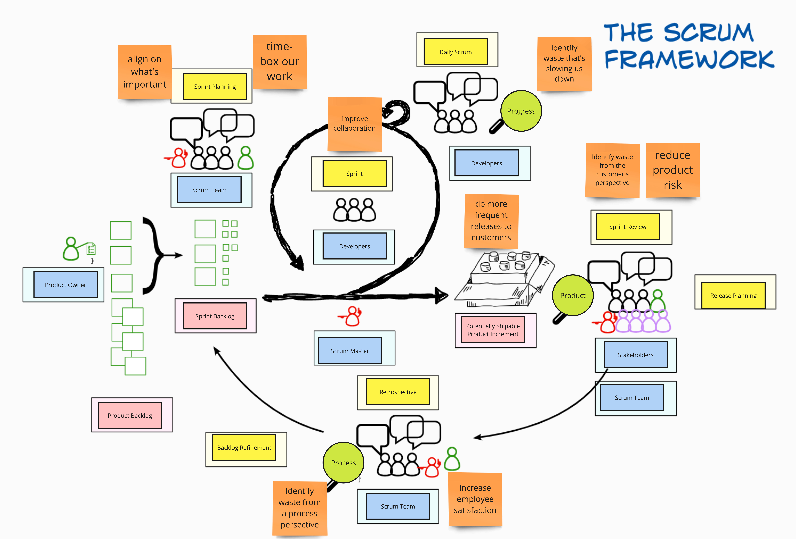

As part of my job doing Agile Coaching, I occasionally have to give training to groups of people, and part of that training sometimes requires that I cover the Scrum framework. But because I like coaching people and teams on agility and not frameworks,* t*eaching Scrum is something I'm always conflicted about.

But the last time I ran a team through Scrum training, I tried a different approach which focused on exploring the meaning and purpose of the various elements in Scrum. By doing that, the Scrum training changed into a discussion about agility and ways of working.

I want to share a few reasons I dislike teaching Scrum and some of the benefits of this new approach.

## What’s the Problem With Teaching Scrum?

Learning about Scrum is not learning about agility.

Scrum defines a set of events, roles and artifacts that comprise the framework, so the first problem with teaching Scrum is that it requires a lot of learning jargon and memorization. People must memorize three artifacts, five events, and three roles, each with different definitions, purposes, and how these elements interact.

Second, teaching teams Scrum can overly constrain people's objectives, giving them the false impression that adopting Scrum alone is satisfactory for success. Scrum describes one way of working, not necessarily the right way and certainly not the best way.

The third problem with teaching Scrum is that it motivates teams to achieve a particular end state and focuses groups on something outside their team rather than on reflecting more critically about how they currently work.

Better ways of working are discovered, not prescribed. That's the lesson I want people to take away from the training I give; a better understanding of what it's like to be agile and the ability to discover better ways of working.

## How I Use Scrum to Teach Agility

Instead of teaching Scrum as a set of roles, artifacts and events, I start with an interactive exercise to set the scene for a discussion on the goals of the various Scrum practices and how they relate to the goals the participants want to achieve. For example, when talking about having two-week, timeboxed iterations, "Doing Sprints" is a terrible goal, but "Getting feedback from customers every two weeks" would be much better.

For the interactive exercise, I'll either use this Mural template Teaching the Scrum framework or whip up my own version of it with a few more helpers and tips that describe Scrum and its different events, roles and artifacts. The drag-and-drop activity makes the training interactive, engages the participants, and is a great exercise to get the memorization-focused parts of the session out of the way. It's a challenging exercise for groups with no clear answer.

[Hard Yard's Teaching the Scrum framework](https://www.mural.co/templates/teaching-the-scrum-framework) Mural template.

After they finish with the drag-and-drop exercise, we review the answer sheet together. I then ask them some more abstract questions:

- What do we want to happen by doing this practice?
- If we didn't have this event regularly, what would happen?
- What problem is this role trying to solve?

As people give their answers to those questions, I'll add sticky notes to the board. Not after long, the visual of the Scrum framework becomes the backdrop to a discussion on agility and ways of working.

During the conversation, if people have conflicting ideas about the goals of specific practices, either how they're done or why, rather than giving them a correct answer or providing a textbook definition, I will typically ask them what would happen if they stopped doing that practice.

One of my goals in my sessions is to have people reflect and share their personal experiences. Stories are an effective means to teach Agile as they are more engaging because they involve real-world examples that the participants can relate to.

There are several reasons I like this approach of using Scrum as a way to teach Agile:

- Starting with an interactive and collaborative exercise gets people engaged.a
- By purposely not focusing on the "what" and "how" of the elements of Scrum, we have to think more critically about "why."
- Sharing stories of people's experiences gives participants more perspective on the goals and challenges of Agile teams.

The workshop becomes more participant-driven rather than facilitator-led.

*A completed Scrum framework exercise with annotations added using orange sticky notes.*

## Running This Exercise

If you want to run this exercise yourself, here are the steps I follow:

1. I start by providing a high-level overview of Scrum and some context about its popularity.
2. I then introduce the goal of the exercise, pointing out the empty canvas and the different shapes the group has to move.
3. I then put the group into breakout rooms of three to four people and set a timer for 10 minutes for them to complete the exercise.
4. As they work, I watch them work and look out for any areas where they struggle and make a note of any parts I should review with the whole group.
5. Once the timer ends and all breakout rooms close, I'll uncover and provide the group with a high-level walkthrough of the answer sheet.
6. I then ask them questions about the purpose and goals of the different Scrum practices. I annotate the answer sheet as they share their responses.
7. Once we finish, I'll create a copy of all the sticky notes and move them into another area of the board, further emphasizing them.

*Key takeaways from a past workshop* 

## Conclusion

The Scrum framework is well-known but poorly understood. That's not a problem but an opportunity as it can lead to more interesting conversations where people share varied or conflicting ideas about their understanding.

By doing an exercise like the one I described, focusing on the meaning and purpose of the elements of Scrum rather than its rules or mechanics, teams have a better opportunity to learn about agility.
