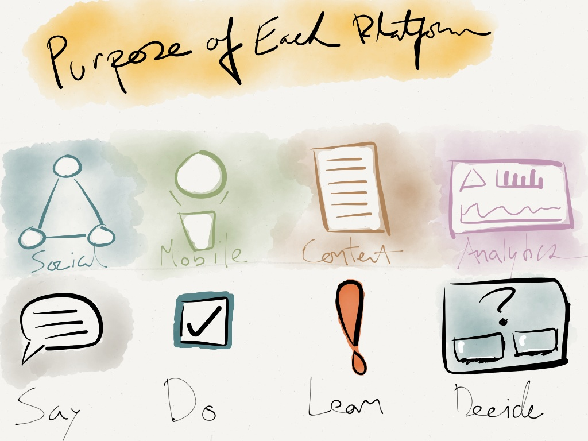

I came up with the idea that each platform has a particular purpose based on what an outcome looks like for the user.

This is another important piece of information when designing the story of your brand experience. As a brand, what are you pushing users towards?
