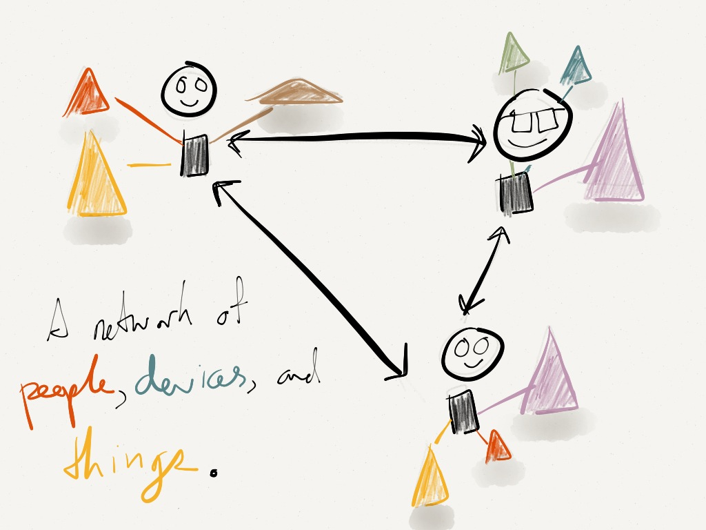

It’s important to realize that we live in a world connected to people and things. While social has already brought us closer to other people, and content helps us navigate the world around us, it’s going to be mobile and analytics that will unlock so much about what we currently see as “Stuff”. Mobile and analytics will tell us the stories about these objects as we see them and across their lives.
