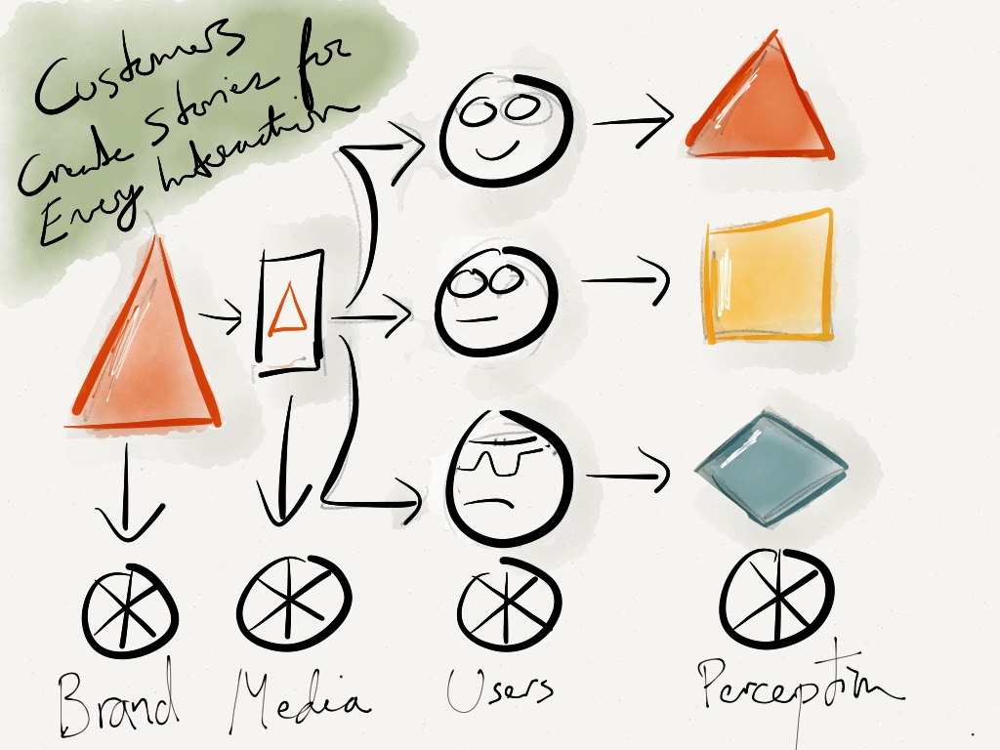

I’ve often heard the saying that consumers define your brand story. That’s a message which is always good to keep with you, but at the same time it’s only a single slice of whats really going on.

Consumers are defining your brand not just by what they say on Facebook, but as a result of every individual interaction they have with you.

It happens with every email, every ad, everytime they use your product and with every call into customer support. Each are instances where your brand is translated into an interaction as media, and communicates with a consumer with a unique profile of their own. The output, the consumer’s perception of your brand, might be different everytime.

There are four different stories here: The brand’s, the media’s, the consumer’s, and the consumer’s perception.
