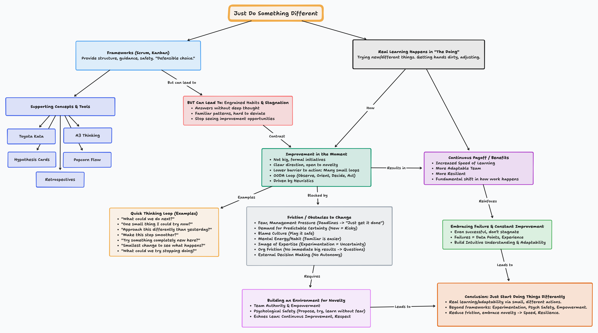

When we talk about agile ways of working, we often emphasize the importance of continuous improvement. Frameworks like Scrum and lean/agile methods, such as A3 thinking and Toyota Kata, provide teams with techniques to implement evolutionary and hypothesis-driven change. While these are all valuable tools, sometimes, the focus on process and planning introduces friction and causes us to overlook where real learning occurs. It happens in the doing.

With Agile frameworks, there's always an emphasis on doing things a particular way or the "right" way. Any practices these frameworks have that encourage experimentation come with too much friction, making it challenging for teams to adopt them consistently while dealing with the pressures of daily work.

Boiling it down to its essence, doing away with frameworks and methods, the thing that's missing is learning through constantly doing things differently, trying things out, seeing what happens, and adjusting.

To learn more, we need to do different things more quickly and frequently.

## Frameworks Create Engrained Habits

Agile frameworks provide teams and organizations with guidance and consistency. They offer a safe path to approach project management or product development based on a set of known or proven practices. And there's comfort in that; nobody gets pushback for suggesting Scrum, adopting Scrum's various meetings, or hiring Scrum Masters and Product Owners. Frameworks provide teams and managers with a solid, defensible choice.

However, this safety has a downside: frameworks provide context-free answers to specific problems without requiring any critical thinking. They can create entrained habits – familiar patterns of thinking and acting that become difficult for teams to break free from. Teams can become so committed to their current way of working that they stop seeing opportunities to improve, even when things aren't quite right. When teams get stuck in static ways of thinking, they stagnate.

## Learning Through Doing

The biggest hurdle to improvement is the friction that gets in the way of people doing things differently. Doing things differently shouldn't depend on waiting for the next bi-weekly retrospective or require filling out a form or reviewing it with your manager.

Doing things differently, experimenting and learning needs to happen in real-time as a natural aspect of working. The goal of the approach is to lower the barrier to taking action. We want to encourage many, much more smaller loops of doing things differently than before.

There are lots of improvement frameworks that require more thorough planning and tracking of experiments; however, this is more akin to the OODA loop (Observe, Orient, Decide, Act) from military strategy, applied to daily work. You observe your environment, orient yourself, act, and see what happens. That experience builds an intuitive understanding. It occurs tacitly, meaning it's fast, without the expense and delay of explicit group discussions, planning, or review. If a small change didn't work out? Try something else. If it worked? Great! Now, try something different again anyway.

In the context of software development and delivery, the point is constant experimentation and evolution.

This approach drives change through simple heuristics – practical rules of thumb – not elaborate, detailed approaches to improvement. Being heuristic-driven means it's a practice that scales because it can be embedded in the daily actions of individuals and teams as they do their work.

What this looks like is pausing before taking action, taking a moment, and first thinking:

- "Am I just doing the same thing?"
- "Could this be better?"
- "What could I try?"
- "Could we approach this task differently than we did yesterday?"
- "Can we make this any smoother?"
- "Could we try something completely new?"
- "What's the smallest thing we could try?"
- "What could we try stopping?"

The goal is to continuously try something different in your local context and nudge things in a better direction.

## The Friction of Doing Something Different

Even encouraging people to make small changes can encounter powerful forms of organizational and cultural resistance.

**Management Pressure to Meet Project Goals**: When there's an intense focus on hitting deadlines, people are driven by the fear of missing them, and the default operating mode becomes "We just have to get it done." Pressure to hit targets leads teams to stick to the known path, even if it's inefficient. Projects often demand predictable certainty, which makes trying anything new feel inherently risky.

**Cognitive Load & Comfort**: Thinking critically about every action requires a significant amount of mental energy. Our brains prefer efficiency and habit. Sticking to what we know is easier.

**Preserving an Image of Expertise**: Some organizational cultures also reward people who project an image of confidence and expertise. Constant experimentation introduces uncertainty and admitting "I don't know," which puts that image at risk.

**High Personal Risk & Friction**: In some companies, particularly those focused on extracting maximum value from existing processes, if a small experiment doesn't match or exceed standard results, people might face uncomfortable questions. The personal risk of trying something different becomes too high to bear. When there's too much organizational or cultural friction, it makes the cost of trying something new prohibitive.

**Blame Culture & Playing It Safe**: Lastly, in organizational cultures without psychological safety, where blame is the norm, people quickly learn to play it safe. They'll do just enough to avoid getting in trouble.

## Conclusion

For this real-time experimentation to thrive, teams need the authority to make decisions about their process. They need to be genuinely empowered. The environment must also be psychologically safe. A safe environment allows people to try ideas without fear of punishment or ridicule. The need for a suitable environment and the importance of supporting people align with Lean principles, such as fostering a culture of continuous improvement and respect for individuals.

Concepts such as Toyota Kata (with its Improvement Kata and Coaching Kata), A3 thinking (structured problem-solving), Hypothesis cards (framing experiments), Retrospectives (structured reflection), and Popcorn flow (a lightweight technique for team experimentation) are popular approaches to experimentation and learning. However, even these structured approaches introduce their own friction. To eliminate any process friction, I believe the core skill is simply building the habit of asking, "What could we do differently right now?" and then doing something.

Real learning and adaptability in agile teams comes when trying something different and learning from those experiences becomes a habit. While frameworks provide helpful structure, growth and learning don't happen by following processes. By reducing friction and barriers to action and embracing a mindset of continuous, small-scale novelty, teams can significantly increase their speed of learning and become more resilient in the face of change. It requires an environment of psychological safety and empowerment where teams feel comfortable experimenting. The key is to just start doing something different.
