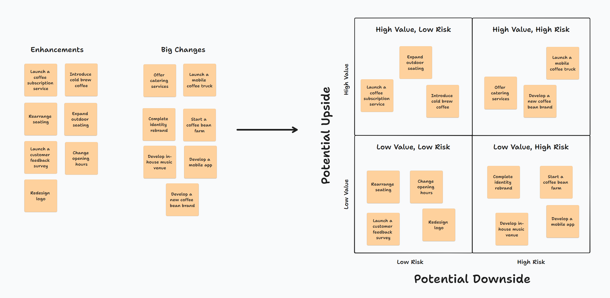
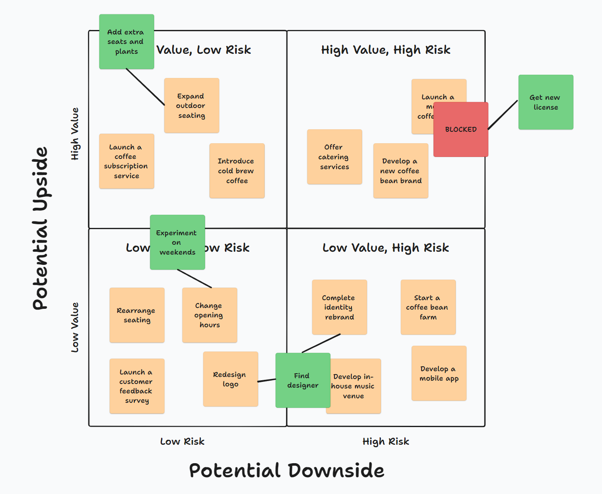
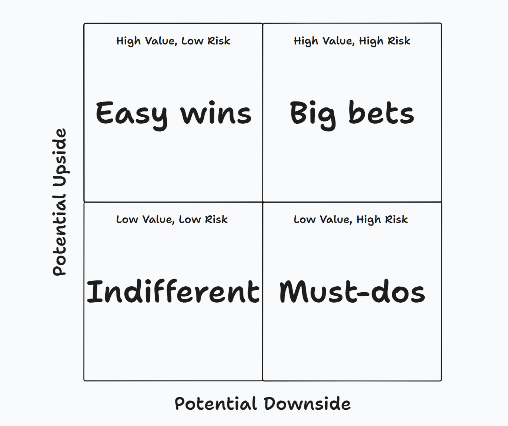

When it comes to dealing with all of the things competing for your attention, one habit I've picked up from practicing [Getting Things Done](https://gettingthingsdone.com/) for over ten years is to start writing down everything that's on my mind and putting it all into an Inbox.

The people I work with always have more work to do than the time to do it, so in my coaching work with managers, we often start by creating an inbox that gets filled with things like

- All the requests they are getting from their bosses
- Their team and delivery-related concerns they want to make sure are ok
- Planning and improvement work they'd like to spend time on
- Organizational accountabilities they have to perform

We apply lots of tools within teams to their backlogs to help them make better selection decisions, but I often find that once we step away from delivery work and move closer to just "work," things revert to unstructured, gut-based decision-making.

## Building the Model

I was working with a manager recently, and he found himself faced with more than 20 different ideas, concerns and improvement projects, and things were continuing to pile up. We were repeatedly returning to this big list of options and scanning it multiple times to figure out what to focus on. I suggested a better way to see things might help us and that mapping those options out would help us see and think about them more clearly.

When we started mapping these options, my client was the first to say, "Some of these are big changes, and some are just enhancements. There can be big consequences if you get the big changes wrong." So, we started by simply splitting the options into two groups, "Enhancements" and "Big Changes."

Note that all the content in the graphics will be using the example of a fictitious neighbourhood coffee shop.

*Breaking down options into enhancements and big changes.*

At this point, we had modelled the risk of our various options and what I was calling the "potential downside," so I suggested, "Why don't we add a second axis to show the potential upside?"

We ended up with a 2x2 matrix with the two dimensions being the risk of doing them wrong and the value of doing them right. Adding this second axis gave us what we needed to organize our options and judge whether the client was focusing on the right options.

*Adding a second dimension of potential upside/value.*

With all of our options mapped, we then annotated it with some extra information, like what actions the client was taking, what options those actions were addressing, and what options were blocked and why.

*Annotating the model with extra info on current activities and obstacles.*

After we added all the various options into the model, we reflected on what it was telling us:

- **Low-risk, low-value:** We found that the options in this quadrant were things nobody really cared about. Even if these sounded like good ideas or someone was pushing for them to happen, it didn't matter if we did them. At the same time, because nobody cared, it allowed us to experiment and try different things.
- **High-risk, low-value:** Only one option, a cost-saving software migration project, fell into this quadrant. In the best case, everything would function as is, and in the worst case, the entire platform would break.
- **Low-risk, high-value:** This quadrant was populated with options relating to automation and time-saving. If we didn't do them, or if we failed, the team could always fall back and continue with what they were already doing. But if they succeeded, everyone's lives would be easier, and the client would save lots of time and money.
- **High-risk, high-value:** The one option that landed in the high-risk, high-value quadrant validated that the client was focusing their attention where it was most needed. This initiative touched on concerns including budgets, team structure and people allocation, which had significant implications for the client's business and its people. A lot was riding on getting this right.

## What the Model Is Telling Us

*The 2x2 helps map options out into four broad categories: Big bets, Must-dos, Easy wins, and Indifferent.*

As simple as it is, I've never seen a model like this used before, so the day after we created it, I spent some time thinking about what it was telling us and how it could be used.

I think the main benefit of this matrix is, I hope, to help people answer the question: **"What should I focus on?"**

It creates clarity on your available options by organizing them into four categories:

- **Indifferent**:
	- Options where it doesn't really matter whether we do them or not.
	- There's a high tolerance for failure.
	- Because there's not a lot riding on these options, there's more opportunity to experiment and discover something valuable.
	- What's important is doing as little work as possible to try something and see if it works.
	- Discover what's possible.
- **Must-dos**:
	- You should avoid these high-risk options with little return.
	- The only options to pay attention to here are the ones you must do.
	- If you have to invest here, the right approach might be to spend as little as is required.
- **Easy wins:**
	- These options bring a lot of value with little risk.
	- The phrase that keeps coming to mind is "It's free," meaning these options are all upside.
	- These options are potentially the low-hanging fruit that are available to you.
- **Big bets**:
	- These options are the big bets because they have a lot of potential value but also carry lots of risk.
	- If you pick up and commit to one of these options, it will likely require more time, attention and energy than anything else.

*Exploring how each quadrant represents the relationship between value and risk.*

After you map your options, the key question you should have more clarity on is: **Are you paying attention and investing time on the right things?**

Still, after completing the matrix, there are some additional ideas that could be useful to think about, including: Breaking high-risk items down and finding ways to reduce the risk or lowering the cost of experimenting and making it easy to try different things.

## Conclusion

I've been cautious in saying "mapping" and not "prioritizing" when talking about this risk-value matrix because when working with this tool, I'm interested in finding a better way of seeing things and understanding the options available, not to make statements to my client about which options are more important or which they should start first.

At most, this tool is something to pull out when faced with multiple options competing for your attention.

Having never seen anything similar used to map out the multiple options on people's to-do lists, I figured maybe I had stumbled onto something new. But it turns out it's been around for a while. After we put this model together, I quickly searched online and found a similar model used in the investment space known as the [Risk-Return Matrix](https://www.icicidirect.com/ilearn/stocks/courses/chapter-6-risk-reward-matrix-for-investment). 

*Taking an idea from the investing space, where do options sit along the line?*
