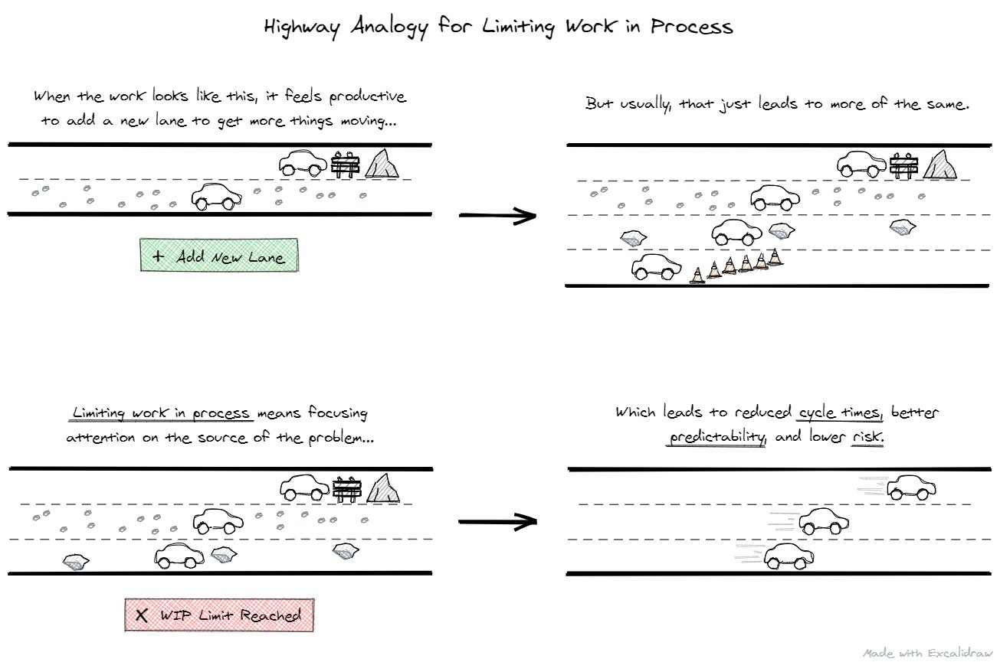
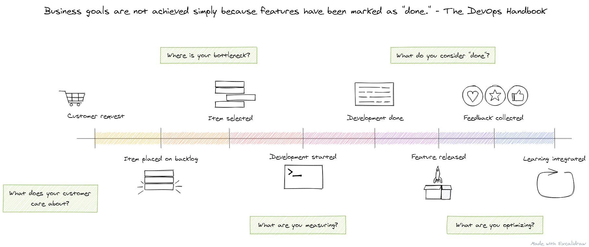
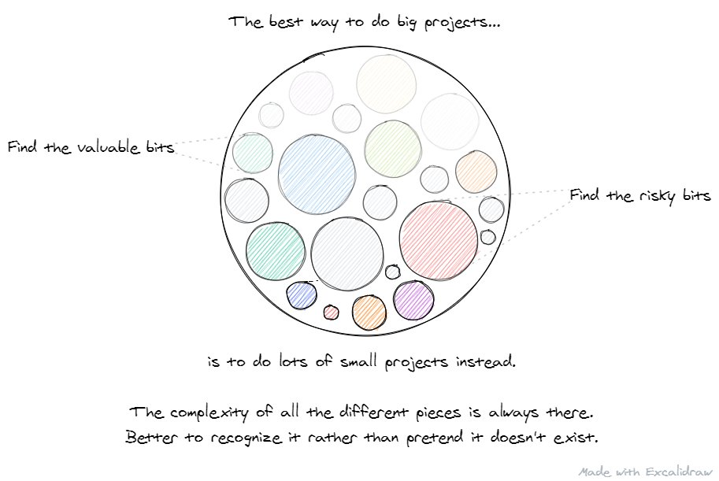
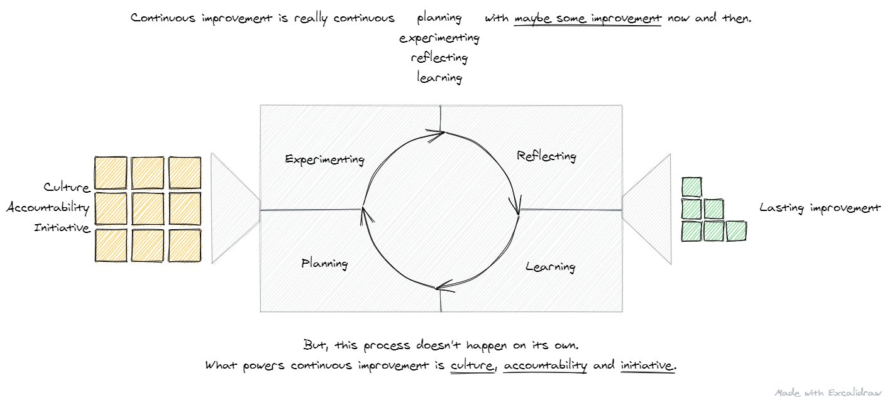
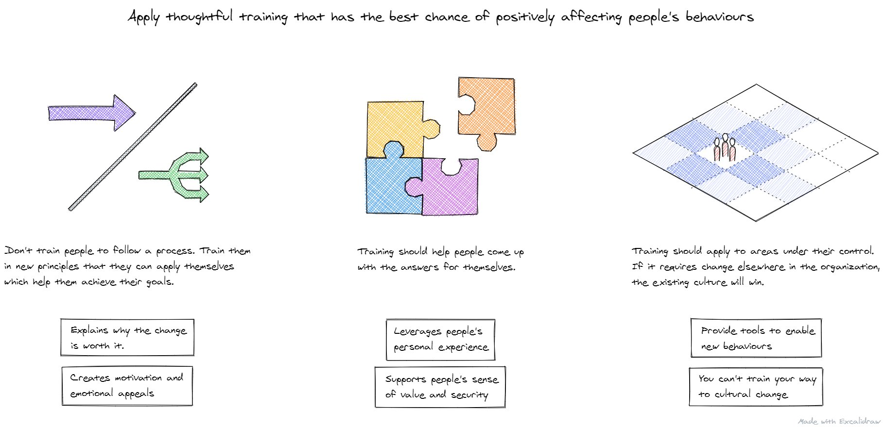
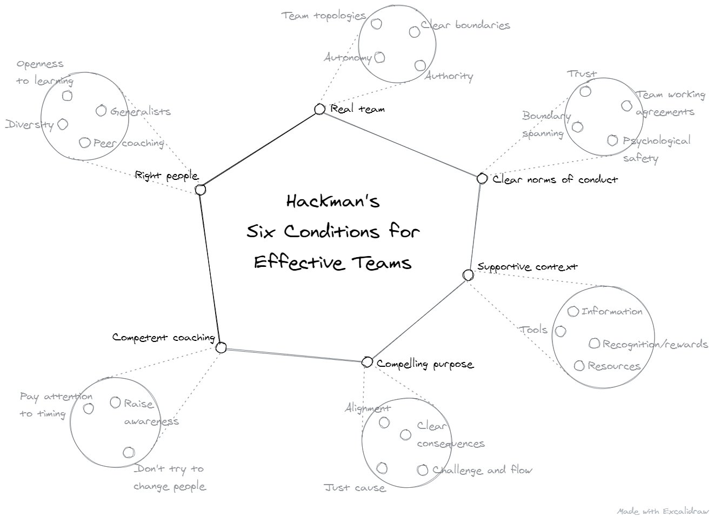

Between September and October of 2022, because the COVID pandemic put my contracts on hold for a few months, I set a personal challenge to create and share 100 agile-related sketches on Twitter. In October 2020, after posting an average of four drawings a day, I completed that challenge. Because I no longer use Twitter, I wanted to repost some of those images here on this platform.

The ideas for these sketches came from all the books I was reading, workshops I attended, and talks I watched. The sketches focused on categories including kanban, change, systems thinking, agile, strategy, organizational design, culture, coaching, product development, complexity, and leadership.

In total, I posted 100 different sketches, but many could have been better, so I will share some of my favourites. These 17 sketches have both a valuable lesson and a cohesive image to go along with it. Here they are, along with their original Twitter captions and some notes on my latest thinking as I look at these for the first time in over two years.

## Kanban

The idea that ties both of these Kanban-related sketches together is understanding the work teams do as services and mapping how those services connect in the bigger value stream.

There's a well-known phrase in Agile, although I don't know who to attribute it to: "The unit of value production is not the individual; it's the team." However, In all the organizations I work with, development teams are only one part of a bigger value stream. Worthwhile improvement can only happen if that bigger system is cared for.

Understanding how work flows through multiple teams is where systems like [Flight Levels](https://www.flightlevels.io/) can help.

The Kanban Lens is a helpful model that reinforces the value of the Kanban principles. What helped me was going from seeing knowledge work as a service in theory to in practice. Seeing it in reality, "Ah! This is a service!" opens up many new opportunities.

Not original, but I attempted to combine a Wardley Map/Maturity Map with the Kanban Maturity Model's dimensions for fitness for purpose.

## Coaching and Change

These sketches are my favourite. The key theme of lots of the sketches around coaching reflected the biggest problems I see in my day-to-day coaching work:

Telling teams what they should do if they want to be agile

Rating, judging or scoring individuals and focusing on fixing them

Having an agenda for how a team should work

Fighting through resistance and pushing change onto teams

Instead of those less efficient and more manipulative change techniques, these sketches promote:

Being adaptable by monitoring change, creating slack, adding feedback loops and keeping changes small

Changing the interactions of actors in a system rather than fixing the perceived problems with individuals

Encouraging the desire to change by helping teams be more aware of their current situation, what's important to them, and what's holding them back

The concept of nudging change, where you look for opportunities to [make change where change is possible](https://malcolmbastien.com/2023/05/05/making-change-where-change-is-possible/)

Change has got to be chosen by people. That's one reason why when I see the signs that some managers are firmly against the work Agile coaches are doing, it's a giant red flag. There shouldn't ever be a "coach's agenda." What are the client's goals? Help them with that.

I'm skeptical of organization change materials that talk about beliefs and values, because when they say you need to have Agile beliefs and values, what are you supposed to do? Reprogram the people in your organization? There are better methods for effective change.

Change curves never did a satisfactory job of communicating the feeling of fog and confusion that comes with change. The talk that happens at the start of a change quickly feels irrelevant as the reality of change happens. Leverage sound theories of change to guide you.

You only manage what you can manage.

## Flow & Lean

Cost of delay, work in progress, waste, and batch sizes are some of the most critical concepts for managers of agile teams to pick up. These sketches are my attempt to communicate those concepts in the hope that one of them gets one of these ideas to click for the first time for people.

All of these sketches relate to work experiences I've had in the past. I've worked with organizations that have struggled with these concepts. One company calculated the cost of delay for every new feature, big and small, and eventually abandoned the system. I worked with another company that deprioritized improvement work so their developers could have more time "hands-on keyboards" to meet a particular project deadline.

Have I seen organizations try to deliver year-long, fixed-date, fixed-scope projects with thousands of user stories and fail? A few.

Using Cost of Delay to prioritize work is transformational. Talking about options in terms of delay cost exposes assumptions, and it challenges the prioritization process. It also shines a light at the real cost of the delays that exist within organizations.

Searching for powerful, visual analogies to help explain the key Kanban concept of limiting work-in-process. A key idea here is that doing things that feel productive tend not to be.

Lean metrics is one of my favourite topics to coach. It's an area where people's beliefs, data, goals, and processes all come together. I've seen how teams treat their metrics act as a pretty good proxy for their overall maturity. Even just lead time reveals so much.

I once heard a manager say, "At some point, we just need them to type code faster." They attributed the lack of results to their team members instead of the systems in place that were actively holding people back.

I heard this line somewhere a long time ago, but this is batch size reduction in practice. Big projects increase overhead, reduce sequencing options, reduce feedback, stress bottlenecks and lengthen cycle times. So avoid doing them.

## Agile

Continuous improvement includes many more activities than just improving. The goal is continuous improvement, but there's more that's required: Planning, experimenting, reflecting, and learning, each of which needs to be supported by the culture of your organization. How much actual improvement you'll get is variable.

I'm a big proponent of focusing on getting just a little bit better but keeping the iterations fast. What can you do today and see the results of tomorrow? Aim to be 1% better than today.

Continuous improvement is a noble idea, but it's essential to recognize how the process works. It's not a process that delivers improvements 100% of the time, and it's not a process that happens on its own. It needs the right conditions in place and constant work.

My favourite part of any Agile training I do is when people share their past work experiences. I also like including someone that has already started working differently. It's an effective way to discuss examples of theories in practice, and both types of participants benefit.

Is there a way to talk about maturity without making it a hierarchy? I took a model of interconnected variables and applied it to the elements we commonly see in organizational maturity models. In this model, one change has many impacts, which you can't know in advance.

## Teams

The key theme across both of the Teams sketches that continues to influence my work is "Conditions." The conditions in which teams operate have a significant impact on their effectiveness. If you don't pay attention to conditions, efforts to change will be crude and ineffective.

Research has shown that leader behavior makes the most constructive difference for teams that are reasonably well structured and supported in the first place. If a team is poorly composed, has an ambiguous or unimportant purpose, and operates in an organization that discourages rather than supports teamwork, there is no way that a leader's hands-on interventions with that team can turn things around.

- J. Richard Hackman, Collaborative Intelligence

What J. Richard Hackman called "conditions" connects to the material about managing complex systems. In the literature on managing complex systems, they're called "Enabling Constraints" or "Constructors." These constructors provide coaches with a broader set of tools to effectively promote positive change.

Even highly motivated people cannot succeed in dysfunctional organizations. A very, very short list of examples.

Hackman's model for effective teams taught me how important it is to have the conditions in place if you want teams to be effective.

# Conclusion

You've just seen 17 of my favourite Agile-related sketches I created and shared on Twitter in 2022. I hope you enjoyed them and learned something new. You may not need to create 100 different drawings as I did, but if you are facilitating meetings, working with a development team or doing coaching, I encourage you to incorporate more visual frameworks and visual thinking in your work. They're interesting, fun, and the clarity they can create can be game-changing.
