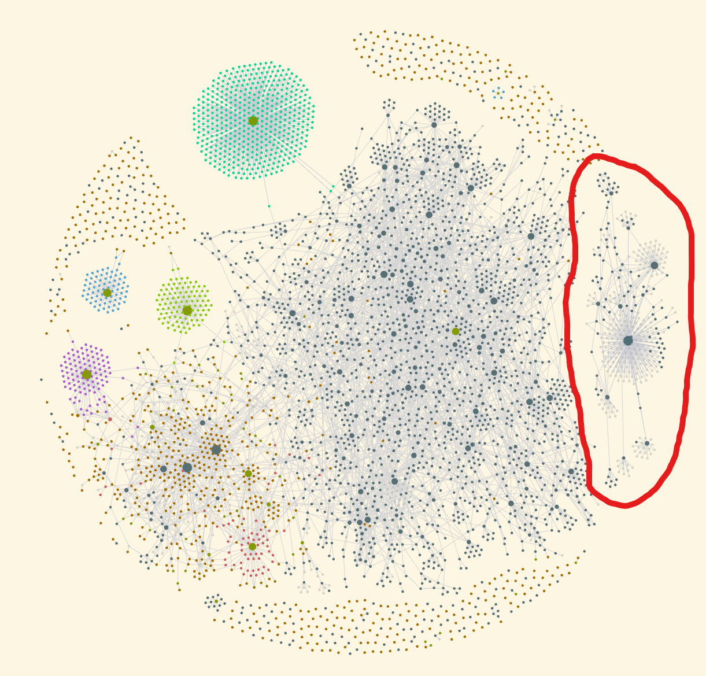
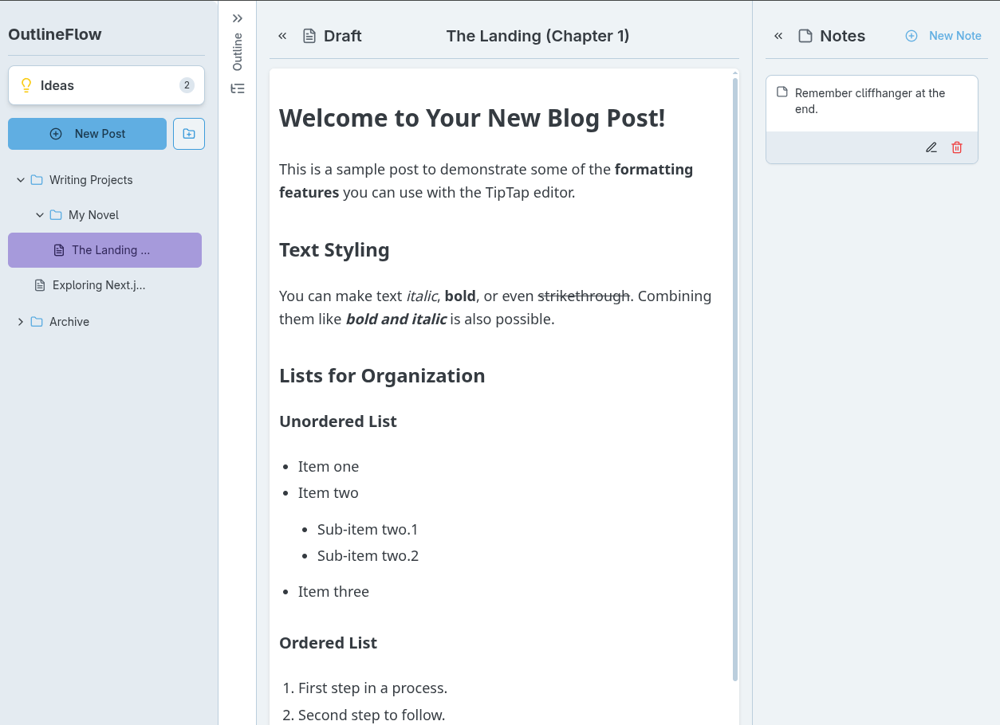
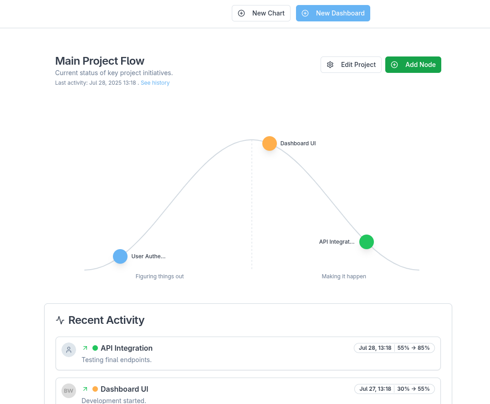

## Learning the foundations

Starting with an understanding of how LLMs worked was important for me, and this led to an intensive few days, consuming multiple YouTube playlists on topics including:

- Neural Networks & Deep Learning
- Transformers and Attention
- Machine Learning
- Math
	- Matrices
	- Gradients & Partial Derivatives
- Prompt Engineering/Context Engineering
	- AI workflows
	- Agents

### YouTube Channels

Here are the specific channels and playlists I learned from.

- [**Professor Bryce**](https://www.youtube.com/@csprof)
	- [Deep Learning](https://www.youtube.com/playlist?list=PLgPbN3w-ia_PeT1_c5jiLW3RJdR7853b9)
- [**Andrej Karpathy**](https://www.youtube.com/@AndrejKarpathy)
	- [General Audience](https://www.youtube.com/playlist?list=PLAqhIrjkxbuW9U8-vZ_s_cjKPT_FqRStI)
	- [Neural Networks: Zero to Hero](https://www.youtube.com/playlist?list=PLAqhIrjkxbuWI23v9cThsA9GvCAUhRvKZ)
- [**3Blue1Brown**](https://www.youtube.com/@3blue1brown)
	- [Neural networks](https://www.youtube.com/playlist?list=PLZHQObOWTQDNU6R1_67000Dx_ZCJB-3pi)
- [**Ernest Ryu**](https://www.youtube.com/@ernest-ryu2747)
	- [Reinforcement Learning of Large Language Models](https://www.youtube.com/playlist?list=PLir0BWtR5vRp5dqaouyMU-oTSzaU5LK9r)
- [**StatQuest with Josh Starmer**](https://www.youtube.com/@statquest)
	- [Neural Networks / Deep Learning](https://www.youtube.com/playlist?list=PLblh5JKOoLUIxGDQs4LFFD--41Vzf-ME1)
	- [Machine Learning](https://www.youtube.com/playlist?list=PLblh5JKOoLUICTaGLRoHQDuF_7q2GfuJF)

After watching all these videos and reading numerous other articles online, I transcribed my notes into Obsidian. It now has a new sizable section dedicated to the different Deep Learning concepts I learned:

*My Obsidian graph illustrates the relationship between various deep learning concepts in my notes.*

## Vibe Coding

Here are some personal projects I created when I first started experimenting with vibe coding a few months ago, back in May.

[**DelayCost Visualizer**](https://studio--delaycost-visualizer.us-central1.hosted.app/): Utility to visualize how the start order of work impacts the cost of delay.

*DelayCost Visualizer is a utility to visualize how the start order of work affects the cost of delay.*

[**OutlineFlow**](https://studio--outlineflow.us-central1.hosted.app/): Blogging tool

*OutlineFlow is a blogging tool which includes a section for ideas and a blog editor. Each blog post has an outline and a notes section to save attachments, links and ideas.*

[**Hillflow**](https://studio--hillflow.us-central1.hosted.app/): A project management tool inspired by 37Signals' [Hill Charts](https://basecamp.com/hill-charts).

*A project's hill chart, showcasing key initiative statuses and recent activity updates.*

[**Ganttify**](https://studio--ganttify-6q9ac.us-central1.hosted.app/): GUI to edit Mermaid Gantt charts

*Ganttify lets users use a friendly GUI to create new or import and edit existing Mermaid Gantt charts.* 

There are many services offering solutions to help you create apps from a prompt, including [v0](https://v0.dev/), [Lovable](https://lovable.dev/), and most recently, [GitHub Spark](https://github.com/features/spark). However, when I started, I decided to try [Google Firebase Studio](https://firebase.studio/) first.

## **Coding with AI Agents**

- **Code editors**
	- [Zed](https://zed.dev/)
	- VS Code ([VSCodium](https://github.com/VSCodium/vscodium))
- **AI coding agents**
	- VS Code extensions
		- [Cline](https://github.com/cline/cline)
		- [Roo Code](https://github.com/RooCodeInc/Roo-Code)
		- [Kilo Code](https://github.com/Kilo-Org/kilocode)
		- [Gemini Code Assist](https://marketplace.visualstudio.com/items?itemName=Google.geminicodeassist)
- CLI tools
	- [Gemini CLI](https://github.com/google-gemini/gemini-cli)
	- [opencode](https://github.com/sst/opencode)
- **Task management for AI development**
	- [Task Master](https://github.com/eyaltoledano/claude-task-master)
- **AI gateway**
	- [OpenRouter](https://openrouter.ai/)

Creating custom agents in Markdown with opencode was fun.

Task Master is probably the tool that impressed me the most. With its ability to break down a product specification into structured tasks and the control it provides to manage your project plan, it will be hard to go back to working without it.

What's also cool about Task Master is that, using MCP, I was able to interact with Task Master through any of the LLM tools I tried, whether I felt like using Gemini CLI, opencode, or Zed. I could also control Task directly through commands via the terminal.

The Gemini Code Assist VS Code plug-in was the least impressive. I had the hardest time with it as it wasn't able to smoothly figure out what I wanted to do or understand my project structure.

Using these different AI coding agents through VS Code was fine, but perhaps not as cool as using something like Zed. It was also a bit confusing trying to figure out the difference between the Cline, Roo Code and Kilo Code plug-ins, which in the end, all seemed to do pretty much the same thing.

### AI Agent Experiments GitHub

While experimenting with AI agents, I needed a place to push my code, so I created a new GitHub repository set up for use with GitHub Pages.

- [https://malcolmbastien.github.io/](https://malcolmbastien.github.io/)
- [GitHub repository](https://github.com/malcolmbastien/malcolmbastien.github.io)

It was pretty exciting to see ideas flow from my head and get deployed directly to my repository. Once I played around with things for a bit and got used to what was going on, I had the LLM model the process as a flow diagram:

*Flow diagram illustrating the development workflow, showcasing interactions between the user, code, and various tools including the Zed Editor, Task Master, opencode and Gemini.*

## Setting Up a Local LLM

I thought setting up a local LLM would be a lot more difficult than it was. Including installing [Ollama](https://ollama.com/), having a working LLM on my computer was done in fewer than four commands in the terminal.

The only complicated part was choosing which LLM to download and run. There's already just a plethora of different models, each with different versions based on the number of parameters. It's also not very clear when browsing all these models what the performance difference is between them, or how fast they'll run on your system. Not all models on Ollama provide thorough comparative evaluations.

For example, if you browse Ollama, you'll find seven versions of [DeepSeek-R1](https://ollama.com/library/deepseek-r1) and eight versions of [Qwen3](https://ollama.com/library/qwen3). Although these two are the exception, most other models have between 2 and 4 versions.

However, with only a small computer, the performance of the smaller local models is significantly worse and slower than the larger, cloud-hosted versions. I didn't end up using them for more than a couple of minutes before uninstalling them.

## What's Next

I think the next steps include building something more substantial with these tools and exploring the features they are rapidly adding in more depth. One example is experimenting more with agents and new features, such as Agent Hooks, which [Kiro](https://kiro.dev/), an AI IDE from Amazon, recently introduced. I expect other AI coding agent tools to copy this soon.

There are also other tools to try, including DSPy, a framework for building AI software, which may be the direction serious development using AI takes as it matures. AI Architecture (in the context of deploying AI systems in enterprise products) is also something worth exploring.
