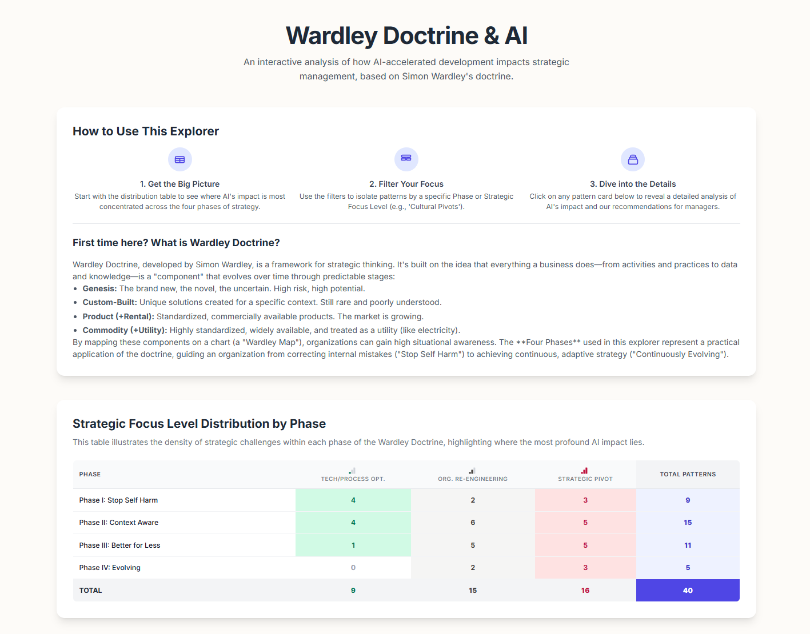
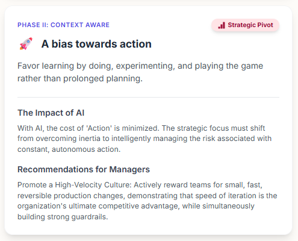
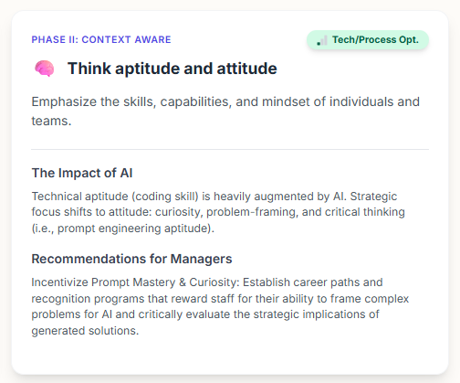
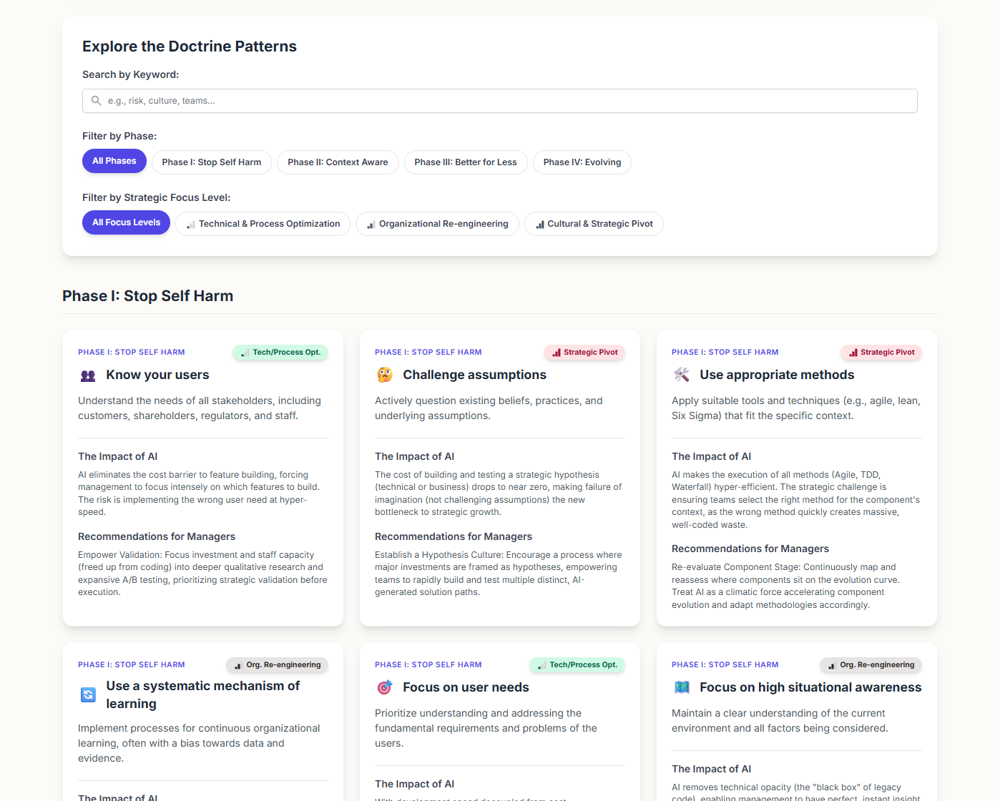

The speed at which AI coding agents help teams develop new features breaks the old models of work. If the bottleneck is no longer coding, then we need to focus our attention elsewhere. There's always a bottleneck, and it will either move upstream or downstream of the coding activity.

As the bottleneck shifts from developer productivity and coding velocity to organizational process and strategic alignment, the manager's job must change. Old activities like tracking tasks and reporting timelines become obsolete. The new role of managers is to define direction, instill purpose, and ask the right questions. [Simon Wardley](https://www.swardleymaps.com/)'s Doctrine—a set of 40 universal principles—provides a helpful framework for navigating this shift into the AI-enabled era.

Throughout this post, I will reference examples of doctrine principles taken from the [Wardley Doctrine & AI Impact Explorer](https://wardley-doctrine-ai-impact-explorer-512441749265.us-west1.run.app/) app that I created. This app serves as a reference guide to the 40 doctrine principles. It features AI-generated summaries on how AI adoption impacts teams and provides actionable recommendations for managers.

An overview of the Wardley Doctrine and AI Impact Explorer.

## Managers Must Constantly Attack Friction and Inertia

AI eliminates the software development bottleneck, exposing organizational inertia as the new primary constraint. For years, teams were organized and managed around the idea that building software was the slowest, riskiest and most expensive part of product development. Organizations created elaborate hierarchies and processes to manage this development. AI coding agents eliminate that bottleneck. A small team can now accomplish what once took an entire department.

The primary bottleneck in value delivery is no longer the development cycle; with development accelerated, the bottleneck shifts upstream and downstream to decision-making, approvals, and legal reviews.

When development was the bottleneck, managers could get by with just focusing on asking developers for updates, tracking task status, reporting progress, and updating plans.

None of that internal tracking was ever value-adding work to begin with, but with AI accelerating development to hyper-speed, doing the same things makes no sense.

To get the most out of AI, you must relentlessly attack organizational friction and inertia.

### Principles Relevant to Inertia

**Principle:** A bias towards action

**Summary:** Favour learning by doing, experimenting, and playing the game rather than prolonged planning.

**The Impact of AI:** With AI, the cost of 'Action' is minimized. The strategic focus must shift from overcoming inertia to intelligently managing the risk associated with constant, autonomous action.

**Recommendations for Managers:** Promote a High-Velocity Culture - Actively reward teams for small, fast, reversible production changes, demonstrating that speed of iteration is the organization's ultimate competitive advantage, while simultaneously building strong guardrails.

**Principle:** Manage Inertia

**Summary:** Actively address resistance to change stemming from existing practices, political capital, or past investments.

**The Impact of AI:** The primary source of organizational inertia shifts from technical debt/legacy code (which AI can resolve) to political capital and vested interests in old processes/structures that AI renders obsolete.

**Recommendations for Managers:** Fund Process Re-engineering - Dedicate budget and senior leadership attention to re-engineering or dismantling managerial, HR, and approval processes that no longer align with AI-accelerated development speed.

**Principle:** Design for constant evolution

**Summary:** Build systems, organizations, and processes with continuous adaptation and change as a fundamental design principle.

**The Impact of AI:** AI ensures constant technical evolution (code changes). Management must design the organizational structure and compliance framework (the human processes) to be equally flexible and adaptable, preventing human inertia from slowing down the AI's speed.

**Recommendations for Managers:** Implement 'Liquid Governance' - Replace rigid annual budgeting and review cycles with dynamic, rolling forecasts and automated compliance checks. Structure teams around short-term missions, not permanent functions, allowing the organization to reconfigure itself as quickly as the AI refactors code.

## Strategy at the Speed of AI

AI collapses the OODA Loop (Observe, Orient, Decide, Act). The "Act" phase is now nearly instantaneous, which forces the other phases to accelerate. You can deploy five different strategic hypotheses before a competitor finishes the first version of their quarterly plan.

The new failure mode is a slowness of learning. 

The biggest risk is no longer imperfect execution but a slowness of learning**.** The cost of testing a hypothesis drops dramatically, so the biggest risk is not moving fast enough. Annual planning is too slow, expensive and risky; your strategy must become a living, real-time learning system.

Focus on creating high-speed feedback loops. Empower teams to run dozens of small, safe-to-fail tests. Your job is to synthesize the learnings from these high-velocity experiments into a coherent strategic direction in real-time.

### Principles Relevant to Velocity

**Principle:** Move fast

**Summary:** Prioritize timely execution; an imperfect plan executed today is often better than a perfect plan delayed until tomorrow.

**The Impact of AI:** AI makes moving fast the default, not an aspiration. The strategic danger is building the wrong thing quickly. The doctrine shifts from speed being a choice to speed being a necessity.

**Recommendations for Managers:** Define Reversible Changes - Empower teams with autonomy for high-velocity deployment, provided all changes are small, isolated, and easily reversible (built-in "undo" capability) to mitigate the cost of speed.

**Principle:** Distribute power and decision-making

**Summary:** Empower individuals and teams to make decisions closer to the work, fostering autonomy and responsiveness.

**The impact of AI:** Velocity demands that decision-making happen at the point of action (the prompt). Managers must decentralize power to the prompt engineers and the teams closest to the AI execution.

**Recommendations for Managers:** Delegate Prompt Authority - Empower small, cross-functional teams with full ownership and decision rights over the components they build, trusting their proximate knowledge and AI-driven speed over centralized review.

**Principle:** Commit to the direction, be adaptive along the path

**Summary:** Maintain a clear overall objective and strategic intent while remaining flexible and responsive in how to achieve it.

**The Impact of AI:** AI-accelerated execution creates the ultimate adaptive path. Management must provide an ironclad Commitment to Direction (the North Star) to prevent high-velocity teams from wandering into irrelevant but easy-to-build solutions.

**Recommendations for Managers:** Reinforce Mission Over Task - Communicate the strategic mission (the "why") relentlessly and clearly. Use high-level strategy as the primary filter for team-level AI prompt design and decision-making.

## Productivity is Measured by Business Impact

Thanks to AI, the potential impact an individual developer can have grows. Productivity is no longer measured in lines of code or completed tasks; it's measured in business impact. A developer's value shifts from writing boilerplate to framing problems, architecting systems, and auditing AI-generated output. Context engineering becomes a core strategic skill.

Hiring and career progression must change. You are no longer hiring for pure coding speed. You are hiring to accelerate the AI-enabled value stream, which includes curiosity, communication skills, problem-framing, and critical thinking.

AI makes small teams hyper-effective. A single context engineer, paired with a product expert, can accomplish the work of a ten-person team. Managers need to shift from tracking tasks to coordinating networks of small, autonomous, hyper-productive work cells.

### Principles Relevant to Productivity

**Principle:** Think aptitude and attitude

**Summary:** Emphasize the skills, capabilities, and mindset of individuals and teams.

**Recommendations for Managers:** Technical aptitude (coding skill) is heavily augmented by AI. Strategic focus shifts to attitude: curiosity, problem framing, and critical thinking (i.e., context engineering aptitude).

**The Impact of AI:** Incentivize Prompt Mastery & Curiosity - Establish career paths and recognition programs that reward staff for their ability to frame complex problems for AI and critically evaluate the strategic implications of generated solutions.

**Principle:** Use appropriate tools

**Summary:** Select and apply tools and techniques that are suitable for the specific context, such as mapping or financial models.

**The Impact of AI:** AI eliminates the technical friction of learning new tools. The choice of tool becomes a purely strategic decision regarding vendor lock-in, data sovereignty, and security, decoupled from the effort/training costs.

**Recommendations for Managers:** Develop a Strategic Tooling Framework - Shift from technical to strategic evaluation. With AI lowering the adoption cost of any tool, your decision framework must prioritize non-technical factors like vendor lock-in, data sovereignty, security posture, and total cost of ownership. The key question moves from 'Can we use this tool?' to 'Should we commit to this tool?'

**Principle:** Provide purpose, mastery & autonomy

**Summary:** Empower individuals by giving them a clear reason for their work, opportunities to excel, and control over how they achieve their goals.

**The Impact of AI:** AI provides near-total autonomy over code execution. Management must now strategically define the high-level purpose and redefine mastery, shifting it away from coding and towards strategic thinking and emerging new practices, such as context engineering.

**Recommendations for Managers: **Revise Career Ladders - Update engineering career paths and promotion criteria to explicitly reward skills beyond coding. Create senior and principal tracks for 'AI Strategists' or 'Solution Architects' whose primary responsibilities are complex problem framing, prompt engineering, and the strategic auditing of AI-generated systems.

**Principle:** Be humble

**Summary:** Practice active listening, selflessness, and demonstrate fortitude in the face of challenges.

**The Impact of AI:** AI challenges the traditional organizational hierarchy, based on the notion of "who knows the code best," requiring managers to be humble enough to trust AI's analysis over long-held expert opinions.

**Recommendations for Managers:** Launch a 'Reverse Mentorship' Program - Pair senior leaders who have deep business context with junior engineers who are AI-native. The goal is cross-training: leaders learn what's now possible with AI, and engineers learn what business problems are most valuable to solve. This fosters humility and practical skill transfer.

## **Escape the Feature Factory**

Without a deep focus on user needs, AI accelerates the creation of waste. When development is fast and cheap, the risk is of becoming a highly efficient feature factory that builds things nobody needs. Managers must shift focus from "building" to "orientation" and "validation."

Managers need to help their team constantly reorient around the "why." Managers should help define a clear strategic direction—a North Star—to prevent high-velocity teams from wandering off building irrelevant features.

Shifting attention and focus to 'orientation' and 'validation' means focusing more on activities like product management, user research, data analysis, and testing. Tie funding and success metrics to validated user outcomes like retention or engagement, not feature output.

### Principles Relevant to User Needs

**Principle:** Know your users

**Summary:** Understand the needs of all stakeholders, including customers, shareholders, regulators, and staff.

**The Impact of AI:** AI eliminates the cost barrier to feature building, forcing management to focus intensely on which features to build. The risk is implementing the wrong user need at hyper-speed.

**Recommendations for Managers:** Empower Validation - Focus investment and staff capacity (freed up from coding) into deeper qualitative research and expansive A/B testing, prioritizing strategic validation before execution.

**Principle:** Focus on user needs

**Summary:** Prioritize understanding and addressing the fundamental requirements and problems of the users.

**The Impact of AI:** With development speed decoupled from cost, management must become extremely disciplined about delivering value versus producing features. The risk is drowning the customer in irrelevant, quickly-built software.

**Recommendations for Managers:** Prioritize Outcome Metrics - Shift success metrics from feature output to a direct link with measurable, validated user outcomes, mitigating the risk of infinite, low-value feature sprawl.

**Principle**: Listen to your ecosystems

**Summary:** Actively monitor and learn from external environments, customers, partners, and communities, treating them as sources of future insights and sensing engines.

**The Impact of AI:** When technical capacity is unlimited, the critical input is not how to build but what to build. Ecosystem listening becomes the primary strategic function, feeding high-value prompts to the AI engine.

**Recommendations for Managers:** AI Sensing Engines - Deploy AI/LLMs to continuously monitor external public data (e.g., social media, news, forums) to proactively identify emergent weak signals and unmet user needs before they become market trends.

## The Wardley Doctrine & AI Impact Explorer

The Wardley Doctrine & AI Impact Explorer interface, showcasing principles for modern agile leadership in the age of AI.

The [Wardley Doctrine & AI Impact Explorer](https://wardley-doctrine-ai-impact-explorer-512441749265.us-west1.run.app/) is an experimental reference tool for agile leaders. It uses AI to generate summaries of the doctrine principles and gives an overview of how AI could impact each principle. The app also offers managers recommendations for leadership in this high-speed landscape.

Ultimately, the goal is to shift managers' focus beyond simply using AI to speed up coding, and instead encourage them to redefine their role, ask better questions, and guide their teams to build smarter in an AI-enabled organization.

## More Resources

[https://blog.gardeviance.org/2016/08/doctrine.html](https://blog.gardeviance.org/2016/08/doctrine.html)

[https://blog.gardeviance.org/2016/05/wardleys-doctrine.html](https://blog.gardeviance.org/2016/05/wardleys-doctrine.html)

[https://learnwardleymapping.com/doctrine/](https://learnwardleymapping.com/doctrine/)

[https://www.wardleymaps.com/glossary/doctrine](https://www.wardleymaps.com/glossary/doctrine)
