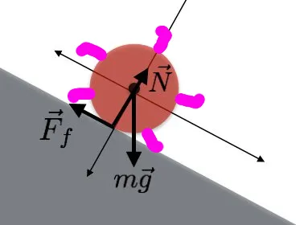
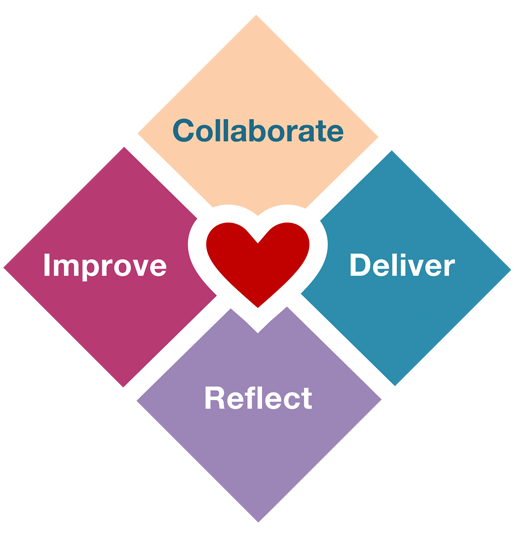

How do you run?

Years ago, when I worked as CrossFit Coach, I frequently attended workshops to improve in particular areas, including Olympic weightlifting and Strongman. One workshop I attended was called CrossFit Endurance, which taught the Pose Method of running. I've been thinking about how the lesson I learned from that workshop relates to how Agile teams work.

## What's the Pose Method?

The Pose Method is a running technique focused on making full use of gravity and teaches runners to create forward movement with the least energy cost and least effort by falling. The method teaches runners how to maximize the time spent falling, creating forward movement, and minimizing the time spent on the ground, interrupting that flow.

The Pose Method works by identifying repetitive “poses” during a running cycle through which every runner must pass: they have been described as Pose (the typical running “picture”), Pull and Fall…

The Pose (Picture #1) equates to landing with your mid-foot directly under your Center of Mass (CoM). Landing with the foot directly under the hips allows us to continue momentum with limited braking force.

[The Pose Method and Effortless Running (evolutionsportspt.com)](https://www.evolutionsportspt.com/the-pose-method-and-effortless-running)

The first thing we learned about the Pose Method was where speed comes from. Speed comes from the distance between your center of mass and your supporting leg (the leg on the ground). When your center of gravity is above your supporting leg, you're balanced and at rest. When your center of gravity is in front of your supporting leg, you start to fall. The further you fall, the faster you go.

The lesson of the workshop was that running is falling. It was a simple lesson to understand logically but very challenging to feel. During the workshop, we did many exercises to help people feel what falling felt like. During one exercise, we were outside, and my job was to run in place with my eyes closed. The class instructor placed his hand on my lower back and slowly walked forward, pushing me and causing my weight to shift over my feet. He started going faster and faster, and soon I was sprinting across an asphalt parking lot with my eyes closed, scared of what would happen if I missed a step.

"That was it!" he exclaimed, "You're falling!"

Until people had a similar experience and felt what it felt like to fall, they'd keep practicing their bad habits. These bad habits included landing heavily with their feet in front of their center of mass or not pulling their trailing leg through fast enough. In every stride, these bad habits work against the runner.

Here's another analogy that helps explain the impact of landing in front of the center of mass vs underneath it:

Imagine a ball rolling downhill with long, purple spikes poking out from the borders: every time one of those spikes hits out in front of the ball, there will be an interruption to the flow of movement that will ultimately SLOW down the smooth progression of the ball.  It will keep rolling downhill despite the slight momentum disruption because gravity and the slope/fall line are a greater force.

Any time the purple spike hits directly under the ball's center of rotation, it will hit the downhill slope in a manner that will promote effective force transmission into the same direction the ball is currently traveling. Our feet are the same way - landing with a foot out beyond the CoM actually causes a force in the direction opposite to forward motion of the body. The foot then needs to remain in place until the CoM “catches up” to the base of support and is positioned over the foot in order to effectively carryover the forward momentum. Longer time on the ground = slower step turnover.

[The Pose Method and Effortless Running (evolutionsportspt.com)](https://www.evolutionsportspt.com/the-pose-method-and-effortless-running)

## What Keeps Agile Teams on the Ground

If "longer time on the ground = slower step turnover," then speed is about maximizing the time spent falling, and the challenge is stopping all of the bad habits preventing this.

With Agile, we want to accomplish the same goal: Stay in Pose, and maximize the time spent falling. The challenge is that teams have similar bad habits to runners, keeping them on the ground and working against them. Like when runners land in front of their center of mass, these practices work against teams at every step.

In the talk, [The Alternate Path to Enterprise Agility](https://www.youtube.com/watch?v=RsayVfMVjbU), David J. Anderson outlines some practices organizations should consider removing from their process:

Estimates

Iterations

Planning

Prioritization

Backlog grooming

Dependency management

There are others I see daily:

Managing work in multiple places instead of a single system

Poor meeting facilitation, where people talk for hours about systems and solutions instead of doing collaborative modelling

Implementing new processes and roles because an Agile framework tells them to

I say teams should work to "get rid of" these practices instead of "get better at" because many teams get caught in the trap of trying to get better at things they would be better off stopping completely. A team won't become Agile by starting these activities and won't get any more Agile by improving how they do them.

For example, one team I talked to told me about how they regularly do planning for new initiatives and consider it a valuable activity because of the dependencies they uncover. The problem is that discovering dependencies doesn't make planning valuable; their planning process was a way to cope with the fact that they couldn't deliver value end-to-end and required hand-offs to other teams. Being efficient would be to get better at planning and dependency management. Being effective would be not having to plan or manage dependencies at all.

In the same way that running is falling, we need to find the equivalent for Agile. Running is not pushing, pumping, or arm swinging, and Agile is not estimating, planning, or prioritizing.

## What's Agile's Pose Position?

If you stop doing estimates, iterations, planning, prioritization, backlog grooming and dependency management, what's left? What does the Agile equivalent of Pose look like?

The answer to that question differs for every organization, team and context. Part of being Agile is not being prescriptive and not holding any single answer as the absolute truth. The quality of being Agile does not come from a defined process, method or framework. Being Agile requires being flexible and adaptable.

To get a better idea about what the Agile equivalent of Pose looks like, here are some sources of inspiration and quotes to point you in the right direction.

### Modern Agile and Heart of Agile

[Modern Agile](https://modernagile.org/) and [Heart of Agile](https://heartofagile.com/) are two movements focused on Agile development's core principles and values. The themes of delivering value, getting feedback, learning rapidly, experimenting and improving paint a picture of agile that touches on the idea of falling and moving smoothly. They focus on the people and the work, not management methods.

Modern Agile

The Heart of Agile | More powerful, More human

Here's a helpful quote from Allen Holub:

Build small.
Talk to each other.

If anybody tells you that "Agile" is anything other than that, I wouldn’t pay much attention to them.

Allen Holub, [Twitter - @allenholub](https://twitter.com/allenholub/status/1469129253878829056)

Another quote from Kevlin Henney:

For all the non-prescriptiveness of the Agile Manifesto, that is unambiguously a core value:

Responding to change over following a plan

That is what the word agile entails. It is not simply achieving a sustainable speed in an optimal direction; it is being able to change both speed and direction, and to do so easily.

Kevlin Henney, [Agility ≠ Speed](https://kevlinhenney.medium.com/agility-speed-96057078fe40)

## Conclusion

The key idea is that running in Pose allows the body to carry your falling momentum forward. The challenge is to stop the bad habits that push back against you. Agile can help you accomplish something similar. Agile helps your team and organization make forward progress and move in any direction in response to change. Focus on the core activities that create forward momentum, and remove the ineffective practices that push back against you.

Remove the unnecessary management methods from your agile work. Remove the command and control. Remove the waterfall and the rigid processes.

Replace estimating, iterations, planning, prioritization, and backlog grooming with practices that help you deliver value continuously. Focus on working software, deliver that software very frequently, get feedback and adjust.
