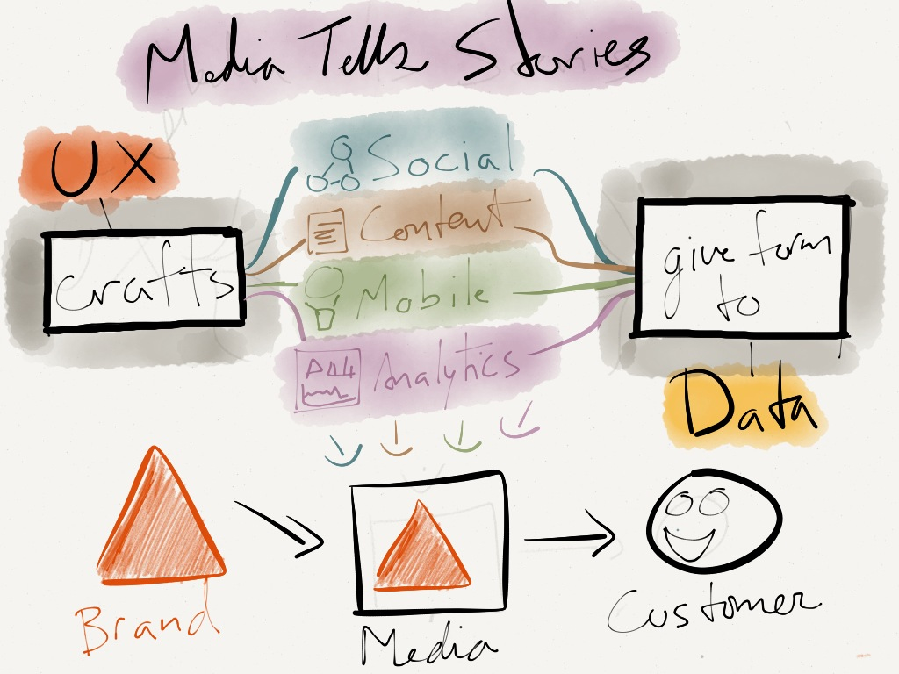

Stories are the core to brands, experiences, and customer perspective. Media is how you bring those stories to life through a variety of platforms and channels.

This image works in the role of UX in creating an experience consistent with a brand across platforms and contexts, and it also hints at how the platforms are just different methods of communicating a story.
