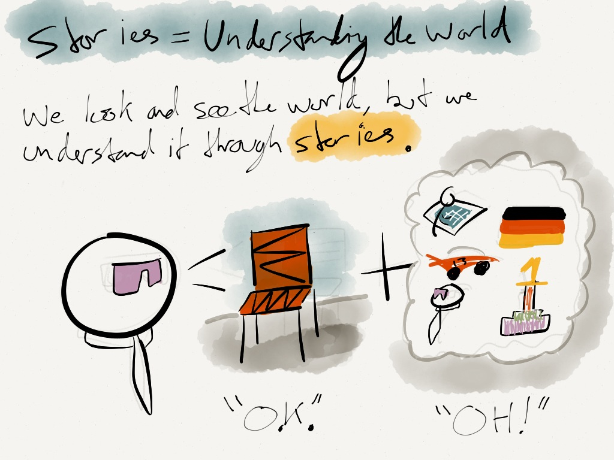

Stories aren’t just how we can market brands and products, they’re the only way we can understand anything in our world. It’s the case for brands, products, experiences, and even mundane everyday items.
