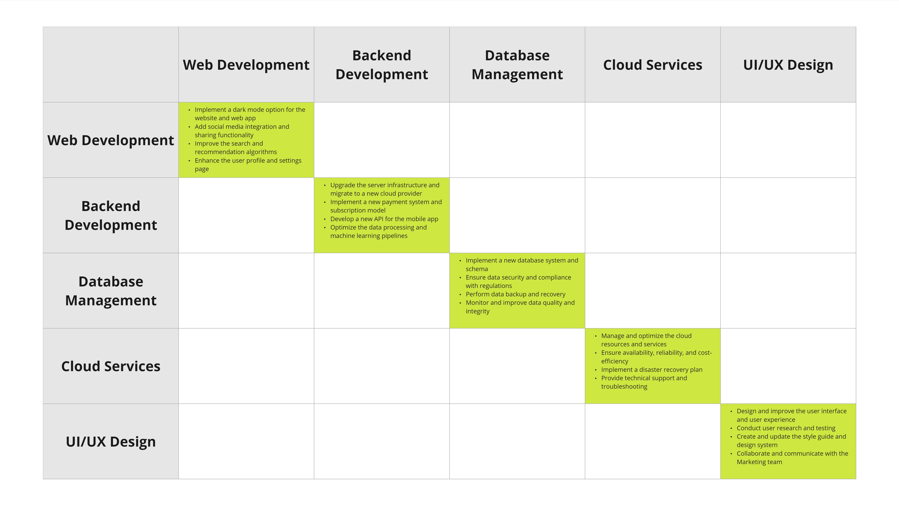
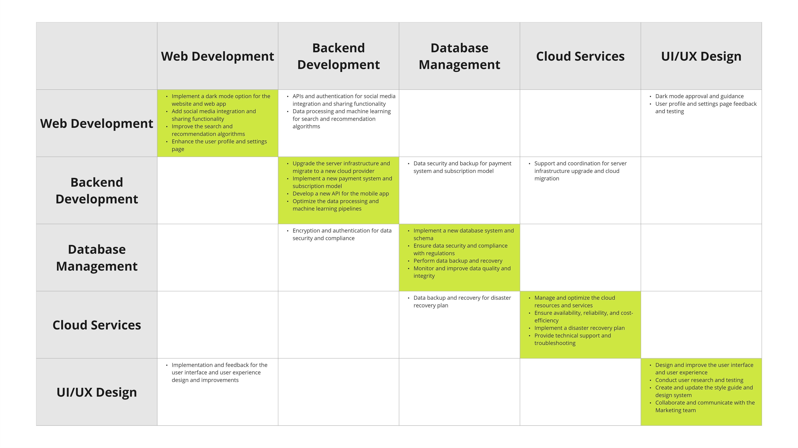
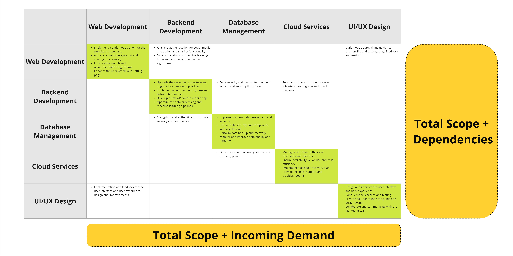

In the large organizations I work with, dependencies are the number one blocker preventing fast flow. In these organizations that, for budgetary reasons, do annual planning, dependencies are the most significant determining factor to the success of their plans and the biggest afterthought.

The tendency I see is for teams to plan their work as if they were the only ones in the world. With poor visibility into the capacity of the teams they depend on and little thought as to what the other teams plan to do, teams all spend significant time preparing plans for the upcoming year in a vacuum that are incompatible when seen as a whole. As a result, new information comes after planning finishes and once delivery starts, causing teams to reprioritize their work, renegotiate with other teams, and redo their plans.

The Team Dependency Matrix was inspired by Dave Gray's [Give and Take Matrix](https://gamestorming.com/give-and-take-matrix/) (who was probably inspired by the [Design Structure Matrix](https://en.wikipedia.org/wiki/Design_structure_matrix)), to help give teams insight into the nature of dependencies in their organization. It creates awareness of other teams' planned work and each team's outbound and inbound dependencies.

On top of providing short-term relief by reducing the planning conflicts caused by dependencies, the dependency landscape that the Team Dependency Matrix brings to light can also help organizations examine why they have so many dependencies. Organizations can use the matrix to identify the teams or services everyone depends on, examine the number of teams that can deliver work independently, and capture which dependencies block or slow down the organization the most.

The outcomes of the Team Dependency Matrix exercise include:

- Create more awareness of other teams' planned work
- Capture each team's outbound and inbound dependencies
- Provide insights into the nature of dependencies in your organization

## How It Works

1. Identify the teams in scope and create a table with the team names set as column and row headers.
2. Add the scope a team plans to deliver at each cell where the team intersects with itself.
3. For each row, capture what dependencies that team has on others in the different columns.
4. After filling out all your backlog items and capturing your dependencies, you now have a picture of each team's scope, dependencies, and total demand.

*Add each team's planned scope in the cells where a team intersects with itself.*

*For each team (rows), go column by column, identifying what dependencies you have on other teams.*  

*A visual aide on how to read the table. In this example, the Backend Development team needs the Database Management team for data security and backup.*

*Once completed, the table reveals a team's planned scope, dependencies, and incoming demand.*

## A Small Step

The Team Dependency Matrix exercise only partially solves an organization's dependency management or planning challenges. The Team Dependency Matrix is a "small step" that teams can take as part of their dependency or planning-related work.

- **It's intuitive:** it's easy to do and requires very little information.
- **It's asynchronous:** Teams don't depend on others and can work on the same artifact independently rather than wait for a large, structured workshop.
- **It's comprehensive:** Organizations can represent all their planned initiatives in one picture.
- **It has a quick payoff:** The matrix starts providing value as soon as you start adding information to it. As more teams add their work to the model, the more valuable it becomes.
- **It's not judgmental:** It doesn't propose anything about how your teams should be structured or how you should do planning.

After an organization completes the exercise, they can decide what step to take next based on what they see. They can:

- Re-examine their team structures
- Identify value chains and system boundaries
- Zoom into areas where there's more risk of dependency-related conflicts
- Determine what work is a priority at the organizational level
- Reallocate people across teams to better match demand vs capacity
- Start putting a delivery plan together.

However, the exercise alone may not be enough for organizations to create perfect delivery plans. It doesn't provide the information to create delivery plans like start times, duration, or priorities. It also doesn't quantify a team's total available capacity.

## Conclusion

My goal with the Team Dependency Matrix exercise is to create a tool that can help organizations solve some simple but real problems, such as:

- Avoid long delays or having to reshuffle work because of being surprised by dependencies.
- Not run into situations where a critical team is understaffed because nobody considered their dependency-driven demand.
- Have conversations about dependencies earlier in the planning process.
- Create situational awareness and help teams work with how things are now.

This exercise is something I thought of while working with very dependency-heavy organizations doing annual planning with large backlogs. Organizations doing short-term or continual planning and delivery, with smaller backlogs and thin-tailed lead times, may not need this exercise.

The exercise provides value quickly with little investment, making it an easy-to-adopt tool for teams looking to improve their planning processes.
