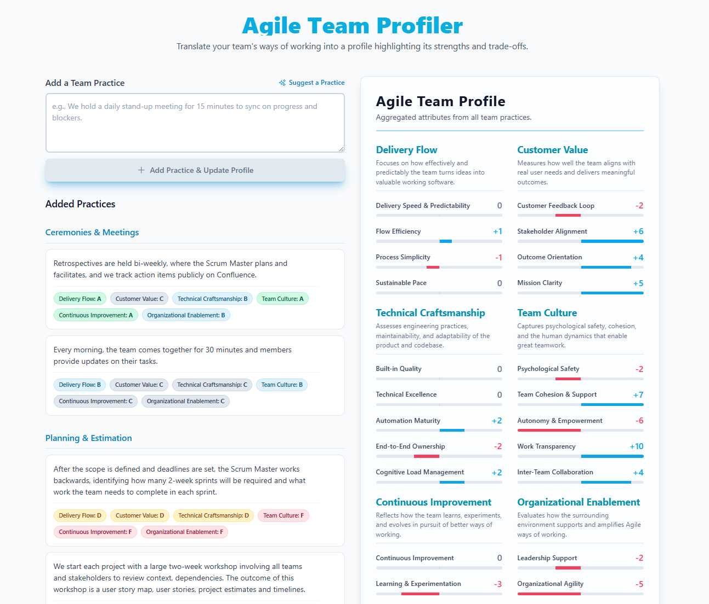
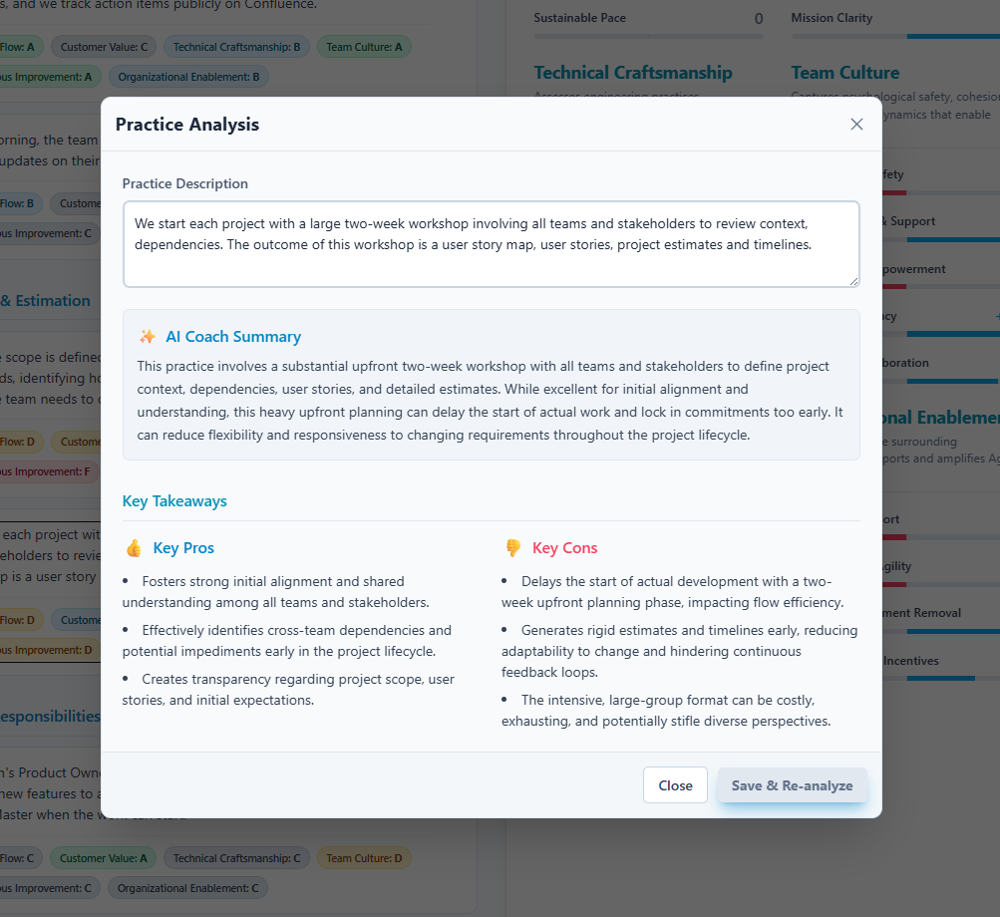
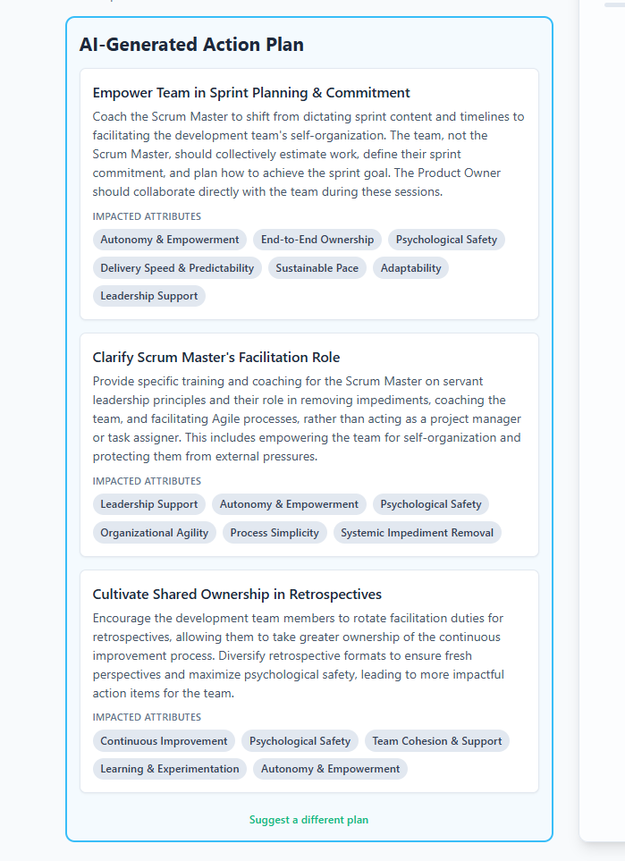

Every decision in Agile carries a cost. There is no single "right" way to build products or organize teams; each choice comes with a hidden set of trade-offs.

## Recognizing Hidden Trade-offs in Agile Practices

Agile teams often select practices with a specific goal in mind, overlooking the less obvious consequences.

For example, escalating a technical disagreement between two teams to a senior manager might be the fastest way to resolve it. But the price is that teams lose autonomy and decision-making power, and the manager, removed from the day-to-day context, risks making a suboptimal choice.

In another example, consider upfront planning, like spending weeks preparing for a two-week project kick-off workshop. Project kick-off workshops may help managers communicate requirements to teams and prepare developers to start coding quickly, but they also bring significant trade-offs: Requirements become locked in, teams get disconnected from the discovery process, and the focus shifts to maximizing scope instead of starting small and iterating.

Trade-offs appear in daily routines, too. Does the Scrum Master always facilitate every meeting? Is the Product Owner the sole contact for customers? Does the team estimate every task? Each of these routine choices about process and structure has hidden trade-offs that ultimately shape team culture. Leaders and coaches must continually consider these potential impacts.

These trade-offs rarely announce themselves. Leaders, coaches, and managers must continually consider the various potential impacts of their decisions.

## Preserving Team Autonomy and Learning

One crucial trade-off concerns who makes decisions. When coaches or consultants dictate solutions, they inadvertently deny the team valuable opportunities for self-discovery and growth. Even sharing an opinion influences thinking; it prevents the team from sharing the unique solutions they might have developed on their own. This dynamic directly impacts team capability and individual learning—two core criteria for team effectiveness, as defined by Richard Hackman, alongside delivering products that are acceptable to clients.

Real team leadership is about creating conditions that enhance the likelihood of meeting these goals.

It's simple to focus on a single outcome. Saying things like, "We need to move fast and get things done," sounds powerful and direct, but it implicitly accepts lots of hidden trade-offs. These kinds of statements, when repeated, define how work gets done and shape a team's culture.

Decisions that consistently strip power from teams will ultimately create a disempowered workforce.

## Lenses for Evaluating Practices

When evaluating team practices, while never perfect, I try to consider decisions through several lenses:

**Decision-Making Authority**: Who is making decisions?

**Team Empowerment**: Does the practice help the team grow?

**Agility**: Does it enhance the team's ability to respond to change?

**Flow**: Does it improve the smooth flow of work?

**Collaboration**: Are things being done collaboratively?

An exclusive focus on speed, by any means necessary, misses the essence of Agile. True agility embraces operating in uncertain environments, valuing responsiveness to change, and showing respect for people. Without these pillars, fast delivery leads to brittle systems and burnt-out teams.

While understanding Agile principles can help you better evaluate potential trade-offs when making decisions about work or practices, it's impossible to recall every relevant principle for every decision at the right time. It's also a mistake to believe you can predict how people will react or how the environment will change.

Because we can only poorly predict the impact of decisions, a practical approach to reducing risk is to make smaller decisions, approach them as experiments, and closely monitor and adapt as you learn.

## The Agile Team Profiler

The Agile Team Profiler turns your daily practices into a clear, visual 'character sheet,' instantly highlighting your collective strengths and hidden weaknesses.

The [Agile Team Profiler](https://agile-team-profiler-539581219123.us-west1.run.app/) is an interactive coaching tool I built for Agile Coaches, Scrum Masters, and Managers. Its purpose is simple: to help teams gain a clearer understanding of the hidden trade-offs in their practices.

Users describe their team's ways of working—from daily meetings to technical habits. The application's AI coach analyzes each practice, scoring its impact against key agile attributes. As more practices are added, the app builds a cumulative "Team Profile" that acts as a character sheet, clearly illustrating the team's collective strengths and weaknesses.

Get a detailed breakdown for every practice, explaining the 'why' with a clear summary and key pros and cons.

### Features

The application is built around a simple workflow:

**AI-Powered Practice Analysis:** Users enter a description of a team practice, and the app uses the AI to provide an in-depth analysis. This includes scoring the practice's impact on various attributes, assigning it to a category (e.g., "Ceremonies & Meetings"), and generating a summary of its key pros and cons.

**Aggregated Team Profile:** All individual practice scores are aggregated into a single, dynamic visualization. This "character sheet" provides a holistic view of the team's strengths and weaknesses, making it easy to spot patterns and imbalances across different areas.

**AI-Generated Action Plan:** After adding practices, users can click a button to receive a custom, AI-generated action plan. This plan provides 3-4 concrete, actionable recommendations to help the team address its weaknesses.

Just describe a team practice, and the AI coach instantly analyzes, categorizes, and grades its impact across key agile areas.

### Attributes and Groupings

The core of the analysis on trade-offs is based on a set of attributes that represent key facets of an Agile team. These are organized into six groups:

**Delivery Flow:** Focuses on how effectively the team turns ideas into working software.

Delivery Speed & Predictability

Flow Efficiency

Process Simplicity

Sustainable Pace

**Customer Value:** Measures how well the team aligns with user needs and business outcomes.

Customer Feedback Loop

Stakeholder Alignment

Outcome Orientation

Mission Clarity

**Technical Craftsmanship:** Assesses the team's engineering quality, codebase health, and operational maturity.

Built-in Quality

Technical Excellence

Automation Maturity

End-to-End Ownership

Cognitive Load Management

**Team Culture:** Captures the human dynamics that enable effective teamwork and collaboration.

Psychological Safety

Team Cohesion & Support

Autonomy & Empowerment

Work Transparency

Inter-Team Collaboration

**Continuous Improvement:** Reflects the team's ability to learn, adapt, and evolve its processes over time.

Continuous Improvement

Learning & Experimentation

Adaptability

Growth Mindset

**Organizational Enablement:** Evaluates how the surrounding organization and leadership support the team's agile ways of working.

Leadership Support

Organizational Agility

Systemic Impediment Removal

Aligned Goals & Incentives

After building your profile, get a custom, AI-generated action plan with concrete steps to amplify your strengths and address your team's biggest challenges.

## Conclusion

Considering the potential trade-offs inherent in Agile practices is crucial for building resilient and effective teams. By thoughtfully considering the possible impacts of process decisions—from major decisions to daily routines—Managers can foster an environment where teams not only deliver valuable products but also grow in capability and learn continuously.

The [Agile Team Profiler](https://agile-team-profiler-539581219123.us-west1.run.app/) is a simple app designed to help visualize these subtle trade-offs, enabling teams to make more informed decisions about their working methods and foster a culture of deliberate, conscious improvement.
