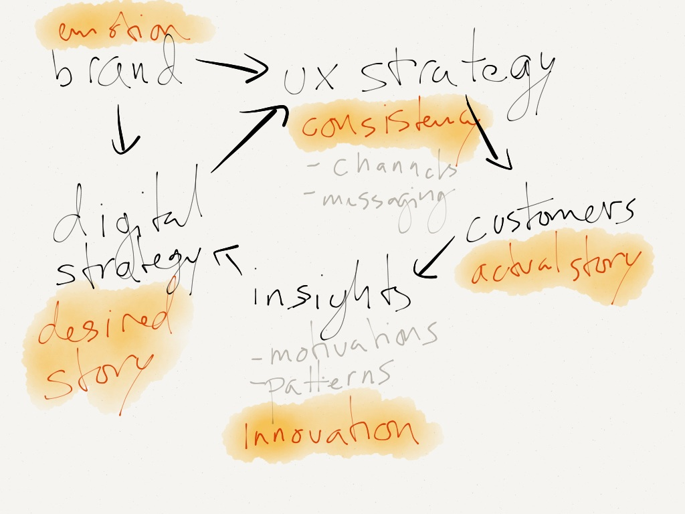

This loop breaks down a digital strategy process and identifies the core element of each step. One interesting bit is the connection that brand has; It sets the boundaries for both strategy and UX.
