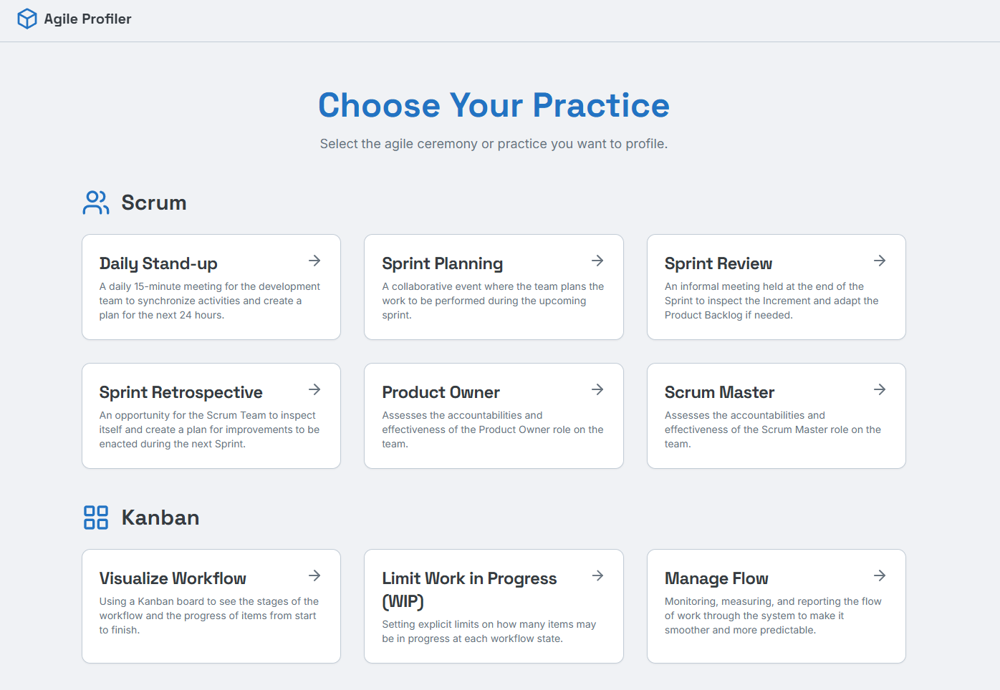
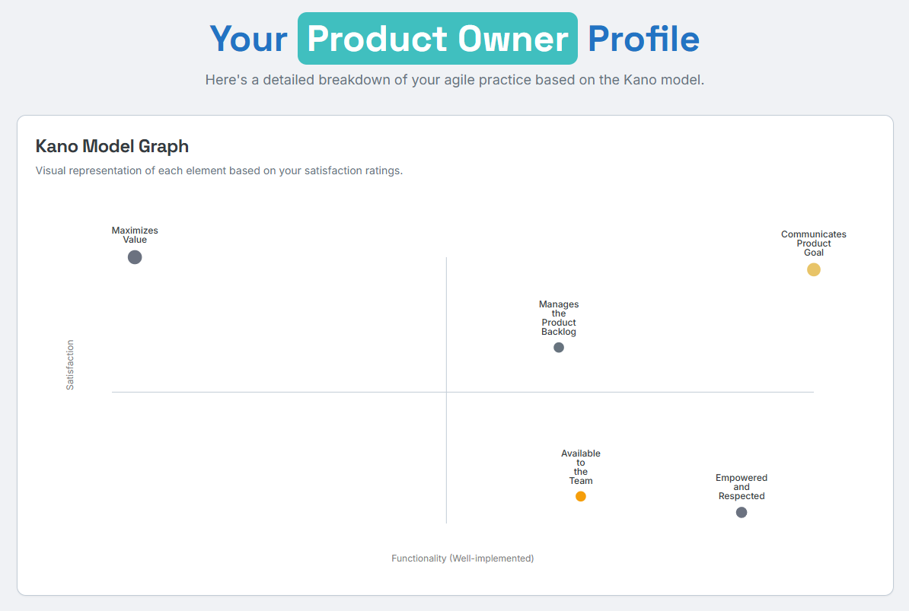
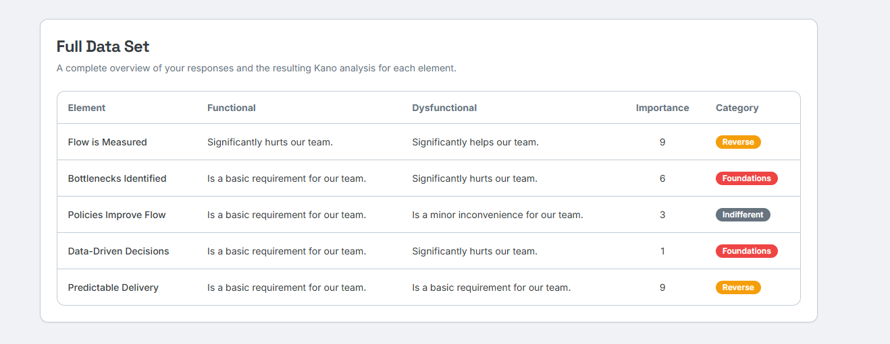

Many agile transformations focus on replacing rigid, waterfall processes with a standard set of ceremonies, roles, and artifacts. Agile maturity is often measured by how many of these practices a team has adopted, or making sure they've adopted the right ones: Long-lived teams are "more agile" than project teams; frequent deployments are "more agile" than big-bang releases.

But this focus on *methods* over *outcomes* misses a crucial point: a team can follow every textbook agile practice and still be rigid. Practices alone don't guarantee agility.

What if we stopped measuring teams based on what Agile practices they follow, and started getting teams to think more about "Which of our team's habits actually add value? Which ones don't?"

This question led me to the idea of applying a product development framework, the **Kano Model**, to a team's ways of working. Using a product development framework helps us get away from common Agile guidance or expert-based opinions on what is or isn't Agile. It focuses solely on what's helping, and what's getting in the way.

## Adjust the Granularity for Better Insights

Instead of relying on agile rubrics or an expert's opinion, the goal is to understand how a team *uniquely expresses* its practices and which specific elements are adding value or creating waste.

Let's take the example of Work-in-Progress (WIP) limits. A typical maturity assessment might have a checkbox: "Does the team use WIP limits?" Yes or no questions like this tell you nothing about whether the team's getting any value thanks to the WIP limits.

This Kano-based approach digs deeper by breaking the practice down. We could ask the team to rate their satisfaction with specific behaviours:

The act of *setting* WIP limits.

The discipline of *following* WIP limits.

The habit of *updating* WIP limits when the context changes.

The focus on limiting WIP at the *bottleneck*.

Does following these behaviours make a positive impact? Would you feel a negative impact if your team did them less or stopped? Which ones are the most important? This granular view moves us from abstract guidance to context-specific insights that a team can act on.

## Use The Kano Model for A Fresh Look at Team Practices

The Kano Model is a powerful tool for understanding customer satisfaction. It plots features on two axes: How you feel if the feature is present (Functional) versus how you feel if it's absent (Dysfunctional).

When we apply this to agile practices, we can ask these questions to team members, managers, stakeholders, or even customer collaborators. By asking team members how they feel about the presence or absence of a specific work habit, we can categorize those habits into five distinct types:

**Performance:** These are "more is better" practices. The better you do them, the more satisfied the team is. The worse you do them, the less satisfied they are.

**Must-be:** These are the non-negotiables. You expect them, and their absence causes major dissatisfaction. However, when done well, customers are just neutral.

**Attractive:** The "wow" factors. These are delightful surprises. When present, they bring a lot of satisfaction, but their absence doesn't cause any dissatisfaction because nobody expected them in the first place.

**Indifferent:** These practices don't move the needle on satisfaction at all. The team doesn't care whether they are present or absent.

**Reverse:** This is the critical category for improvement. A high degree of functionality in these areas actively *causes dissatisfaction*. These are counterproductive, wasteful activities.

## Use "Reverse" to Spot Waste

In large organizations, productivity is often measured by high levels of activity; doing lots of things is seen as positive, whereas not doing something is seen negatively, even if the activity doesn't add any value. The "Reverse" category is especially interesting to us because it gives teams a clear signal that something is creating waste.

Many corporate agile practices start with good intentions but live on long past their expiration date. Think of a weekly status report that a long-gone executive demanded, which everyone is told they must complete, even though no one reads it. By categorizing this activity as "Reverse," the team signals that the practice is not just neutral—it's actively creating waste and creating an adverse effect. This signal allows teams to ask two powerful questions that aren't often considered in large enterprises: **"What would happen if we stopped doing this?"** and **"What if we did nothing?"**

## Focus on Context Specific Improvements

Once you've gathered the data and categorized your team's micro-practices, you can have a focused conversation about what's creating value for people and what's not:

**Amplify the Good:** How can we do more of what we classified as Attractive? How can we invest in improving our Performance practices?

**Eliminate the Waste:** What can we stop or change how we do things from the Reverse category? What Indifferent activities that don't make a difference can we simplify or remove?

This method has an advantage in that it's harder to game. Asking "Are stand-ups important?" is a leading question where people will likely give the answer they know is "correct". But asking about 10 different, specific elements of *how your team conducts its stand-up* forces people to think about things differently and could help reveal new insights.

This more detailed profile of a practice could allow a team to make targeted changes based on their own context-specific practice.

## Agile Profiler Prototype App

I published a prototype to experiment with these ideas. You can find it at Agile Profiler.

It lets users select one from a handful of Agile practices, and for each practice, presents a Kano questionnaire of five questions to measure the satisfaction and functionality scores of different elements of that practice.

After completing the survey, the app generates a Kano Model graph, a profile of the practice, with some actionable recommendations for how users could modify their behaviours to get even more out of the practice.

The prototype uses AI to generate a profile and recommendations, but the idea is that after the data is collected from a team, the reflective part of the exercise and coming up with recommendations could be done as part of a workshop activity.

The Agile Profiler prototype app allows users to select various Agile practices and ceremonies for evaluation.

Visual representation of Agile practice evaluation using the Kano Model, highlighting satisfaction and functionality of five elements of a practice.

Insights into an Agile practice analysis on user stories with recommendations for improvement.

The overview of a Kano analysis displaying responses and the resulting classifications for an Agile practice.

## Conclusion: Focus on Practices that Add Value

Teams don't become successful by simply adopting a list of Agile practices. They succeed by building a system of work that consistently delivers value, but unfortunately, those Agile practices that are supposed to help them frequently become obstacles or create a new status quo.

The Kano Model provides a language and a framework to shift the focus. It moves us away from arguing about whether a practice is "agile" and toward a more productive discussion: Is this making a positive impact on how we work, and would it make any difference if we stopped?

Examining how you work through this lens might help your teams take control and distinguish between value-adding habits and empty rituals. You can stop just *doing* agile and start *being* agile by building the process you want that works for you.
