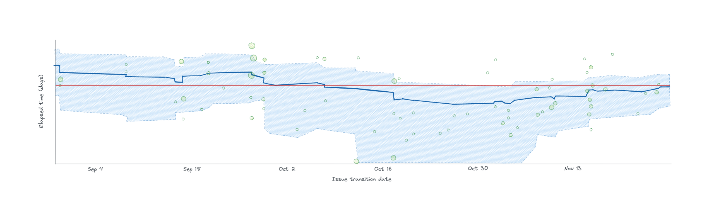

In an earlier post, [[quick-jira-control-chart-aging-wip-hack|Quick Jira Control Chart Aging WIP Hack]], I walked through the process of using Jira's control chart report to get a view of a team's aging work in progress. Aging work in progress is a simple and effective tool to help manage a team's work. Soon after publishing that article, I created another filter to turn Jira's control chart into what people in the kanban community call a lead time scatterplot.

*A lead time scatterplot using Jira's control chart report*

A lead time scatterplot shows completed work items on the x-axis, where every marker represents a story. Stories are plotted left to right from oldest to most recently completed. How long each story took to complete is plotted against the y-axis.

The lead time scatterplot view shows the overall trend of how long it takes for items to move through a kanban system. It's common to see kanban coaches using lead time scatterplots along with confidence levels to understand the odds of something finishing within a given time limit. Confidence levels help us talk about lead time performance while reducing the effects of outliers.

To create the lead time scatterplot graph, you need to create a new quick filter with the following query:

*Jira quick filters*

Jira isn't a kanban tool and doesn't provide that same functionality around confidence levels. Instead, it shows a running average and some information about standard deviation, which some would argue isn't appropriate for measuring knowledge work. Still, without being too concerned about the detailed stats, using Jira's control chart as a lead time scatterplot is a quick way of understanding trends in performance.

Jira's default control chart view isn't adequate out of the box as a lead time scatterplot because Jira pulls in all issues, both open and closed. That mix of issues creates a polluted view and hides the lead time trend. It also pulls in all issue types, which introduces the problem of double counting. With double counting, Jira will record and report the lead times of an epic, a task, and a sub-task separately, even though they have a parent-child relationship.

While the aging work in progress chart is a helpful tool to identify what issues need attention, the lead time scatterplot helps show if your actions are having an effect in reducing system lead times and improving predictability.
