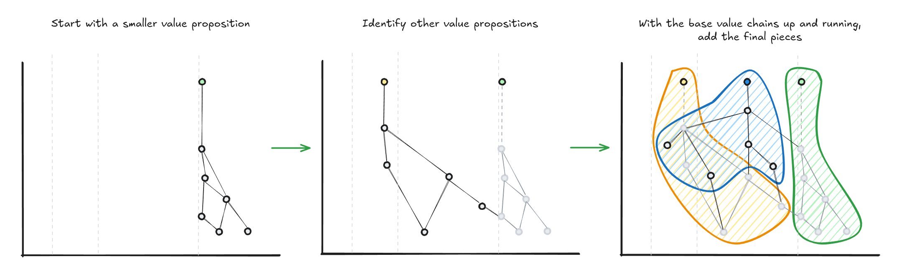

What I see time and again while working on big projects in large corporations is that often, ambitious project plans are started that depend on dozens of new things all going right.

Delivering anything in a large organization can be a challenge, and needing to get many new things all right, all on time, is a big gamble.

Big, ambitious projects get started, and to deliver their scope requires:

- Hiring new people and standing up new teams.
- Creating new value chains between teams.
- Tackling major software updates and cloud migrations.
- Onboarding new services and training support staff.

In large IT projects, this leads to:

- More teams and more people to coordinate.
- More dependencies to juggle.
- Bigger, longer status updates.
- Heavy, drawn-out testing.
- Larger budgets and longer timelines.

Big projects can also lead to situations like heavy, short-term hiring at a project's start, only to see that talent and knowledge vanish after the project concludes, and people are let go or moved elsewhere.

Doing all of this at once creates immense pressure and complexity. So much time is spent on coordination, calendars fill up, and barely any time is left for value-adding work.

It's an expensive, high-risk way to deliver value. There's a better way to work that embraces continuous product development to deliver value faster and with less risk.

*A typical 'Big Bang' project value chain, highlighting the many components that all have to go right to deliver a single outcome.*

## Find the Value Propositions

"Big Bang" projects start with a goal, then the organization works backward, mapping out everything required to get it done.

"We need to launch this new product, so let's map out all of our requirements and dependencies."

Large projects trying to do "Agile" might begin by gathering dozens of people for large kick-off sessions to do discovery, getting everyone aligned on the project's goals, reviewing architecture diagrams or doing dependency mapping.

With so much work and activity focused on the project's final goal, everything gets treated just as a means to an end. But if you step back and out of the project frame, you start to see how many of those tasks are independent sources of value.

Instead of trying to get everything right at once, break down your massive project into smaller parts by identifying the value propositions that can be delivered by a smaller subset of the larger project's value chain.

## Find the Value Chains

Instead of trying to get everything right and deliver big bang projects, unbundle the value. Break down those massive, complex projects into smaller, more manageable pieces. Find where smaller value propositions exist within the plan that can be delivered by a subset of the value chain.

Shifting to thinking about value chains and value propositions allows you to:

- **Deliver value sooner:** Instead of waiting for a massive project to finish, use incremental and iterative development to deliver something meaningful to your customers sooner.
- **Learn from your customers earlier:** By getting new services and features out faster, you get real-world feedback that can inform your next steps.
- **Focus on users and needs:** By thinking of your organization as a network of services, each supporting one or more value propositions, you're encouraged to consider those users and continually improve your service to meet their needs.

*Breaking down complex projects into smaller value propositions and value chains for manageable delivery.*

The shift to working on smaller, independent value chains, on iterative and incremental delivery, and to delivering smaller value propositions is the shift from projects to services using continuous product development.

Every step should create a new or improve an existing value proposition.

## Distribute the Authority

Shifting from big projects to independent services also means moving away from centralized, management-driven control to distributed authority. You will need to empower smaller, more autonomous teams.

Distributed authority and this "think small" approach match nicely with Simon Wardley's Doctrine patterns. These patterns can help support organizations using a services-based model:

- **Know your users:** Understand both your external customers and the internal teams who consume your services.
- **Focus on user needs:** Organize your teams around satisfying your users' needs.
- **Challenge assumptions:** Use the maps to find better ways of breaking down and delivering work that hasn't been considered.
- **Use a common language:** Use maps to support effective communication between teams. Use maps to define your value chains and the boundaries between them.
- **Think small (as in know the details):** Break large landscapes into smaller contracts.
- **Think small (as in teams):** Design services to be owned and delivered by small, independent teams.
- **Move Fast:** Find the smallest set of services and value chains you can get started delivering new or improving existing value propositions.
- **Distribute power and decision-making:** Let the people closest to the choices make them.

As Simon Wardley puts it: ["Put power in the hands of those who are closest to the choices that need to be made."](https://medium.com/wardleymaps/a-smorgasbord-of-the-slightly-useful-2498a1163dd6) This is easier to do when you have small, autonomous teams and are not trying to centrally coordinate hundreds of people across a large, complex project.

## Conclusion

Bringing it all together, we're moving away from "Big Bang" delivery projects by paying attention to the value propositions and value chains in our organizations. Moving away from big bang delivery projects increases the importance and the need for continuous product development, which is supported by a different set of principles and practices than centralized control
