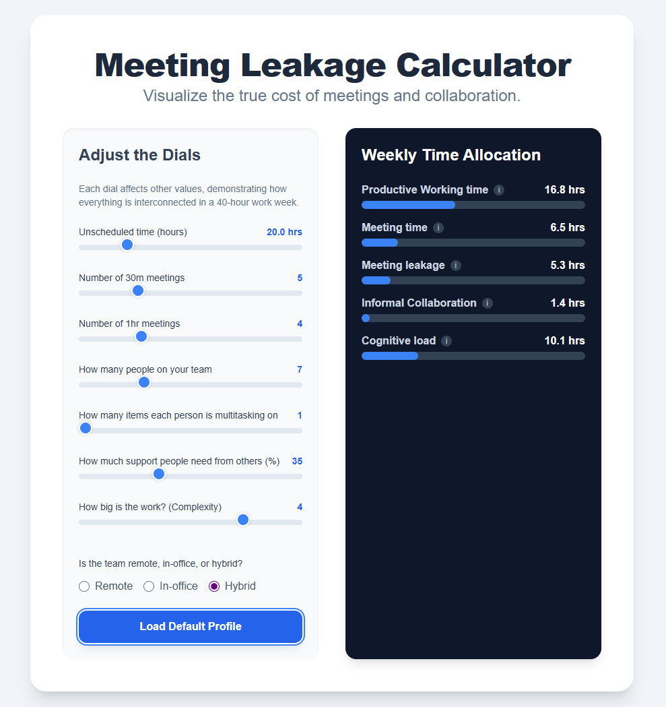

A meeting's cost extends far beyond its scheduled time. In fact, the full, hidden cost is rarely considered and often eats up the rest of your day.

Every meeting creates a hidden ripple effect that affects everyone who is forced to attend. Instead of spending their time focused on delivering value, Agile teams often find themselves spending a significant amount of their time and energy in meetings dealing with those ripple effects.

I call this hidden overhead "Meeting Leakage." It's the mental and logistical effort spent before and after a meeting that turns a thirty-minute calendar slot into an hour or more of lost productivity."

### The Invisible Cost of "Meeting Leakage"

Meetings demand more than just attendance. Before logging on or entering a conference room, individuals need to stop what they were doing and shift gears, mentally getting ready, or sometimes even spend time preparing materials. For in-office teams, this also includes the physical journey to a meeting space, waiting for others to arrive, and casual conversations. Post-meeting, regaining focus on complex tasks requires additional effort, this is often referred to as "context switching." This invisible overhead—the mental ramp-up, the travel, the re-entry into a flow state—is the essence of meeting leakage. It siphons away time from deep, focused, value-adding work.

### How Over-Collaboration Destroys Agility

When calendars are filled with meetings—whether they are daily stand-ups, sprint reviews, or planning sessions—the capacity for productive work shrinks. Agile has contributed to creating a culture of over-collaboration. Over-collaboration isn't about people working together too much; it's when organizations use meetings to fill everyone's calendar in the name of collaboration. It's where decisions require input from everyone and every update needs to be broadly shared.

Over-collaboration is tied to a management need to constantly monitor the visible, surface-level activity of teams—ensuring that work is captured in tickets, that tickets are all assigned, that each ticket has been estimated and has a target completion date, that people provide daily updates and that tickets are moving. In low-trust environments, management's first instinct is often to schedule more meetings to more closely track people and work—a counterproductive cycle of monitoring and overhead.

Despite all these meetings, what gets overlooked are all the invisible effects: the team's dwindling energy, the constant interruptions, and the time lost to context switching. Scrum, the default operating mode for most teams calling themselves Agile, relies heavily on meetings. Without careful consideration, adopting Scrum and all its meetings can consume a significant portion of a team's time, often to the detriment of value-adding work and problem-solving.

### The Myth of the 'Valuable' Meeting

When you discuss meeting costs, someone will inevitably say, 'But you have to look at the value!' This sounds profound, but it's unhelpful. Cost is measurable; whereas value is a vague, almost impossible calculation." Moreover, even though a problem might get solved in a meeting, maybe it could have been solved more easily some other way.

Big meetings are the first, worst solution for solving problems.

There are other ways meetings that are considered valuable really aren't. For example, many recurring meetings are held "just in case" an issue arises, which is a symptom of information not flowing smoothly through an organization.

There's also the case when a team's daily stand-up meeting serves the needs of their manager rather than fostering collaboration or addressing the team's collective challenges. When meetings become primarily about reporting *to* someone, they fall short of their Agile purpose.

It's hard to prove or argue about the value of a team's many meetings; instead, an alternative approach might be to start with a better understanding of where a team's time is spent each week and how meetings impact that time.

### Visualizing Your Team's Time

To understand this impact, [I prototyped a tool that visualizes a team's weekly time allocation](https://gemini.google.com/share/794b0eb9e517). This interactive tool shows the distribution of hours across productive work, meeting time, informal collaboration, cognitive load, and meeting leakage. The tool has various dials you can use to adjust different factors to see their real-world effects:

- **Meeting Frequency:** The number of 30-minute or 1-hour sessions.
- **Team Size:** Larger teams often require more time for alignment and establishing shared context.
- **Multitasking:** The more individuals juggle different tasks, the more common context switching becomes.
- **Interdependencies:** The time team members need getting support from others can generate unplanned interruptions.
- **Work Complexity:** Larger and more complex projects require additional coordination and planning overhead.
- **Team Location:** Remote setups can optimize against physical travel time, while hybrid models introduce unique communication challenges.

As these factors shift, the tool would dynamically show how overall productive working time changes. It reveals how a forty-hour work week is a finite resource, meetings and other factors interact to reduce the time people have to work and collaborate productively.

*An interactive Meeting Leakage Calculator to visualize the true cost of meetings and over-collaboration.*

### Towards More Intentional Collaboration

Considering the impact meetings have on teams, how they are too easy to book, and how they're often the first, worst solution employed to solve problems, exploring alternatives and asking simple questions like "What else could we do?" can help uncover more effective ways to tackle a problem. 

Teams can eliminate many unnecessary meetings through improved information sharing and better communication, which can lead to issues getting resolved asynchronously. For example, Kanban's practices of visualizing work and limiting work in progress provide transparency that can reduce the need for status update meetings.

### Conclusion

Understanding the full impact of meeting leakage is paramount for any team striving for agility; however, managers and teams often overlook the hidden costs of meetings, including mental, logistical, and time spent context switching.

Meeting leakage means that the cost of a 30-minute meeting is never just 30 minutes.

By recognizing these invisible factors and by examining a team's collaboration habits, they can reclaim both time and energy. The goal of the meeting leakage tool is to provide teams with information they can use to make better, more deliberate choices about their time.
