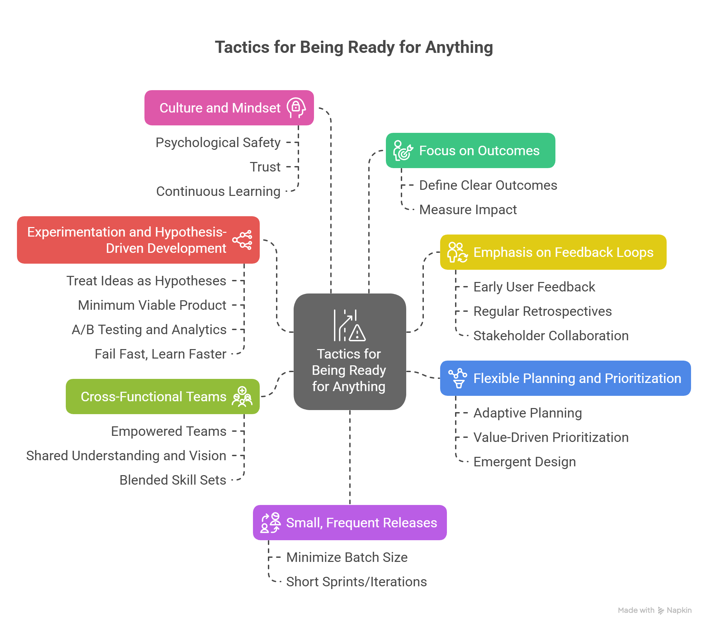

In software development projects, I constantly see teams spend significant time convincing and trying to give managers the impression that all the project's variables are known and under control.

Even though most of the teams I work with are called "Agile," they're assigned to work on waterfall projects and told to deliver a fixed scope of work by a fixed timeline. In these contexts, teams are expected to have believable plans, to have all the answers up front, and to present a clear picture of the future confidently.

It doesn't stop there; Sprints are planned months in advance, teams are scored on how well they deliver against their sprint commitments, and their velocity is measured and graded against a target figure. Teams are forced to attend review meetings and produce frequent status updates or reports demonstrating that they have a clear and achievable plan to reach a particular target state and that their performance aligns with that plan. On large projects, I see teams spend thousands of person-hours a month talking about the future: When things will finish, when things will start, how long things will take, and the order of events.

The prevalence of all these practices must be a sign that they're solving a real need. This constant production of plans satisfies the organization's craving for certainty. The appetite for certainty and control is endless. There can never be enough of it.

But what if we stopped trying so hard to fight against uncertainty and trying to convince each other that we've somehow reigned in the complexity of software development with a well-designed set of tasks and timelines? If we accept that software development is an uncertain endeavour and that nobody really knows what will happen, could we change our approach? Could we be more productive? Could we spend our time on things that actually make an impact?

## The Illusion of Certainty

Projects often start with a flurry of planning, timelines, and detailed specifications. People try to nail down every aspect upfront, making guesses about things like:

- How long it will take
- How much it will cost
- Who will use it
- What the return will be
- What all the risks are
- What we don't know

Teams then pitch these guesses to managers to get their buy-in.

Much of what's being sold to promote certainty and control is guesswork, lies, or fantasies. I like to think about what's real in software development, and that all comes down to working software and what users are doing with it. Conjectures about what will happen in the future are very much not real. The plans become a false reality that everyone is expected to follow.

Because preparing project plans takes a lot of time, and commitments are made to executives based on those plans, teams are pressured to stick to the plan. Pressure and fear become the primary driving forces as people work to meet their timelines at any cost. Most of the time, though, the plans and timelines are finalized before work even starts! They're big bundles of guesses made at the start of new projects when we know the least.

This pursuit of certainty also creates a lot of overhead and pressure for teams. Think about all the status reports, reviews, and presentations made to show that everything is going according to plan. What if we could let go of this pressure? But what if we shift our focus from trying to control the future to being ready for anything?

## The Agile Alternative: Being Ready for Anything

So, what's the alternative? It's simple: "We don't know." Accept that uncertainty isn't a problem to be solved, but it's a truth to live with. Adopt ways of working that are better suited to dealing with that reality.

But the goal isn't to start from "We don't know" and eventually move to the "We know " stage by implementing structured practices. The goal is to recognize that you'll never know. A lot of the work people do today is to tell and convince each other that "We know," but it's just not possible.

If you accept the truth of "We don't know " and realize that anything else is impossible, then new possibilities open up. Rather than drowning in a whirlpool of countless status meetings and reports, you shift from trying to control the future to embracing uncertainty and being ready for anything.

## Tactics for Being Ready for Anything

**Focus on Outcomes:**

- **Define Clear Outcomes:** Instead of focusing on delivering a list of features (outputs), define the desired business or user outcomes (e.g., "increase user engagement by X%," "reduce customer support calls by Y%").
- **Measure Impact:** Regularly assess whether the delivered features are actually achieving the desired outcomes. If not, be prepared to adjust.

**Small, Frequent Releases/Iterations:**

- **Minimize Batch Size:** Break down work into the smallest valuable increments that can be delivered independently. Minimizing batch size allows for frequent feedback and less "sunk cost" if a change is needed.
- **Short Sprints/Iterations:** Work in short, time-boxed iterations (e.g., 1-2 weeks). Short iterations enable frequent reviews and changes.

**Emphasis on Feedback Loops:**

- **Early and Continuous User Feedback:** Get working software into the hands of real users as early and often as possible. Don't wait until the "final product." Early user feedback validates assumptions and highlights problems quickly.
- **Regular Retrospectives:** Dedicate time after each iteration to reflect on what went well, what didn't, and what can be improved. Regular retrospectives foster a culture of continuous learning and adaptation.
- **Stakeholder Collaboration:** Involve stakeholders directly in the development process so they can provide real-time input and understand trade-offs.

**Flexible Planning and Prioritization:**

- **Adaptive Planning:** Plan at a high level for the long term but in detail only for the immediate future. Revisit and adjust plans frequently based on new information.
- **Value-Driven Prioritization:** Focus on delivering the highest business value items first. Even if feedback informs you that your direction needs to change, you've already delivered the most important things. Techniques like CD3 or Weighted Shortest Job First (WSJF) can be helpful.
- **Emergent Design:** Allow the design to evolve as you learn rather than trying to perfect it upfront.

**Experimentation and Hypothesis-Driven Development:**

- **Treat New Ideas as Hypotheses:** Frame new features or initiatives as testable hypotheses (e.g., "We believe X feature will lead to Y outcome for Z users").
- **Minimum Viable Product (MVP):** Build the smallest possible version of a new idea that can deliver value and gather learning.
- **A/B Testing and Analytics:** Test to validate hypotheses and measure the impact of new features. Testing and analytics help you learn what works and what doesn't before scaling.
- **Fail Fast, Learn Faster:** Embrace the idea that some experiments will fail. The goal is to learn from those failures quickly and pivot.

**Cross-Functional Teams**:

- **Empowered Teams:** Give teams the autonomy and responsibility to decide *how* to achieve their goals. Having empowered teams fosters ownership and faster decision-making.
- **Shared Understanding and Vision:** Improve the quality and speed of decision-making by ensuring everyone on the team understands the product vision, goals, and customer needs.
- **Blended Skill Sets:** Teams with diverse skills (development, design, testing, product ownership) can address challenges holistically and reduce dependencies.

**Culture and Mindset:**

- **Psychological Safety:** Speed up learning by creating an environment where team members feel safe to voice concerns, admit mistakes, and propose new ideas without fear.
- **Trust:** Build a culture where teams operate with confidence in each other. Foster high standards for competence and commitment, minimizing the need for oversight, detailed reporting, and "checking."
- **Continuous Learning:** Foster a culture where both individual and team learning is valued and encouraged. The pressure to meet timelines kills the conditions needed for learning to flourish.

Each of these practices aims to better enable us to react to change in the face of uncertainty. We don't take direction from a plan. We set our direction from what the real world tells us. We organize ourselves so that our systems, culture, and teams align with that goal.

## Conclusion: Thriving in the World of "We Don't Know"

The need for certainty in software development is understandable, but many projects are too big and planned with a high degree of precision that's unsuitable for their complexity. In the "We know" way of working, teams craft, defend and conform to plans.

In "We don't know," instead of putting our energy into a fictional future, we actively work in the present and aim to improve our ability to respond to the real world.
